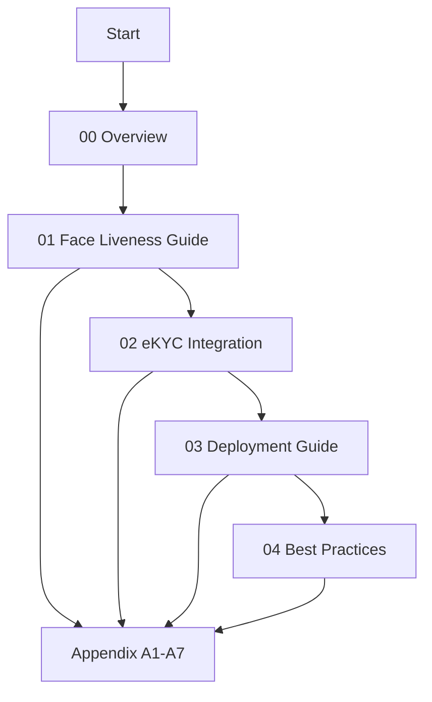
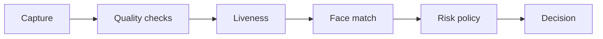

# 00. Overview

## Who should read this page

This page is for anyone who wants the **fastest orientation** before going deeper.

---

## What this documentation is

This repository explains **face liveness for eKYC** in simple language while still covering the points that matter in real systems.

Face liveness answers one core question:

> Is the camera seeing a real person who is physically present right now, or is it seeing some kind of spoof?

A spoof could be:

- a printed photo
- a replayed video on another screen
- a mask
- an injected image or video stream
- AI-generated or manipulated face content

---

## Why this repo was reorganized

A lot of face liveness material becomes hard to read because it mixes everything together too early:

- definitions
- attack taxonomy
- metrics
- deployment engineering
- standards and compliance
- vendor evaluation

That makes the first reading heavy.

This repo now uses a simpler structure:

### Main guide
Use this first. It explains the core ideas in plain English.

### Appendix and deep reference
Use this when you need technical detail, standards context, long checklists, or deeper testing material.

---

## The big idea to remember

A **face match** system and a **face liveness** system solve different problems.

| Check | Main question |
|------|---------------|
| Face match | Does this face look like the enrolled face or the ID portrait? |
| Face liveness | Is this a real live person present during capture? |

A system can be good at face matching and still accept a spoof.

That is why remote eKYC usually needs both.

---

## Reading path by role

| Role | Start with | Then go to |
|------|------------|------------|
| Product or business | [01-face-liveness-guide.md](01-face-liveness-guide.md) | [02-ekyc-integration.md](02-ekyc-integration.md), [04-best-practices.md](04-best-practices.md) |
| ML engineer | [01-face-liveness-guide.md](01-face-liveness-guide.md) | [03-deployment-guide.md](03-deployment-guide.md), [appendix/A3-metrics-and-evaluation.md](appendix/A3-metrics-and-evaluation.md) |
| Backend or platform engineer | [02-ekyc-integration.md](02-ekyc-integration.md) | [03-deployment-guide.md](03-deployment-guide.md), [appendix/A5-security-and-privacy.md](appendix/A5-security-and-privacy.md) |
| Risk or fraud team | [01-face-liveness-guide.md](01-face-liveness-guide.md) | [appendix/A2-attack-taxonomy.md](appendix/A2-attack-taxonomy.md), [appendix/A5-security-and-privacy.md](appendix/A5-security-and-privacy.md) |
| Compliance or procurement | [01-face-liveness-guide.md](01-face-liveness-guide.md) | [appendix/A4-standards-and-compliance.md](appendix/A4-standards-and-compliance.md), [appendix/A6-vendor-evaluation-checklist.md](appendix/A6-vendor-evaluation-checklist.md) |

---

## The five main pages

| Page | Why it exists |
|------|---------------|
| [01. Face Liveness Guide](01-face-liveness-guide.md) | Explains the core concepts in simple English |
| [02. eKYC Integration](02-ekyc-integration.md) | Shows where liveness fits in the full onboarding flow |
| [03. Deployment Guide](03-deployment-guide.md) | Covers real engineering and runtime choices |
| [04. Best Practices](04-best-practices.md) | Gives a practical do-and-don't checklist |
| [05. Real-World Examples](05-real-world-examples.md) | Shows where liveness is used in actual journeys |
| [06. API and Response Examples](06-api-and-response-examples.md) | Gives practical response patterns and integration ideas |
| [07. Decision Logic](07-decision-logic.md) | Shows how to turn score into action |
| [08. Evaluation Playbook](08-evaluation-playbook.md) | Explains how to test readiness on real attacks and devices |
| [09. Common Failures](09-common-failures.md) | Explains where production issues usually come from |
| [10. Product Guide](10-product-guide.md) | Translates liveness into product trade-offs |
| [11. Advanced Topics](11-advanced-topics.md) | Introduces fusion, calibration, and maturity topics |
| [Appendix](appendix/A1-key-terms.md) | Holds deep technical, metrics, security, and vendor material |

---

## Visual reading map

---

## A simple mental model

Think about face liveness as one layer in a larger trust pipeline:

Face liveness is important, but it is not the whole system.

---

## Related docs

- [01. Face Liveness Guide](01-face-liveness-guide.md)
- [02. eKYC Integration](02-ekyc-integration.md)
- [05. Real-World Examples](05-real-world-examples.md)
- [Appendix A1 — Key Terms](appendix/A1-key-terms.md)

## Read next

Go to [01. Face Liveness Guide](01-face-liveness-guide.md).
