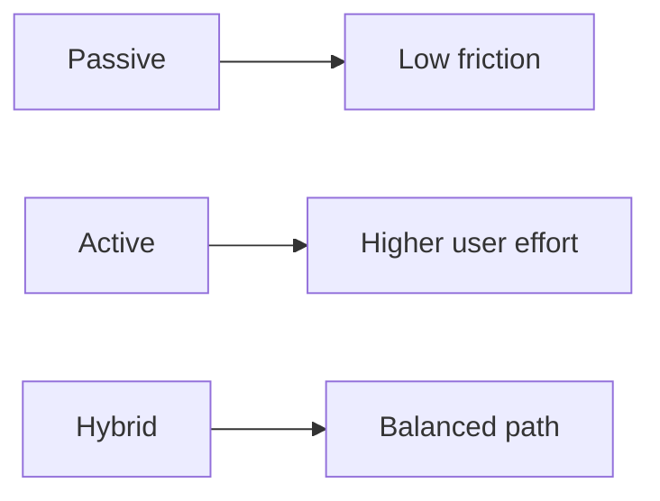
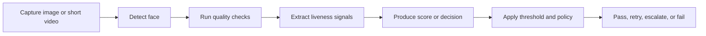

# 01. Face Liveness Guide

## Who should read this page

This page is the best first full read for product teams, engineers, fraud teams, and compliance readers who want the core idea without too much technical overload.

---

## What face liveness means

Face liveness verifies that the face shown to the camera belongs to a **real person who is physically present during capture**.

This matters because a face recognition system can correctly match a face to an ID document and still be fooled by a spoof. A system may see the right face, but it may not be seeing a real live person.

In remote eKYC, face liveness helps answer:

- Is this person real?
- Is the person present right now?
- Is the camera feed genuine, or is it being spoofed?

---

## Why it matters in eKYC

Remote onboarding removes in-person supervision. That makes fraud easier.

Without liveness, a system may accept:

- a photo of the target person shown on another device
- a replayed video of the target person blinking or moving
- a mask or other presentation attack
- an injected or virtual camera stream
- manipulated or AI-generated face content

That is why face liveness is now a core control in:

- account opening
- video KYC
- account recovery
- step-up verification
- high-risk transaction approval

---

## Face match vs face liveness

These are related, but they are not the same.

| Question | Face match | Face liveness |
|----------|------------|---------------|
| What does it ask? | Does this face look like the expected person? | Is this a real live person present during capture? |
| Typical output | match score or similarity score | live/spoof result or liveness score |
| Main weakness without the other | may accept a spoof of the right person | may confirm a live person who is not the right identity |

A simple way to remember it:

- **Face match** checks identity similarity
- **Face liveness** checks physical presence and authenticity

In eKYC, both are usually needed.

---

## Main types of face liveness

| Type | What it does | Main strength | Main limitation | Good fit |
|------|--------------|---------------|-----------------|----------|
| Passive | Detects spoofing without asking the user to do a challenge | low friction | may need stronger surrounding controls | smoother onboarding |
| Active | Asks the user to do something such as blink or turn | raises difficulty for simple attacks | adds friction | higher-risk flows |
| Hybrid | Combines passive and active signals | balances security and usability | more design complexity | many production eKYC flows |

### Passive liveness

**What it is**  
Passive liveness tries to detect spoofing from one image or a short sequence without asking the user to do a challenge.

**Why teams use it**  
It is fast, low-friction, and easier for many users.

**What it looks for**  
Depending on the system, it may use texture, lighting response, motion consistency, depth hints, screen artifacts, or learned spoof patterns.

**Limits**  
It can struggle more against stronger replay or injection attacks if the capture and security environment are weak.

### Active liveness

**What it is**  
Active liveness asks the user to do something, such as blink, smile, turn the head, or follow an on-screen cue.

**Why teams use it**  
It makes simple presentation attacks harder because the attacker must respond correctly in real time.

**Limits**  
It adds friction. If the challenge is poorly designed, it can hurt conversion and accessibility.

### Hybrid liveness

**What it is**  
Hybrid liveness combines passive and active signals.

**Why it is common**  
It gives a better balance between security and usability. Many production systems use passive checks first and only ask for an active challenge when confidence is low or risk is high.

---

## Simple comparison view

---

## Common attack groups

A simple way to understand attacks is to group them into four buckets.

| Attack group | Simple examples | Main concern |
|--------------|-----------------|--------------|
| Physical presentation attacks | print, cut-out, screen replay, mask | camera sees fake physical media |
| Digital or injection attacks | virtual camera, emulator, API hook, direct stream injection | media bypasses normal capture path |
| AI-assisted attacks | deepfake, face swap, generated face media | spoof media becomes more realistic |
| Operational attacks | coached behavior, weak fallback abuse, compromised device | process weakness defeats a good model |

For the full breakdown, see [Appendix A2 — Attack Taxonomy](appendix/A2-attack-taxonomy.md).

---

## Input quality still matters

Even a strong model will struggle if capture quality is poor.

Common quality problems include:

- low light or strong backlight
- blur from hand movement
- face too small in the frame
- face partly outside the frame
- occlusion from hair, glare, mask, hand, or device edge
- aggressive image compression
- old front camera or unstable browser capture

A good production system should check capture quality early and guide the user before making a hard liveness decision.

---

## A simple pipeline view

A practical face liveness flow often looks like this:

In many real systems, the final decision may also consider:

- document verification result
- device risk
- account risk
- IP or geo signals
- retry history
- fraud rules

---

## Scores, thresholds, and decisions

A liveness score is only useful when it is connected to a decision policy.

### Example policy

- **High score** → pass
- **Middle band** → retry, stronger challenge, or manual review
- **Low score** → fail or escalate

Threshold choice always involves a trade-off:

- a stricter threshold reduces spoof acceptance risk
- a stricter threshold can also reject more genuine users

This is why thresholds should be tuned using realistic traffic and attack conditions, not only ideal lab data.

---

## What teams should measure

The most useful practical measures are:

- spoof acceptance risk
- genuine-user rejection risk
- retry rate
- completion rate
- latency
- device coverage
- robustness across lighting, pose, and network conditions

The deeper metric discussion is in [Appendix A3 — Metrics and Evaluation](appendix/A3-metrics-and-evaluation.md).

---

## Where teams usually make mistakes

Common mistakes include:

- using face match without liveness in remote onboarding
- testing only on easy datasets
- ignoring injection attacks
- trusting one benchmark number too much
- tuning only for high-end devices
- treating retry logic as an afterthought
- failing to monitor score drift after launch

---

## Practical example

Imagine a user uploads a selfie that looks very similar to the ID photo. A face match model may return a strong similarity score.

But if that selfie is actually a replayed video shown on another phone, the identity match alone is not enough.

Face liveness adds the missing question:

> Is this media coming from a real live person in front of the camera right now?

That is the gap it is meant to close.

---

## Practical takeaway

For most eKYC systems, face liveness is not just a model. It is a full control layer that includes:

- capture design
- input quality checks
- spoof detection
- threshold policy
- retry and fallback logic
- security hardening
- monitoring and re-evaluation

Face liveness works best when it is treated as part of a broader trust pipeline, not as a single score in isolation.

---

## Related docs

- [02. eKYC Integration](02-ekyc-integration.md)
- [03. Deployment Guide](03-deployment-guide.md)
- [Appendix A2 — Attack Taxonomy](appendix/A2-attack-taxonomy.md)
- [Appendix A3 — Metrics and Evaluation](appendix/A3-metrics-and-evaluation.md)

## Read next

Go to [02. eKYC Integration](02-ekyc-integration.md).
