# 1.3 The eKYC Pipeline — Where Liveness Fits

---

## The Complete eKYC Flow

Face liveness verification doesn't operate in isolation — it's one critical stage within a larger identity verification pipeline. Understanding this pipeline is essential for proper integration, error handling, and security architecture.

```mermaid
graph TD
    A["👤 User Initiates\nKYC Process"] --> B["📄 Stage 1:\nDocument Capture"]
    B --> C["🔍 Stage 2:\nDocument Authentication"]
    C --> D["📝 Stage 3:\nOCR & Data Extraction"]
    D --> E["🧬 Stage 4:\nFACE LIVENESS\nVERIFICATION"]
    E --> F["👥 Stage 5:\nFace Matching"]
    F --> G["🗄️ Stage 6:\nDatabase & Watchlist Checks"]
    G --> H["⚖️ Stage 7:\nRisk Scoring & Decision"]
    H --> I{"Decision"}
    I -->|"✅ Approved"| J["Account Opened"]
    I -->|"⚠️ Review"| K["Manual Review Queue"]
    I -->|"❌ Rejected"| L["Application Rejected"]
    
    style E fill:#1B4F72,stroke:#154360,color:#fff
    style J fill:#27ae60,stroke:#1e8449,color:#fff
    style L fill:#e74c3c,stroke:#c0392b,color:#fff
    style K fill:#f39c12,stroke:#d68910,color:#fff
```



---

## Stage-by-Stage Breakdown

### Stage 1: Document Capture

The user photographs their government-issued identity document using their device camera.

| Aspect | Details |
|--------|---------|
| **Input** | Camera frame(s) of identity document |
| **Documents Supported** | Passport, national ID, driving license, Aadhaar card, voter ID, PAN card, residence permit |
| **Key Challenges** | Glare, blur, partial occlusion, poor lighting, skewed angles, damaged documents |
| **Quality Checks** | Blur detection, completeness check, document boundary detection, readability assessment |
| **Output** | Cropped, de-skewed document image(s) — front and back if applicable |

!!! tip "Liveness Relevance"
    Document capture quality directly impacts downstream face matching accuracy. A blurry document photo means a blurry reference face, which increases false rejection rates in the liveness + matching pipeline.

---

### Stage 2: Document Authentication

The system verifies that the captured document is a genuine, unaltered government-issued document.

| Aspect | Details |
|--------|---------|
| **Input** | Cropped document image(s) |
| **Checks Performed** | Security feature verification (holograms, UV patterns, microprinting), MRZ/barcode validation, tamper detection (photo substitution, text alteration, digital manipulation), template matching against known document types |
| **Document Liveness** | Determines if the document is a physical original (not a photocopy, screen display, or digitally fabricated document) |
| **Key Challenges** | Sophisticated document forgeries, digital-first documents (e.g., mAadhaar), document wear and aging |
| **Output** | Authentication confidence score, detected security features, tamper alerts |

!!! warning "Coordinated Attack Vector"
    A sophisticated attacker may present **both** a forged document and a spoofed face simultaneously. The document authentication and face liveness stages must be considered as **complementary defenses** — weakness in either stage compromises the entire pipeline.

---

### Stage 3: OCR & Data Extraction

Structured data is extracted from the authenticated document using Optical Character Recognition and intelligent field extraction.

| Aspect | Details |
|--------|---------|
| **Input** | Authenticated document image(s) |
| **Data Extracted** | Full name, date of birth, document number, address, gender, nationality, expiry date, photo region |
| **Technologies** | Layout-aware models (LayoutLMv3, LiLT, Donut), MRZ parsers, barcode/QR decoders |
| **Key Challenges** | Multilingual text, handwritten fields, poor print quality, non-standard layouts |
| **Output** | Structured JSON with extracted fields + confidence scores, extracted face photo from document |

!!! info "Face Photo Extraction"
    The face photo extracted from the document at this stage becomes the **reference image** for face matching in Stage 5. Its quality (resolution, lighting, recency) directly affects matching accuracy.

---

### Stage 4: Face Liveness Verification ⭐

**This is the focus of this entire guide.** The system confirms the user is a real, live, physically present human being.

| Aspect | Details |
|--------|---------|
| **Input** | Live camera feed (video frames or single selfie image) |
| **Processing** | Face detection → quality assessment → liveness analysis (passive/active/hybrid) → deepfake detection → score fusion → decision |
| **Key Signals** | Texture analysis, depth estimation, temporal consistency, physiological signals (rPPG), challenge-response compliance, device integrity |
| **Anti-Spoofing Targets** | Printed photos, screen replays, video replays, 2D/3D masks, deepfakes, virtual camera injection, adversarial attacks |
| **Output** | Liveness score (0-1), liveness decision (live/spoof/uncertain), attack type classification (if detected), captured face image(s) for matching |


---

### Stage 5: Face Matching / Recognition

The live face (confirmed as genuine by liveness) is compared against the document photo to confirm identity.

| Aspect | Details |
|--------|---------|
| **Input** | Liveness-verified face image(s) + document face photo |
| **Processing** | Face alignment → feature extraction → embedding comparison → similarity scoring |
| **Key Challenges** | Aging between document issuance and current appearance, glasses/makeup/beard changes, lighting differences, resolution mismatch |
| **Threshold Management** | Similarity threshold balances false acceptance (impostor accepted) vs. false rejection (genuine user rejected) |
| **Output** | Match score (0-1), match decision (match/no-match/review), confidence level |

!!! tip "Liveness + Matching Coupling"
    Some architectures perform liveness and matching as a **joint pipeline**, using shared feature extractors. This can improve efficiency but creates a single point of failure. The recommended approach for banking is **independent liveness and matching engines** with separate model architectures.

---

### Stage 6: Database & Watchlist Checks

The verified identity is checked against external databases and regulatory lists.

| Check Type | Sources | Purpose |
|-----------|---------|---------|
| **Sanctions Lists** | OFAC SDN, EU Consolidated, UN Security Council, HMT | Block sanctioned individuals |
| **PEP Screening** | Dow Jones, Refinitiv World-Check, ComplyAdvantage | Identify politically exposed persons |
| **Adverse Media** | News databases, court records | Flag negative news associations |
| **Duplicate Detection** | Internal customer database | Prevent duplicate accounts (same person, multiple identities) |
| **Fraud Databases** | CIFAS (UK), CIBIL (India), LexisNexis | Check known fraud histories |
| **Government Databases** | Aadhaar (India), Digilocker, NSDL PAN | Direct identity verification against government records |

---

### Stage 7: Risk Scoring & Decision

All signals from previous stages are aggregated into a final risk assessment.

```mermaid
graph TD
    A["Document Auth Score"] --> G["Risk Scoring Engine"]
    B["OCR Confidence"] --> G
    C["Liveness Score"] --> G
    D["Face Match Score"] --> G
    E["Watchlist Results"] --> G
    F["Device/Behavioral Signals"] --> G
    
    G --> H{"Risk Level"}
    H -->|"Low Risk"| I["✅ Auto-Approve\n(STP - Straight Through Processing)"]
    H -->|"Medium Risk"| J["⚠️ Manual Review\n(Enhanced Due Diligence)"]
    H -->|"High Risk"| K["❌ Auto-Reject\n(with reason codes)"]
    
    style I fill:#27ae60,stroke:#1e8449,color:#fff
    style J fill:#f39c12,stroke:#d68910,color:#fff
    style K fill:#e74c3c,stroke:#c0392b,color:#fff
```



| Decision | Typical STP Rate | Action |
|----------|-----------------|--------|
| **Auto-Approve** | 70-85% of applications | Account opened immediately, welcome flow initiated |
| **Manual Review** | 10-20% of applications | Queued for human reviewer with all evidence, SLA 24-48 hours |
| **Auto-Reject** | 5-10% of applications | Application rejected with appropriate messaging, fraud team notified if warranted |

---

## Integration Architecture Patterns

### Pattern 1: Sequential Pipeline (Most Common)

Each stage completes before the next begins. Simpler to implement and debug, but slower.

```
Document Capture → Document Auth → OCR → Liveness → Face Match → Database → Decision
     (5s)            (2s)          (1s)    (5-15s)     (1s)        (2s)       (0.5s)
                                                                     Total: 16-26s
```

### Pattern 2: Parallel Pipeline (Optimized)

Independent stages run simultaneously where possible.

```
Document Capture ─→ Document Auth ─→ OCR ───────┐
                                                 ├─→ Face Match → Database → Decision
Selfie/Liveness ─→ Liveness Verification ────────┘
                                                              Total: 8-18s
```

### Pattern 3: Progressive Pipeline (Best UX)

Results are communicated progressively; user sees progress.

```
Document Capture ─→ [Show "Document verified ✓"]
                    ↓
                 Document Auth + OCR (parallel)
                    ↓
Selfie + Liveness ─→ [Show "Identity confirmed ✓"]
                    ↓
                 Face Match + Database (parallel)
                    ↓
                 [Show "Account Ready ✓"]
```

---

## Cross-Stage Security Considerations

!!! danger "Critical Security Principles"

    **1. Session Integrity**  
    All stages must operate within a single, time-bounded session with anti-replay tokens. An attacker should not be able to pass liveness at one time and use that result for a different session.
    
    **2. Data Continuity**  
    The face image used for liveness verification MUST be the same image used for face matching. If these are decoupled, an attacker could pass liveness with their own face and submit someone else's photo for matching.
    
    **3. Server-Side Authority**  
    Final decisions must be made server-side. Client-side results (including local liveness scores) should be treated as preliminary signals, never as authoritative.
    
    **4. Atomic Transactions**  
    The pipeline should be transactional — if any stage fails or is compromised, the entire verification should be invalidated, not just the failed stage.
    
    **5. Coordinated Attack Defense**  
    Design for the scenario where an attacker simultaneously presents a forged document AND a spoofed face. Cross-stage correlation (e.g., does the document photo match the live face?) must be enforced.

---

## Failure Modes & Fallback Flows

| Failure Point | Impact | Recommended Fallback |
|--------------|--------|---------------------|
| Document capture fails (blur, glare) | Pipeline cannot start | Real-time quality guidance, retry with tips |
| Document authentication fails | Possible forgery or unrecognized document | Escalate to manual review, request alternate document |
| OCR extraction fails | Cannot extract reference data | Manual data entry fallback, partial automation |
| **Liveness fails (false reject)** | **Genuine user blocked** | **Retry with guidance (2-3 attempts), then escalate to Video KYC or branch** |
| **Liveness fails (attack detected)** | **Spoof attempt blocked** | **Terminate session, log full audit trail, alert fraud team** |
| Face match fails | Identity mismatch | Consider aging/appearance changes, offer manual review |
| Database check flags | Potential watchlist hit | Enhanced due diligence, manual review by compliance |

---

## Key Takeaways

!!! success "Summary"
    1. Face liveness is **Stage 4** in a 7-stage eKYC pipeline
    2. It sits **after** document verification and **before** face matching — this ordering is critical
    3. **Session integrity** must bind all stages together to prevent mix-and-match attacks
    4. **Parallel processing** can reduce total time from 25s to under 18s
    5. The **same face image** must be used for both liveness and matching
    6. Design for **coordinated attacks** where both document and face are spoofed simultaneously
    7. Clear **fallback flows** prevent genuine customer abandonment while maintaining security

---

*Next: [Core Terminology & Glossary →](glossary.md)*
