# 1.1 What Is Face Liveness Verification?

---

## Definition

**Face liveness verification** (also called **face liveness detection**, **presentation attack detection (PAD)**, or **anti-spoofing**) is the process of determining whether a biometric facial sample presented to a camera sensor originates from a **live, physically present human being** — as opposed to an artificial reproduction such as a printed photograph, a screen replay, a 3D mask, or an AI-generated deepfake.

In simple terms, it answers one critical question:

!!! question "The Core Question"
    **Is there a real, living person in front of this camera right now?**

---

## The Problem It Solves

Without liveness verification, a facial recognition system has no way to distinguish between:

```mermaid
graph LR
    A["📸 Camera Sensor"] --> B{"What does it see?"}
    B --> C["✅ Real Person<br>(Bona Fide)"]
    B --> D["❌ Printed Photo"]
    B --> E["❌ Screen Replay"]
    B --> F["❌ 3D Mask"]
    B --> G["❌ Deepfake Video"]
    
    style C fill:#27ae60,stroke:#1e8449,color:#fff
    style D fill:#e74c3c,stroke:#c0392b,color:#fff
    style E fill:#e74c3c,stroke:#c0392b,color:#fff
    style F fill:#e74c3c,stroke:#c0392b,color:#fff
    style G fill:#e74c3c,stroke:#c0392b,color:#fff
```

A face recognition system can confirm that "this face matches the identity document" — but it **cannot** confirm that "this face belongs to a person who is physically present." That's the gap liveness verification fills.

---

## Formal Definition (ISO/IEC 30107)

The international standard **ISO/IEC 30107-1** defines the formal framework:

| Term | ISO Definition | Plain English |
|------|---------------|---------------|
| **Presentation Attack** | Presentation to the biometric data capture subsystem with the goal of interfering with the operation of the biometric system | Any attempt to fool the camera with something that isn't a real, live person |
| **Presentation Attack Detection (PAD)** | Automated determination of a presentation attack | The technology that detects spoofing attempts |
| **Presentation Attack Instrument (PAI)** | Biometric characteristic or object used in a presentation attack | The thing used to attack — a photo, mask, screen, deepfake, etc. |
| **Bona Fide Presentation** | Interaction of the biometric capture subject with the data capture subsystem in a fashion that does not involve a presentation attack | A genuine, live person presenting themselves naturally |

---

## How It Works — Conceptual Overview

Face liveness systems analyze multiple signal dimensions to distinguish real from fake:

```mermaid
graph TD
    subgraph "Signal Dimensions Analyzed"
        A["🔬 TEXTURE<br>Skin micro-patterns<br>Pore structure<br>Specular highlights"] 
        B["📐 GEOMETRY<br>3D facial structure<br>Depth consistency<br>Parallax effects"]
        C["⏱️ TEMPORAL<br>Natural motion<br>Micro-expressions<br>Blink patterns"]
        D["🌈 SPECTRAL<br>Color response<br>NIR reflectance<br>Frequency domain"]
        E["🧠 BEHAVIORAL<br>Challenge response<br>Gaze tracking<br>Physiological signals"]
    end
    
    A --> F["Score Fusion"]
    B --> F
    C --> F
    D --> F
    E --> F
    F --> G{"Decision"}
    G -->|"Score ≥ Threshold"| H["✅ LIVE"]
    G -->|"Score < Threshold"| I["❌ SPOOF"]
    
    style H fill:#27ae60,stroke:#1e8449,color:#fff
    style I fill:#e74c3c,stroke:#c0392b,color:#fff
```

### Signal Dimension Details

**1. Texture Analysis**

Live human skin has unique properties at the micro-texture level that are extremely difficult to replicate:

- **Pore structure**: Natural skin pores create a characteristic texture visible even at standard camera resolutions. Printed photos show halftone dot patterns instead; screens show pixel grids.
- **Subsurface scattering**: Light penetrates skin and scatters beneath the surface, creating a characteristic soft glow. This is absent in flat reproductions.
- **Specular highlights**: The way light reflects off skin (especially oily areas like the forehead, nose, and cheeks) follows predictable patterns related to skin microgeometry. Paper and screens have fundamentally different reflectance models.
- **Moire patterns**: When a screen is photographed by another camera, interference between the pixel grids creates visible Moiré artifacts.

**2. Geometry / Depth**

A real face is a 3D object; most attacks present a 2D surface:

- **Monocular depth estimation**: Neural networks can estimate depth from a single 2D image. Live faces produce depth maps consistent with human facial anatomy (nose protrudes, eyes are recessed, cheeks curve). Flat attacks produce anomalous, inconsistent depth.
- **Parallax effects**: When the device or head moves slightly, the relative position of facial features changes in a way consistent with 3D geometry. Flat images don't exhibit this.
- **Edge geometry**: The boundary between the face and background in a live presentation has natural depth-of-field blur and 3D edge characteristics different from the sharp, flat edges of a printed photo or screen.

**3. Temporal Analysis**

Real faces exhibit constant, involuntary micro-movements:

- **Blink patterns**: Humans blink every 2-10 seconds with characteristic lid motion dynamics. Photos don't blink; simple video loops have predictable blink timing.
- **Micro-expressions**: Involuntary facial muscle activations lasting 50-500ms occur constantly. These are extremely difficult to synthesize.
- **Blood flow (rPPG)**: Remote photoplethysmography can detect subtle color changes in facial skin caused by blood flow synchronized with heartbeat. This is a strong liveness signal absent in all non-living presentations.
- **Natural motion**: Head stability (micro-sway), breathing-related movement, and other physiological motion create temporal patterns unique to live presentations.

**4. Spectral Analysis**

Different materials respond differently to light:

- **Frequency domain signatures**: Fourier/wavelet analysis reveals frequency patterns characteristic of different media (printer halftone frequencies, screen pixel frequencies, camera sensor noise patterns).
- **Color gamut differences**: Screens and printers have limited color gamuts compared to real-world skin tones, especially in challenging lighting conditions.
- **Near-infrared response**: If NIR sensors are available, skin has dramatically different NIR reflectance than paper, plastic, or screen glass.

**5. Behavioral Analysis**

Active challenge-response provides high-confidence signals:

- **Challenge compliance**: The user correctly performs a randomized action (head turn, blink, smile) within expected timing parameters.
- **Gaze correlation**: Eye movements track a moving target naturally, with characteristic saccadic patterns.
- **Physiological consistency**: Multiple signals (motion, expression, gaze) are consistent with a single, live human source.

---

## What Liveness Is NOT

!!! warning "Common Misconceptions"

    **Liveness ≠ Face Recognition**  
    Liveness detection determines if a person is *real and present*. Face recognition determines *who* the person is. They are complementary but separate technologies.

    **Liveness ≠ Face Detection**  
    Face detection locates faces in images. It says "there is a face here" but nothing about whether it's live or spoofed.

    **Liveness ≠ Identity Verification**  
    Identity verification is the complete process of confirming someone is who they claim to be. Liveness is one component within this larger process.

    **Liveness ≠ Deepfake Detection**  
    While modern liveness systems include deepfake detection capabilities, standalone deepfake detectors and liveness systems have different design objectives. Deepfake detectors identify AI manipulation; liveness systems confirm physical presence.

---

## The Spectrum of Sophistication

Liveness systems range from basic to extremely sophisticated:

| Level | Approach | What It Detects | What It Misses |
|-------|----------|----------------|----------------|
| **Level 0** | No liveness | Nothing | Everything — system accepts any face image |
| **Level 1** | Basic blink/motion detection | Static photos | Video replay, all advanced attacks |
| **Level 2** | Texture + depth analysis | Photos, basic screen replay | High-quality video, masks, deepfakes |
| **Level 3** | Multi-signal passive + active | Photos, screens, basic masks, basic deepfakes | Sophisticated silicone masks, real-time deepfakes |
| **Level 4** | Full multi-modal with deepfake detection | All Level 3 + deepfakes, injection attacks | State-of-the-art adversarial attacks, neural avatars |
| **Level 5** | Adaptive AI with continuous learning | All known attacks with rapid adaptation | Truly novel, zero-day attack methods |

!!! danger "Banking Minimum"
    For banking and financial services, **Level 3 is the absolute minimum** with a clear roadmap to Level 4. Deploying anything below Level 3 exposes the institution to unacceptable fraud risk and regulatory non-compliance.

---

## Key Takeaways

!!! success "Summary"
    1. Face liveness verification confirms **physical presence** of a live human being
    2. It operates across **five signal dimensions**: texture, geometry, temporal, spectral, and behavioral
    3. It is **distinct from** face recognition, face detection, and identity verification
    4. It is **formalized** under ISO/IEC 30107 as Presentation Attack Detection (PAD)
    5. Banking deployments require **Level 3+ sophistication** at minimum
    6. It sits at **Stage 4** of the eKYC pipeline — after document verification, before face matching

---

*Next: [Why Face Liveness Matters for Banking →](why-it-matters.md)*
