# 1.2 Why Face Liveness Matters for Banking

---

## The Stakes

For banks and financial institutions, face liveness verification isn't a "nice-to-have" technology feature — it's a **critical security control** that directly impacts fraud exposure, regulatory standing, customer trust, and competitive positioning.

!!! danger "The Cost of Getting It Wrong"
    A single compromised liveness system can result in:
    
    - **Millions in direct fraud losses** from synthetic identity accounts and account takeover
    - **Regulatory fines** ranging from $100K to $50M+ depending on jurisdiction
    - **License restrictions** or mandatory enhanced supervision
    - **Reputational damage** that takes years to recover from
    - **Customer attrition** as trust erodes

---

## The Five Pillars of Why It Matters

### 1. Fraud Prevention & Financial Loss Avoidance

Identity fraud is the **fastest-growing financial crime category globally**. Without effective liveness detection, attackers can:

```mermaid
graph TD
    A["Attacker obtains<br>victim's photo<br>(social media, data breach)"] --> B["Presents photo/deepfake<br>to eKYC system"]
    B --> C{"Liveness Check?"}
    C -->|"No Liveness"| D["Account opened<br>in victim's name"]
    C -->|"Weak Liveness"| E["Sophisticated attack<br>bypasses check"]
    C -->|"Strong Liveness"| F["❌ Attack blocked"]
    
    D --> G["💰 Fraud Executed<br>- Money mule account<br>- Loan fraud<br>- Credit card fraud<br>- Money laundering"]
    E --> G
    
    style F fill:#27ae60,stroke:#1e8449,color:#fff
    style G fill:#e74c3c,stroke:#c0392b,color:#fff
```

**Key fraud statistics:**

| Fraud Type | Annual Impact (Global) | Liveness Role |
|-----------|----------------------|---------------|
| **Synthetic Identity Fraud** | $6B+ (US alone) | Primary defense — prevents creation of synthetic identity accounts |
| **Account Takeover** | $11B+ globally | Step-up authentication verifies the real account holder |
| **New Account Fraud** | $3.4B+ (US banking) | Blocks onboarding with stolen/fabricated identities |
| **Loan/Credit Fraud** | $2.7B+ annually | Prevents loan applications under false identities |
| **Money Laundering** | $800B-2T laundered annually | Prevents creation of mule accounts used for layering |

!!! info "ROI Example"
    A mid-size bank processing 500,000 digital onboarding attempts per year with a 0.5% attempted fraud rate (2,500 attacks) and an average fraud loss of $5,000 per successful attack:
    
    - **Without liveness**: ~80% attack success rate = 2,000 × $5,000 = **$10M annual fraud loss**
    - **With strong liveness (99.5% detection)**: ~12 successful attacks = **$60K annual fraud loss**
    - **Net savings: $9.94M/year** against a typical liveness system cost of $200K-500K/year

---

### 2. Regulatory Compliance

Regulators worldwide are tightening requirements around digital identity verification, with specific mandates for anti-spoofing measures:

| Regulator | Requirement | Consequence of Non-Compliance |
|-----------|-------------|-------------------------------|
| **RBI (India)** | V-CIP requires real-time liveness during video KYC | License restrictions, mandatory remediation, enhanced supervision |
| **EBA (Europe)** | Remote onboarding guidelines mandate robust anti-spoofing | Fines up to 10% of annual turnover, prohibition of remote onboarding |
| **FinCEN (US)** | BSA/AML requires adequate CDD procedures | Civil penalties up to $1M/day per violation, criminal prosecution |
| **MAS (Singapore)** | Technology Risk Management mandates anti-spoofing | Regulatory actions, restrictions on digital banking license |
| **HKMA (Hong Kong)** | Remote onboarding guidelines require liveness | Enhanced supervision, mandatory technology audits |
| **BaFin (Germany)** | Video identification requires qualified examiner + anti-spoofing | Prohibition of video identification, mandatory reversion to in-person |

!!! warning "Regulatory Trend"
    The direction is unmistakable: every major financial regulator is moving toward **explicit requirements** for biometric anti-spoofing. Institutions without robust liveness verification face increasing compliance risk with every regulatory update.

---

### 3. Customer Trust & Experience

Liveness verification, when implemented well, **enhances** rather than hinders customer experience:

**The Digital Onboarding Gap:**

**Impact on conversion:**

| Metric | Branch-Based KYC | Digital KYC without Liveness | Digital KYC with Liveness |
|--------|-----------------|-------|-------|
| **Application completion rate** | 40-60% | N/A (non-compliant) | 75-92% |
| **Time to account opening** | 3-7 days | — | 5-15 minutes |
| **Customer satisfaction (NPS)** | +10 to +25 | — | +40 to +65 |
| **Cost per verification** | $15-50 | — | $0.10-2.00 |
| **Geographic reach** | Branch footprint only | — | Nationwide/Global |

!!! success "Customer Trust Signal"
    Customers increasingly expect secure digital experiences. A visible, smooth liveness check actually **increases trust** — customers see the bank is taking their security seriously. Survey data shows 78% of banking customers prefer biometric verification over OTP/password methods when properly implemented.

---

### 4. Competitive Advantage

In a market where digital banking is the primary battleground for customer acquisition:

- **Neobanks and fintechs** are setting customer expectations with frictionless onboarding
- **Traditional banks** that can't offer equivalent digital experiences lose market share
- **First-mover advantage** in liveness implementation compounds over time through better fraud models trained on more data
- **Multi-geography expansion** becomes feasible when onboarding doesn't require physical presence
- **Cost structure** shifts dramatically — digital onboarding at $0.10-2.00 vs. branch-based at $15-50 per verification

---

### 5. Ecosystem & Partnership Requirements

Modern banking operates within an interconnected ecosystem where liveness verification is increasingly a **prerequisite**:

- **Open Banking / Account Aggregator**: Partners require verified digital identities for data sharing
- **Payment Networks**: UPI, SWIFT gpi, and card networks are introducing biometric authentication requirements
- **Insurance Partners**: Bancassurance products increasingly require biometric verification for policy issuance
- **Government Platforms**: UIDAI (Aadhaar), EU Digital Identity Wallet, and Singapore SingPass mandate anti-spoofing for integration
- **Correspondent Banking**: Cross-border partners require evidence of robust KYC including biometric verification

---

## Real-World Impact: What Happens Without Liveness

!!! example "Case: Bank Account Fraud Ring (India, 2023)"
    A fraud ring opened **2,300+ accounts** at multiple banks using stolen Aadhaar photos displayed on smartphone screens. The banks had face matching but **no liveness detection**. These accounts were used to launder ₹180 crore ($21.6M) from online loan fraud schemes. RBI mandated immediate implementation of liveness checks across all digital onboarding channels.

!!! example "Case: Deepfake Account Takeover (Europe, 2024)"
    An attacker used real-time deepfake technology to impersonate a corporate client during a video banking session, authorizing a €35 million wire transfer. The bank's video KYC system had basic motion detection but **no deepfake detection capability**. The fraud was discovered 4 hours later when the real client called.

!!! example "Case: Synthetic Identity at Scale (US, 2023)"
    A sophisticated operation created **10,000+ synthetic identities** using GAN-generated faces paired with manufactured identity documents. These were used to open accounts, build credit histories over 12-18 months, then execute bust-out fraud totaling $200M+ across multiple financial institutions. Banks with advanced liveness (deepfake + synthetic face detection) blocked 97% of attempts.

---

## The Decision Matrix

For leadership teams evaluating investment in face liveness verification:

| Factor | No Liveness | Basic Liveness | Advanced Liveness |
|--------|------------|----------------|-------------------|
| **Regulatory Risk** | 🔴 Critical | 🟡 Moderate | 🟢 Low |
| **Fraud Exposure** | 🔴 Extreme | 🟡 Significant | 🟢 Minimal |
| **Digital Onboarding** | 🔴 Not possible (compliant) | 🟡 Limited channels | 🟢 Full omnichannel |
| **Customer Experience** | 🔴 Branch-dependent | 🟡 Partial digital | 🟢 Fully digital |
| **Competitive Position** | 🔴 Falling behind | 🟡 Table stakes | 🟢 Differentiator |
| **Ecosystem Access** | 🔴 Restricted | 🟡 Basic partnerships | 🟢 Full ecosystem |
| **Annual Cost** | $0 + fraud losses | $100K-300K | $300K-1M |
| **Expected ROI** | Negative | 3-5x | 10-20x |

---

## Key Takeaways

!!! success "Summary"
    1. Face liveness is a **business-critical security control**, not just a technology feature
    2. **Fraud prevention ROI** typically exceeds 10x for mid-size banks
    3. **Regulatory compliance** increasingly mandates anti-spoofing globally
    4. **Customer experience** improves dramatically with digital onboarding
    5. **Competitive positioning** depends on digital KYC capability
    6. **Real-world cases** demonstrate catastrophic consequences of weak or absent liveness

---

*Next: [The eKYC Pipeline →](ekyc-pipeline.md)*
