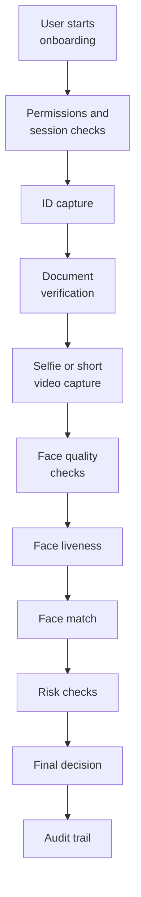
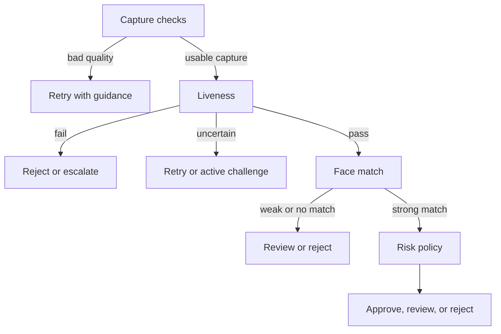

# 02. eKYC Integration

## Who should read this page

This page is most useful for product teams, solution architects, backend engineers, fraud teams, and anyone designing the end-to-end onboarding or verification flow.

---

## What this page covers

This page explains where face liveness fits inside the **full remote eKYC flow**.

The main idea is simple:

> Face liveness should not be treated as a standalone feature. It should sit at the right point in the capture, identity, fraud, and decision pipeline.

---

## A typical remote eKYC flow

A common flow looks like this:

1. User starts onboarding
2. Device or browser permissions are checked
3. ID document capture happens
4. Document verification happens
5. Selfie or short video capture happens
6. Face quality checks run
7. Face liveness runs
8. Face match runs against the ID portrait or enrolled face
9. Other fraud and risk checks run
10. Final policy decision is made
11. Audit records are stored

Some regulated or high-risk flows may add extra steps, but this structure is a good mental model.

---

## Visual flow

---

## Where liveness should sit

In most flows, face liveness should happen **before you fully trust the selfie for identity comparison**.

Why? Because a clean face match score does not prove the media is real.

### Common placement patterns

| Pattern | Flow | Best use | Watchout |
|--------|------|----------|----------|
| A | quality check → liveness → face match | clear and explainable default flow | slightly more sequential latency |
| B | liveness and face match in parallel | optimized low-latency flows | policy must keep the two signals separate |
| C | passive first, active only when needed | better balance of UX and security | requires stronger policy design |

#### Pattern A — quality check → liveness → face match
This is often the clearest production flow.

Benefits:

- bad input is rejected early
- compute is not wasted on obviously unusable capture
- live presence is checked before identity trust increases

#### Pattern B — liveness and face match in parallel
Useful when latency matters and the final decision waits for both results.

Benefits:

- faster end-to-end flow
- good for optimized production systems

Watchouts:

- the policy layer must still treat both checks separately
- a strong face match should not hide a weak liveness result

#### Pattern C — adaptive flow
Use passive liveness first, then ask for an active challenge only when risk is high or confidence is weak.

Benefits:

- better balance of security and user experience
- lower friction for good users

---

## A simple decision pipeline

### Step 1 — capture checks
Check for things like:

- single face present
- enough brightness
- acceptable blur
- stable framing
- face size in range

### Step 2 — liveness result
Possible outcomes:

- pass
- uncertain
- fail

### Step 3 — face match result
Possible outcomes:

- strong match
- weak match
- no match

### Step 4 — risk policy
Bring in supporting signals such as:

- document confidence
- device risk
- prior fraud signals
- retry history
- account policy

### Step 5 — final action
Possible actions:

- auto approve
- retry
- stronger challenge
- manual review
- hard reject

---

## Decision logic at a glance

---

## Why retry logic matters

Retry is not only a UX feature. It is part of security design.

### Good retry design

- explains the issue clearly
- separates quality problems from spoof suspicion
- caps the number of attempts
- logs why each retry happened
- can increase scrutiny after repeated uncertainty

### Bad retry design

- vague messages such as “verification failed”
- unlimited retries
- same weak capture instructions repeated every time
- no distinction between quality failure and suspected spoofing

---

## Why final policy must be broader than the model output

A liveness result should not be the only signal that decides whether an onboarding case is trusted.

The final policy layer may also consider:

- document verification confidence
- face match confidence
- known fraud patterns
- device integrity or device reputation
- user journey behavior
- velocity and retry history
- account risk level

This helps the system stay more robust than a single-score design.

---

## Practical example

A user provides a clean selfie. Liveness passes. But the face match against the ID portrait is weak.

That case should not pass only because liveness is good.

Now consider the reverse: face match is very strong, but liveness is weak or uncertain. That case also should not pass automatically.

Both checks matter because they answer different questions.

---

## Integration mistakes teams often make

- running face match first and trusting it too early
- merging liveness and identity results into one unclear score
- allowing too many retries without increased scrutiny
- failing to log why a case was approved, retried, or rejected
- designing fallback paths that become fraud shortcuts

---

## Practical takeaway

Face liveness creates the most value when it is treated as part of a **decision system**.

That means integrating it with:

- capture quality
- retry policy
- face match logic
- broader fraud checks
- final business decisioning
- audit and review workflows

When it is placed correctly in the flow, face liveness becomes much more valuable and easier to operate.

---

## Related docs

- [03. Deployment Guide](03-deployment-guide.md)
- [04. Best Practices](04-best-practices.md)
- [Appendix A5 — Security and Privacy](appendix/A5-security-and-privacy.md)

## Read next

Go to [03. Deployment Guide](03-deployment-guide.md).
