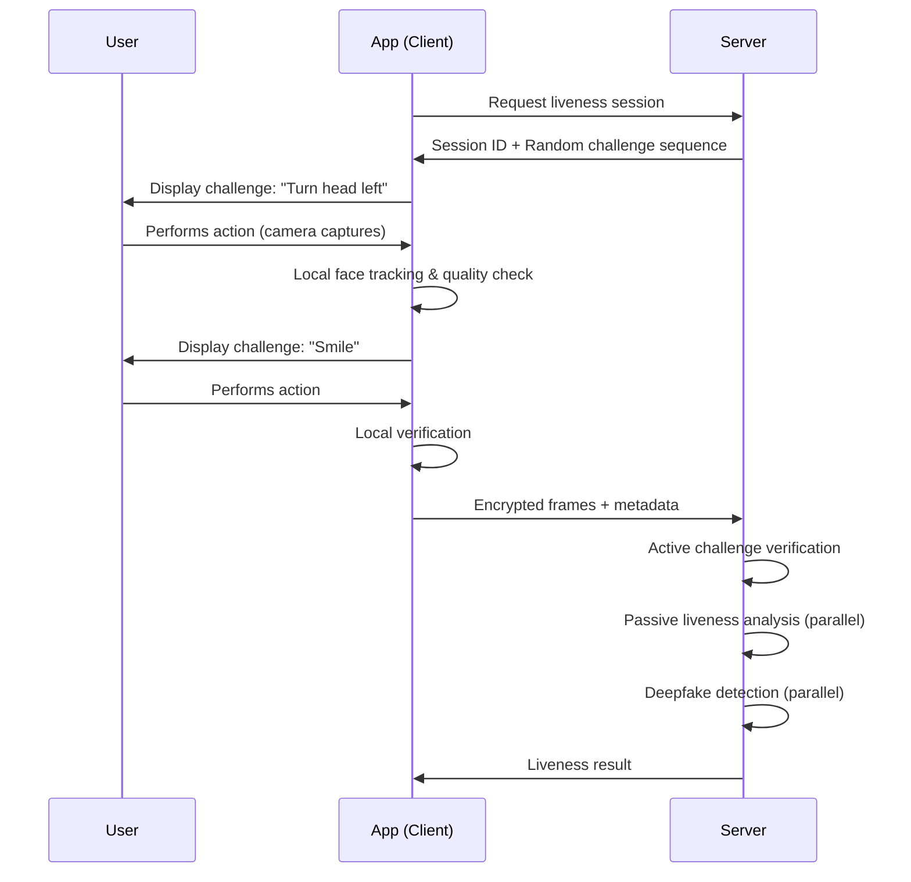
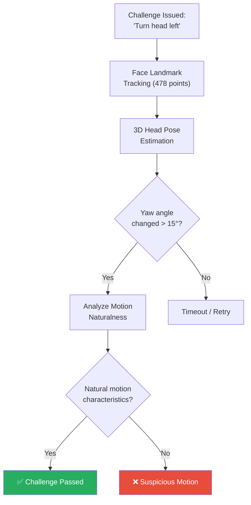
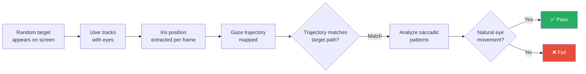
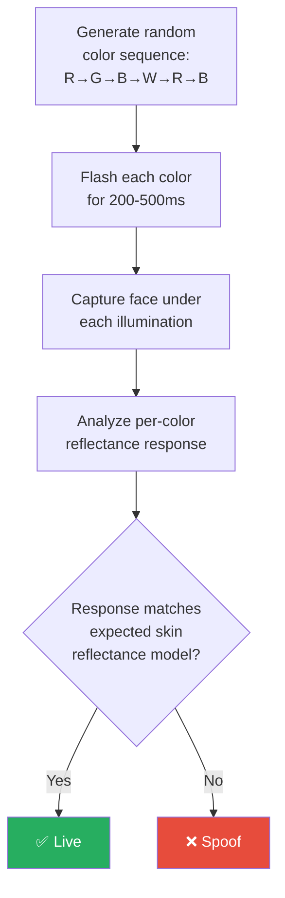
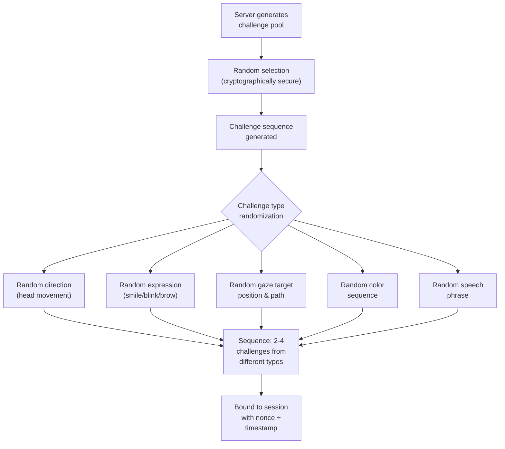
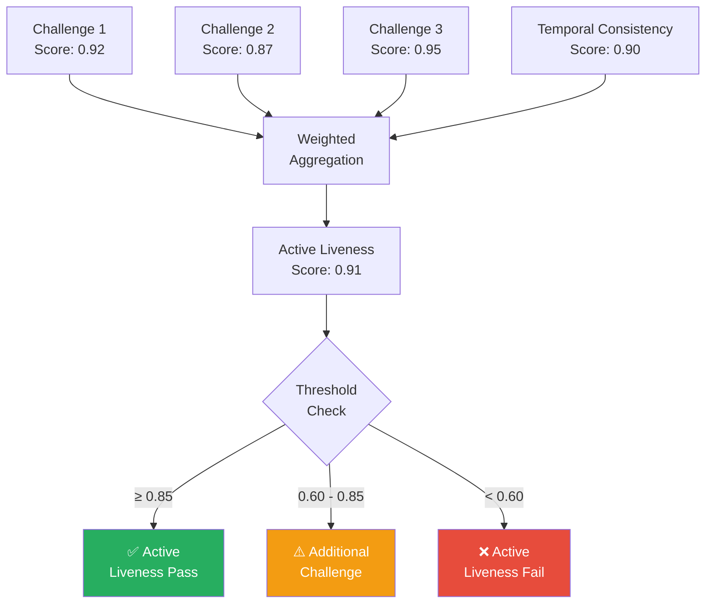

# 2.1 Active Liveness Detection

---

## Overview

Active liveness detection requires the user to perform **specific actions** in response to system-generated prompts. The system verifies both that the actions are performed correctly and that they exhibit characteristics consistent with a live human being.

---

## Challenge Types in Detail

### 1. Head Movement Challenges

The user is instructed to turn their head in a specific direction (left, right, up, down) or perform a sequence of movements.

**How It Works:**

**What the system analyzes:**

| Signal | Live Person | Photo/Screen Attack | 3D Mask |
|--------|------------|-------------------|---------|
| **Yaw/Pitch/Roll change** | Smooth, continuous | None or rigid (whole image moves) | Can simulate but lacks skin deformation |
| **Motion blur** | Natural blur at edges during rotation | Absent or uniform blur | Minimal, unnatural |
| **Parallax effects** | Nose tip moves faster than ears, depth-consistent | No parallax — flat image | Approximate parallax but incorrect for flexible features |
| **Skin deformation** | Neck skin folds, cheek compression | None | Absent or artificial |
| **Temporal dynamics** | Acceleration/deceleration curve matches human biomechanics | Instantaneous or mechanical | Approximate but measurable differences |
| **Background consistency** | Background perspective shifts with head movement | Background moves with face (screen) or stays static (photo) | Background may be visible around mask edges |

**Implementation parameters:**

| Parameter | Recommended Value | Rationale |
|-----------|------------------|-----------|
| Minimum yaw change | 15-25° | Below 15° is too easy to fake; above 25° causes user discomfort |
| Maximum allowed time | 3-5 seconds per direction | Prevents coached/assisted attacks while accommodating normal users |
| Minimum angular velocity | 5°/second | Ensures motion is intentional, not environmental vibration |
| Frame rate for tracking | 15-30 FPS | Below 15 FPS loses motion detail; above 30 adds no value for most cameras |
| Landmark model | 478-point mesh (MediaPipe) or 68-point (dlib) | 478-point provides superior head pose accuracy |

---

### 2. Facial Expression Challenges

The user is prompted to perform specific facial expressions — smile, raise eyebrows, open mouth, close eyes.

**How It Works:**

The system uses the **Facial Action Coding System (FACS)** to verify genuine muscle movements. Each expression corresponds to specific Action Units (AUs):

| Expression | Primary Action Units | What System Checks |
|-----------|---------------------|-------------------|
| **Smile** | AU6 (cheek raise) + AU12 (lip corner pull) | Both AUs activate together (Duchenne smile indicators); cheek muscles lift; crow's feet appear around eyes |
| **Blink** | AU45 (blink) | Lid closure speed (150-400ms natural), lid opening trajectory, simultaneous bilateral closure |
| **Raised Eyebrows** | AU1 (inner brow raise) + AU2 (outer brow raise) | Forehead wrinkles appear; skin texture changes dynamically; natural asymmetry |
| **Open Mouth** | AU25 (lips part) + AU26 (jaw drop) | Jaw hinge motion, teeth visibility progression, lip deformation |
| **Puffed Cheeks** | AU34 (puff) | Bilateral cheek expansion, chin muscle tension, natural asymmetry |

**Key detection signals:**

- **Muscle activation authenticity**: Real expressions involve coordinated muscle groups. A photo bent to simulate a smile doesn't produce the eye crinkle (AU6) or cheek lift.
- **Temporal dynamics**: Real expressions have natural onset (200-500ms), peak, and offset phases. Deepfakes often show unnatural timing.
- **Micro-expression leakage**: Before and after the requested expression, involuntary micro-expressions occur in genuine presentations.
- **Skin texture change**: Wrinkles appear and disappear dynamically with expressions; paper and screens can't replicate this.

!!! warning "Accessibility Concern"
    Expression-based challenges can be difficult or impossible for users with **facial paralysis (Bell's palsy), Parkinson's disease, post-stroke conditions, or Moebius syndrome**. Always provide alternative challenge types or passive liveness fallback for accessibility compliance.

---

### 3. Gaze Tracking Challenges

The user follows a moving target on the screen with their eyes.

**How It Works:**

**What makes gaze tracking effective:**

| Signal | Why It's Hard to Fake |
|--------|----------------------|
| **Saccadic movements** | Rapid, involuntary eye jumps between fixation points. Unique to live eyes. Average velocity: 300-500°/s |
| **Smooth pursuit** | Eyes track moving targets with a slight lag (50-100ms). Videos show no pupil tracking |
| **Vergence** | Eyes converge/diverge based on target distance. This requires real binocular vision |
| **Pupillary response** | Pupils dilate/constrict with light changes. Moving from bright to dark areas of screen produces measurable pupil change |
| **Vestibulo-ocular reflex** | Eyes counter-rotate when head moves to stabilize gaze. Photos can't exhibit this |
| **Microsaccades** | Tiny involuntary eye movements during fixation (0.2-1°). Present in all live eyes, absent in photos/videos |

---

### 4. Color Sequence Illumination

The device screen flashes a random sequence of colors while the front camera captures the user's face.

**How It Works:**

**Why it works:**

- **Subsurface scattering**: Real skin absorbs, scatters, and re-emits light differently at different wavelengths. Red light penetrates deeper into skin than blue light, causing different color-dependent reflectance patterns.
- **Screen attacks fail**: A screen displaying a face cannot react to the illumination from another screen. The pre-recorded face image has fixed lighting, so it doesn't change color naturally when illuminated.
- **Print attacks fail**: Paper has fundamentally different spectral reflectance than skin at every wavelength.
- **3D mask attacks**: Silicone and latex have different spectral absorption characteristics than skin, though this is the hardest case.

**Implementation considerations:**

| Parameter | Value | Notes |
|-----------|-------|-------|
| Number of colors | 4-8 | More colors = higher security, longer process |
| Duration per color | 200-500ms | Must be long enough for camera exposure adjustment |
| Color randomization | Per-session random sequence | Prevents replay of pre-recorded color responses |
| Color choices | Red, Green, Blue, White, Cyan, Magenta, Yellow | Primary and secondary colors for maximum spectral diversity |
| Ambient light baseline | Captured before sequence starts | Used to normalize color response measurements |

---

### 5. Speech-Based Challenges

The user reads a randomly generated phrase, number sequence, or one-time code displayed on screen.

**How It Works:**

The system performs multi-modal analysis:

| Analysis Layer | What's Checked |
|---------------|----------------|
| **Lip-sync correlation** | Mouth movements match the spoken audio timing and phoneme shapes |
| **Voice liveness** | Audio characteristics confirm a live voice (not text-to-speech or replay) |
| **Content verification** | The spoken words match the displayed prompt (ASR verification) |
| **Temporal alignment** | Audio and video are synchronized within acceptable tolerance (< 100ms) |
| **Replay detection** | Environmental acoustics match the visual environment; no echo/reverberation anomalies |

!!! info "Multi-Modal Strength"
    Speech-based challenges are particularly powerful because they require coordination of **visual (lip movements)**, **audio (speech)**, and **cognitive (reading comprehension)** channels simultaneously. This makes it extremely difficult for any single attack modality to succeed.

!!! warning "Limitations"
    - Not suitable for users with speech impairments, hearing loss, or in noisy environments
    - Privacy concerns with voice capture in some jurisdictions
    - Real-time lip-sync deepfakes (Wav2Lip) can now defeat basic lip-sync analysis
    - Adds 5-10 seconds to the verification process

---

## Challenge Randomization Strategy

The randomization of challenges is critical — predictable challenges can be pre-recorded and replayed.

**Randomization principles:**

1. **Challenge type randomization**: Don't always use the same challenge type. Mix head movements with expressions with gaze tracking.
2. **Parameter randomization**: Within each type, randomize direction (left vs right), expression (smile vs blink), target position, color sequence, and speech content.
3. **Sequence length randomization**: Vary the number of challenges (2-4) per session.
4. **Timing unpredictability**: Vary the delay between challenges (0.5-2 seconds).
5. **Server-side generation**: Challenges must be generated server-side and bound to the session with cryptographic nonces. Client-side generation is trivially bypassable.

---

## Scoring & Decision Logic

---

## Advantages & Disadvantages Summary

| Aspect | Rating | Details |
|--------|--------|---------|
| **Security against 2D attacks** | ⭐⭐⭐⭐⭐ | Challenge randomization makes photo/screen replay extremely difficult |
| **Security against 3D masks** | ⭐⭐⭐⭐ | Effective for rigid masks; flexible masks may simulate some movements |
| **Security against deepfakes** | ⭐⭐⭐⭐ | Multi-modal challenges increase difficulty; real-time deepfakes can partially respond |
| **User experience** | ⭐⭐⭐ | Adds 5-15 seconds; clear instructions needed; some users find it confusing |
| **Accessibility** | ⭐⭐ | Challenging for users with motor/visual/speech impairments |
| **Drop-off rate** | ⭐⭐⭐ | Typically 10-25% drop-off depending on challenge complexity and UX quality |
| **Processing speed** | ⭐⭐⭐ | 5-15 seconds for full challenge sequence |
| **Device requirements** | ⭐⭐⭐⭐ | Standard front camera + display; no special hardware needed |
| **Regulatory acceptance** | ⭐⭐⭐⭐⭐ | Widely accepted; explainable security model that regulators understand |

---

## Best Practices for Banking Deployment

!!! success "Implementation Recommendations"
    1. **Always combine with passive liveness** — Active challenges alone miss texture/frequency signals
    2. **Limit to 2-3 challenges** per session to minimize drop-off
    3. **Provide clear visual guidance** — Animated overlays showing expected motion
    4. **Implement progressive difficulty** — Start easy, escalate if risk signals detected
    5. **Offer accessibility alternatives** — Passive-only mode or Video KYC fallback for users who can't perform challenges
    6. **Server-side validation is mandatory** — Never trust client-side challenge verification alone
    7. **Monitor challenge completion rates** — If a specific challenge has >15% failure rate among genuine users, recalibrate or replace it
    8. **Randomize everything** — Challenge type, direction, sequence, timing

---

*Next: [Passive Liveness Detection →](passive-liveness.md)*
