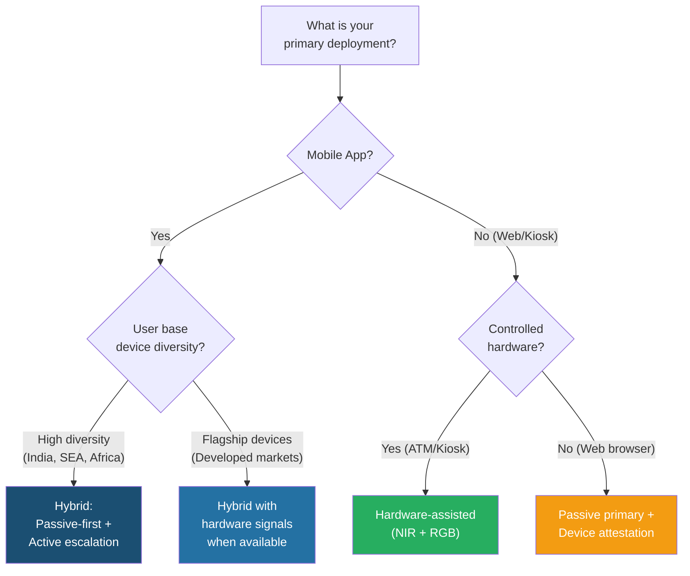

# 2.5 Comparison Matrix

---

## Comprehensive Comparison

| Criteria | Active | Passive | Hybrid | Hardware-Assisted |
|----------|--------|---------|--------|-------------------|
| **User Experience** | ⭐⭐⭐ Moderate | ⭐⭐⭐⭐⭐ Excellent | ⭐⭐⭐⭐ Good | ⭐⭐⭐⭐⭐ Excellent |
| **Security (2D)** | ⭐⭐⭐⭐⭐ | ⭐⭐⭐⭐ | ⭐⭐⭐⭐⭐ | ⭐⭐⭐⭐⭐ |
| **Security (3D Masks)** | ⭐⭐⭐⭐ | ⭐⭐⭐ | ⭐⭐⭐⭐ | ⭐⭐⭐⭐⭐ |
| **Security (Deepfakes)** | ⭐⭐⭐⭐ | ⭐⭐⭐ | ⭐⭐⭐⭐⭐ | ⭐⭐⭐⭐⭐ |
| **Security (Injection)** | ⭐⭐⭐ | ⭐⭐ | ⭐⭐⭐⭐ | ⭐⭐⭐⭐⭐ |
| **Accessibility** | ⭐⭐ | ⭐⭐⭐⭐⭐ | ⭐⭐⭐⭐ | ⭐⭐⭐ (device dependent) |
| **Drop-off Rate** | 10-25% | 2-5% | 5-10% | 2-5% |
| **Processing Time** | 5-15s | 1-3s | 2-8s | 1-2s |
| **Device Requirements** | Camera + Display | Camera only | Camera + Display | Specialized sensors |
| **Regulatory Acceptance** | ⭐⭐⭐⭐⭐ | ⭐⭐⭐⭐ Growing | ⭐⭐⭐⭐⭐ Highest | ⭐⭐⭐⭐ |
| **Implementation Cost** | Medium | Medium | High | Low (SDK) |
| **Maintenance Cost** | Medium | Medium | High | Low |
| **Scalability** | Good | Excellent | Good | Limited by device |

---

## Decision Matrix for Banking

!!! success "The Banking Recommendation"
    **Hybrid (passive-first with active escalation)** is the recommended approach for most banking deployments. It provides the best balance of security, user experience, accessibility, and regulatory compliance.

---

*Next: [Part III — Attack Taxonomy Overview →](../03-attack-landscape/taxonomy-overview.md)*
