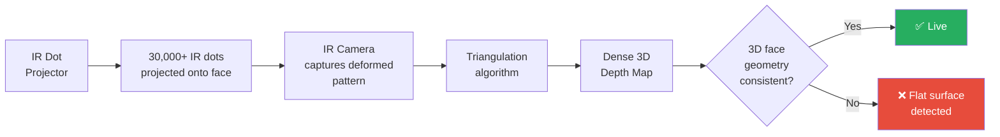

# 2.4 Hardware-Assisted Liveness

---

## Overview

Hardware-assisted liveness leverages **specialized sensors** beyond the standard RGB camera to provide additional modalities for distinguishing live faces from spoofs.

---

## Structured Light (Apple TrueDepth / Android Equivalents)

### How It Works

A projector emits a known pattern of **infrared dots** (30,000+ dots for Face ID) onto the face. An IR camera captures the deformed pattern. The deformation encodes 3D depth information.

| Property | Details |
|----------|---------|
| **Accuracy** | Sub-millimeter depth precision |
| **Range** | 25-50cm (optimal for selfie distance) |
| **Speed** | Real-time (30 FPS depth maps) |
| **Attack resistance** | Defeats all 2D attacks; most 3D attacks except high-quality silicone masks |
| **Availability** | iPhone X and later (TrueDepth); select Android flagships (limited) |

### Limitations for Banking

- **Device dependency**: Only ~35% of global smartphone users have structured light sensors
- **Cannot be mandated**: Inclusive banking requires supporting all device types
- **Use as enhancement**: Use when available, fall back to RGB-only liveness when not

---

## Time-of-Flight (ToF) Sensors

Emits modulated light and measures the **phase shift** of returned light to calculate distance per pixel.

| Property | Details |
|----------|---------|
| **Accuracy** | 1-5mm depth precision |
| **Range** | 0.2-5 meters |
| **Speed** | 30-60 FPS |
| **Availability** | Samsung Galaxy S20+, Huawei P30 Pro, select others |
| **Limitation** | Lower resolution than structured light; susceptible to ambient IR interference |

---

## Near-Infrared (NIR) Imaging

NIR cameras capture reflectance at 850-940nm wavelength, where materials behave very differently than in visible light.

| Material | NIR Behavior | Visible Light Behavior |
|----------|-------------|----------------------|
| **Live skin** | Moderate absorption, subsurface scattering visible | Normal skin appearance |
| **Paper** | High reflectance, uniform | Shows printed texture |
| **LCD screen** | Very low emission (backlight doesn't emit NIR) | Displays image |
| **OLED screen** | Near-zero NIR emission | Displays image |
| **Silicone** | Different absorption pattern than skin | May look similar to skin |
| **Latex** | High reflectance, different from skin | May look similar to skin |

!!! success "NIR is Extremely Effective"
    NIR imaging can distinguish live skin from screens with **near-perfect accuracy** because screens emit virtually no NIR light. This is why ATM and kiosk-based systems prefer NIR cameras.

---

## Recommendation for Banking

| Deployment Context | Recommended Approach |
|-------------------|---------------------|
| **Mobile app (diverse devices)** | RGB-only liveness (passive + active), with hardware features as bonus signals when available |
| **ATM / Kiosk** | NIR camera + RGB (controlled hardware, can mandate sensor) |
| **Branch tablet** | Structured light if available (iPad Pro), else RGB liveness |
| **Web browser** | RGB only (no hardware sensor access) |

---

*Next: [Comparison Matrix →](comparison-matrix.md)*
