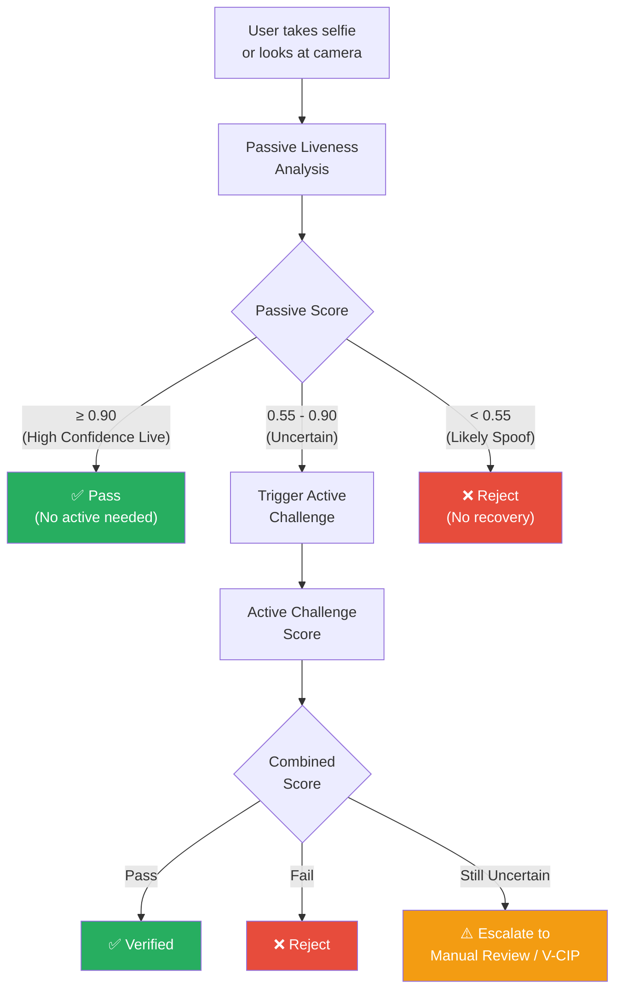
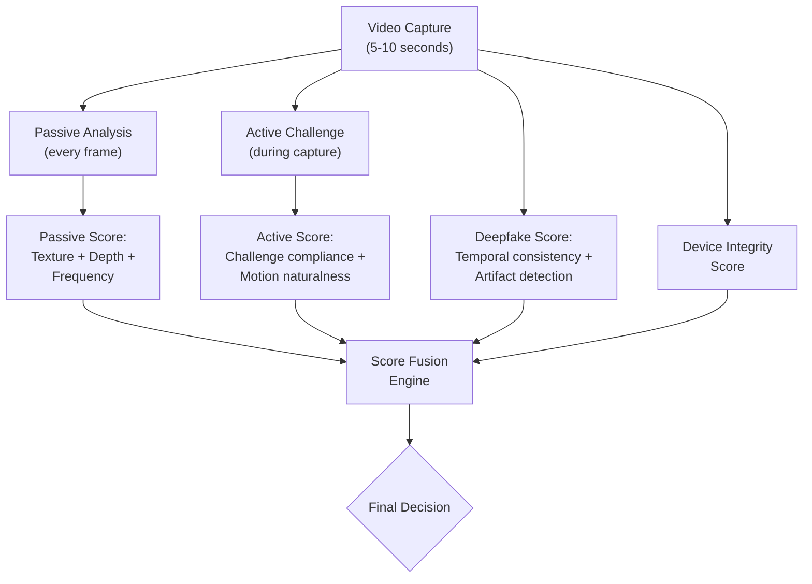

# 2.3 Hybrid & Adaptive Liveness

---

## Overview

Hybrid liveness detection combines **active and passive methods** into a unified system that adapts its behavior based on risk signals, environmental conditions, and confidence levels. This is the **recommended approach for banking deployments** — it provides the best balance of security, user experience, and regulatory compliance.

---

## Architecture Patterns

### Pattern 1: Passive-First with Active Escalation (Recommended)



**Why this works best:**

- **80-90% of genuine users** pass passive liveness with high confidence — they never see an active challenge
- Only **uncertain cases** (10-20%) are escalated to active challenges, minimizing friction
- **Clear spoofs** are rejected immediately without wasting the user's time on challenges
- **Overall drop-off**: 3-8% (vs. 10-25% for always-active)

### Pattern 2: Parallel Analysis

Both active and passive analysis run simultaneously on the same video capture.



### Pattern 3: Risk-Adaptive (Most Sophisticated)

The system dynamically adjusts its verification intensity based on pre-computed risk signals.

| Risk Signal | Low Risk | Medium Risk | High Risk |
|-------------|----------|-------------|-----------|
| **Transaction value** | < $1,000 | $1,000 - $50,000 | > $50,000 |
| **Account age** | > 2 years | 6 months - 2 years | New account |
| **Device** | Known device | New but attested device | Unknown / emulator / rooted |
| **Geolocation** | Home location | Domestic travel | International / VPN / proxy |
| **Behavioral biometrics** | Normal typing/swipe patterns | Slightly anomalous | Highly anomalous |
| **Time of day** | Normal hours | Off-hours | 2-5 AM local time |
| **Previous attempts** | First attempt | 2nd attempt | 3+ attempts |

| Risk Level | Liveness Approach |
|-----------|------------------|
| **Low** | Passive only (single selfie) |
| **Medium** | Passive + 1 active challenge |
| **High** | Passive + 2-3 active challenges + deepfake detection |
| **Critical** | Full active sequence + deepfake + device attestation + manual review queue |

---

## Score Fusion Strategies

### Weighted Linear Fusion

```
Final_Score = w₁ × Passive_Score + w₂ × Active_Score + w₃ × Deepfake_Score + w₄ × Device_Score
```

Typical weights for banking:

| Component | Weight | Rationale |
|-----------|--------|-----------|
| Passive Liveness | 0.35 | Strong baseline signal from texture/depth/frequency |
| Active Challenge | 0.30 | High-confidence signal from challenge-response |
| Deepfake Detection | 0.20 | Essential for emerging threats |
| Device Integrity | 0.15 | Prevents injection and tampering attacks |

### Decision-Level Fusion (Voting)

Each subsystem makes an independent live/spoof decision. Final decision uses voting:

- **All agree LIVE**: Accept
- **Majority LIVE, minority uncertain**: Accept with monitoring flag
- **Any subsystem says SPOOF with high confidence**: Reject
- **Split decision**: Escalate to manual review

### Learned Fusion (Best Performance)

A small neural network or gradient-boosted classifier learns to combine scores optimally from labeled data:

```
Input: [passive_score, active_score, deepfake_score, device_score, 
        face_quality, ambient_light, device_model, ...]
Output: final_liveness_probability
```

This learns non-linear relationships (e.g., "low passive score is acceptable IF device integrity is perfect AND active score is very high").

---

## Implementation Recommendations for Banking

!!! success "Best Practices"
    1. **Default to Pattern 1** (Passive-first with active escalation) for onboarding
    2. **Use Pattern 3** (Risk-adaptive) for transaction authentication and step-up
    3. **Always include deepfake detection** as a parallel signal regardless of pattern
    4. **Set aggressive passive thresholds** for auto-pass (≥ 0.90) and auto-reject (< 0.55)
    5. **Log everything** — every score, every decision, every frame for audit
    6. **A/B test thresholds** with fraud rate and drop-off rate as dual metrics
    7. **Review monthly**: Attack landscape evolves; thresholds need recalibration

---

*Next: [Hardware-Assisted Liveness →](hardware-assisted.md)*
