# 2.2 Passive Liveness Detection

---

## Overview

Passive liveness detection analyzes a **single image or short video clip** without requiring any explicit user interaction. The system extracts features from the captured face that distinguish live presentations from spoofed ones — all transparently, in the background.

!!! tip "The User's Experience"
    From the user's perspective, passive liveness is invisible. They simply take a selfie or look at the camera, and the system makes its determination. This results in a **seamless, frictionless experience** with the highest completion rates.

```mermaid
graph LR
    A["📸 User takes<br>selfie / looks<br>at camera"] --> B["Face Detection<br>& Quality Check"]
    B --> C["Feature<br>Extraction"]
    C --> D["Multi-Signal<br>Analysis"]
    D --> E["Liveness<br>Score"]
    E --> F{"Decision"}
    F -->|"Live"| G["✅ Continue<br>to face matching"]
    F -->|"Spoof"| H["❌ Reject"]
    
    style G fill:#27ae60,color:#fff
    style H fill:#e74c3c,color:#fff
```

---

## Core Analysis Methods

### 1. Texture Analysis (Spatial Domain)

The most fundamental passive liveness signal. Deep learning models analyze **micro-texture patterns** at the pixel level.

**What the model looks for:**

| Feature | Live Skin | Printed Photo | Screen Display | 3D Mask |
|---------|-----------|---------------|----------------|---------|
| **Pore structure** | Natural, irregular pore distribution | Halftone dot patterns replace pores | Pixel grid visible under analysis | Smooth or artificially textured |
| **Skin micro-texture** | Rich, multi-scale texture with natural variation | Ink dot patterns, paper fiber texture | RGB sub-pixel patterns, aliasing | Silicone/latex grain, paint texture |
| **Specular highlights** | Single, consistent environmental reflections on oily regions | Matte paper: absent. Glossy: paper-like reflectance | Glass/screen reflections overlaid on face | Material-dependent, often too uniform |
| **Color distribution** | Wide, natural skin color gamut with subsurface warmth | Limited printer gamut, shifted color balance | Backlit colors, potential color banding | Paint/pigment gamut, often slightly off |
| **Edge characteristics** | Smooth 3D-to-background transition with natural depth-of-field | Sharp 2D cutout edges, paper boundary visible | Screen bezel boundary, Moiré at edges | Mask-to-skin boundary visible |

**How texture models work internally:**

```mermaid
graph TD
    A["Input Face Image<br>224×224 or 256×256"] --> B["Backbone CNN<br>(MobileNetV3 / EfficientNet)"]
    B --> C["Multi-Scale<br>Feature Maps"]
    C --> D["Low-level features:<br>Edge patterns, noise<br>(Layers 1-3)"]
    C --> E["Mid-level features:<br>Texture patterns, pores<br>(Layers 4-8)"]
    C --> F["High-level features:<br>Semantic understanding<br>(Layers 9+)"]
    D --> G["Feature<br>Aggregation"]
    E --> G
    F --> G
    G --> H["Classification Head"]
    H --> I["Liveness Score<br>0.0 → 1.0"]
```

---

### 2. Depth Estimation

Neural networks estimate the 3D geometry of the face from a single 2D image. Live faces produce **consistent 3D depth maps**; flat attacks produce anomalous depth.

**Depth map comparison:**

| Scenario | Expected Depth Map | Key Characteristics |
|----------|-------------------|---------------------|
| **Live face** | Nose protrudes (closest to camera), eyes recessed in orbits, cheeks curve away, chin projects forward | Smooth, anatomically consistent depth gradients; 40-80mm depth range across face |
| **Printed photo** | Flat plane with minor curvature from paper bending | Near-uniform depth; no anatomical depth structure; < 5mm depth variation |
| **Screen display** | Flat plane matching screen surface | Perfectly uniform depth; possible slight concavity from screen curvature |
| **3D rigid mask** | Approximate facial geometry but incorrect in fine details | Exaggerated or incorrect nasal bridge, missing orbital depth, uniform surface without fine detail |
| **3D flexible mask** | Close to real but with detectable differences | Subtle geometric deviations, especially around eyes, nostrils, and mouth |

**Training approach for depth-based liveness:**

The model is trained with **auxiliary depth supervision** — alongside the liveness label, the model learns to predict a depth map:

- For **live faces**: Ground truth depth map generated from a 3D face reconstruction model (e.g., 3DDFA, DECA)
- For **spoof faces**: Ground truth depth is a zero/flat map
- The model learns that "being live" is associated with "having valid 3D structure"

---

### 3. Frequency Domain Analysis

**Fourier Transform and Wavelet analysis** reveal frequency signatures characteristic of different media.

```mermaid
graph LR
    A["Face Image"] --> B["2D FFT<br>(Fourier Transform)"]
    B --> C["Power Spectrum"]
    C --> D["Frequency<br>Signature Analysis"]
    
    D --> E["High-frequency peaks<br>at regular intervals?<br>→ Print halftone"]
    D --> F["RGB sub-pixel<br>frequency peaks?<br>→ Screen display"]
    D --> G["Natural 1/f<br>noise falloff?<br>→ Live face"]
    D --> H["GAN upsampling<br>artifacts?<br>→ Deepfake"]
```

**Frequency signatures by attack type:**

| Attack Type | Frequency Domain Signature |
|-------------|---------------------------|
| **Live face** | Natural 1/f noise spectrum (power decreases inversely with frequency); sensor noise pattern consistent with camera model |
| **Laser/inkjet print** | Periodic peaks corresponding to halftone screen frequency (typically 150-300 LPI); paper texture frequency |
| **LCD screen** | Peaks at pixel pitch frequency (varies with screen PPI); RGB sub-pixel pattern frequencies; backlight frequency |
| **OLED screen** | Sub-pixel pattern (PenTile or RGB stripe); different from LCD due to pixel layout |
| **GAN-generated** | Upsampling artifacts at specific frequencies; checkerboard patterns from transposed convolutions; GAN fingerprint |
| **Deepfake (face swap)** | Blending boundary frequencies; inconsistent noise patterns between swapped face and surrounding area |

---

### 4. Reflection & Specularity Analysis

Analysis of how light interacts with the presentation surface.

**Key signals:**

- **Corneal reflections**: Live eyes show clear reflections of the environment (lights, windows, screens). The reflection should be consistent with the ambient scene and identical in both eyes. Screens show screen-within-screen reflections.
- **Skin specularity**: Oily skin areas (T-zone: forehead, nose, chin) show specular highlights that move consistently with head motion and lighting direction.
- **Double reflection**: Screen-based attacks often show two reflection sources — one from the original scene captured in the photo/video, and one from the attack screen surface.
- **Polarization cues**: Though not capturable with standard cameras, the principle applies — reflections from glass (screens) are partially polarized differently than reflections from skin.

---

### 5. Image Quality & Artifact Detection

Detection of artifacts that indicate a non-live source.

| Artifact | Indicates | Detection Method |
|----------|-----------|-----------------|
| **Moiré patterns** | Screen capture of another screen | Frequency analysis for periodic interference patterns |
| **JPEG compression artifacts** | Re-compressed image (not fresh capture) | Block boundary analysis, quantization table detection |
| **Color banding** | Limited bit depth or color gamut compression | Gradient analysis in smooth regions (cheeks, forehead) |
| **Pixel repetition** | Digital zoom or upscaling | Auto-correlation analysis for repeating pixel patterns |
| **Edge ringing** | Sharpening artifacts from processing | High-pass filter analysis near strong edges |
| **Noise inconsistency** | Composited image (different noise levels in face vs background) | Local noise estimation across image regions |
| **Lens distortion absence** | Non-camera source (rendered or stitched image) | Radial distortion model fitting |
| **EXIF metadata anomalies** | Modified or fabricated image | Metadata consistency checks (though unreliable — easily faked) |

---

### 6. Remote Photoplethysmography (rPPG)

Even from a "single image" passive approach, **short video clips** (2-5 seconds) enable rPPG analysis — one of the strongest passive liveness signals.

**Why rPPG is powerful:**

- Blood flow causes **micro-color changes** in skin (imperceptible to the human eye but detectable by cameras) synchronized with the heartbeat
- **No known attack** can synthetically reproduce physiologically accurate rPPG signals in real-time
- Works as a strong **supplementary signal** even when other passive methods are uncertain
- **Limitation**: Requires 2-5 second video, not a single frame; affected by motion, compression, and very dark skin tones

---

## Model Architecture for Passive Liveness

### Recommended Architecture: Multi-Task Learning

**Multi-task benefits:**

- Depth map supervision provides **better gradient signal** than binary classification alone
- Attack type classification enables **interpretable decisions** (know what type of attack was detected)
- Domain classifier (with gradient reversal) enables **domain-invariant features** for better generalization

---

## Advantages & Disadvantages

| Aspect | Rating | Details |
|--------|--------|---------|
| **User experience** | ⭐⭐⭐⭐⭐ | Zero friction — user just takes a selfie; highest completion rates |
| **Accessibility** | ⭐⭐⭐⭐⭐ | No motor/speech/cognitive requirements; works for all users |
| **Processing speed** | ⭐⭐⭐⭐⭐ | 100-500ms for single-frame; 1-3s with short video |
| **Drop-off rate** | ⭐⭐⭐⭐⭐ | 2-5% (mostly due to camera quality, not liveness UX) |
| **Security (2D attacks)** | ⭐⭐⭐⭐ | Strong against prints and basic screen replays |
| **Security (3D masks)** | ⭐⭐⭐ | Moderate — texture analysis helps but geometry can fool depth models |
| **Security (deepfakes)** | ⭐⭐⭐ | Moderate — depends on deepfake quality and detector sophistication |
| **Security (injection attacks)** | ⭐⭐ | Weak if only analyzing image content without device/session validation |
| **Regulatory acceptance** | ⭐⭐⭐⭐ | Growing acceptance; some regulators still prefer active challenge evidence |
| **Explainability** | ⭐⭐⭐ | Harder to explain "why rejected" to regulators compared to active methods |

---

## When to Use Passive Liveness

!!! success "Ideal For"
    - High-volume, low-friction onboarding where drop-off reduction is critical
    - First-pass screening before active challenge escalation
    - Inclusive deployments where accessibility is a hard requirement
    - Markets where users are less tech-savvy and active challenges cause confusion
    - Transaction authentication where speed is essential

!!! warning "Not Sufficient Alone For"
    - High-value banking transactions (combine with active or multi-modal)
    - Jurisdictions where regulators explicitly require active challenge evidence
    - Deployments where sophisticated deepfake attacks are a primary threat
    - Scenarios where virtual camera injection is a known attack vector

---

*Next: [Hybrid & Adaptive Liveness →](hybrid-liveness.md)*
