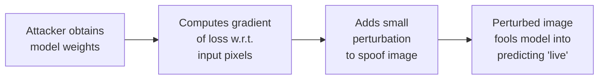
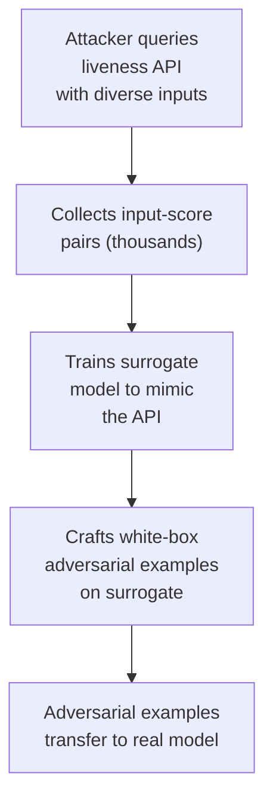

# 3.7 Adversarial Machine Learning Attacks

---

## Overview

Adversarial ML attacks target the **machine learning models** powering the liveness system. Instead of fooling the camera with physical artifacts, they fool the neural network with carefully crafted input modifications.

---

## Attack Types

### White-Box Attacks (Attacker Has Model Access)

| Method | Perturbation Size | Success Rate | Detectability |
|--------|------------------|-------------|---------------|
| **FGSM** (Fast Gradient Sign) | ε = 4/255 | 60-80% | Low perturbation — nearly invisible |
| **PGD** (Projected Gradient Descent) | ε = 8/255 | 85-95% | Moderate perturbation |
| **C&W Attack** | Minimal (optimized) | 95-99% | Minimal — optimized for imperceptibility |
| **AutoAttack** | Varies | 90-98% | Ensemble of attacks |

### Black-Box Attacks (No Model Access)

| Method | Approach | Queries Needed | Success Rate |
|--------|----------|---------------|-------------|
| **Transfer attack** | Craft adversarial on surrogate model; hope it transfers | 0 (transfer) | 30-60% |
| **Score-based** | Use returned scores to estimate gradients | 1,000-10,000 | 50-80% |
| **Decision-based** | Only uses accept/reject decisions | 10,000-100,000 | 40-70% |
| **Query-efficient** | Combines transfer + score-based | 100-1,000 | 60-85% |

### Model Extraction

---

## Defenses

| Defense | Mechanism | Effectiveness | Cost |
|---------|-----------|---------------|------|
| **Adversarial training** | Include adversarial examples in training data | 🟢 High — most effective single defense | Training time +50-100% |
| **Input preprocessing** | JPEG compression, spatial smoothing, bit-depth reduction before model | 🟡 Moderate — destroys some perturbations | Minimal |
| **Ensemble models** | Multiple diverse models; adversarial for one unlikely to fool all | 🟢 High — diversity is key | Inference cost ×N |
| **Randomized smoothing** | Add random noise to input; average predictions over multiple samples | 🟡 Moderate — certified robustness | Inference time ×K |
| **Rate limiting** | Limit API queries per device/IP/session | 🟢 High against query-based attacks | Minimal |
| **Score obfuscation** | Return binary decision instead of continuous score; add noise to scores | 🟢 High against score-based attacks | Minimal |
| **Model diversity** | Rotate between different model architectures periodically | 🟡 Moderate — prevents persistent extraction | Maintenance overhead |
| **Input anomaly detection** | Detect statistically anomalous input patterns that suggest adversarial manipulation | 🟡 Moderate | Additional model required |

---

## Banking Recommendation

!!! success "Defense-in-Depth Against Adversarial Attacks"
    1. **Adversarial training** as standard practice in model training pipeline
    2. **Never return raw scores** to the client — binary decisions only via API
    3. **Rate limit aggressively** — max 3-5 attempts per session, 10 per device per day
    4. **Ensemble of 2-3 diverse models** for production inference
    5. **Monitor score distributions** — sudden shifts indicate possible adversarial probing
    6. **Rotate models** quarterly with architectural diversity

---

*Back to: [Attack Taxonomy Overview →](taxonomy-overview.md)*
