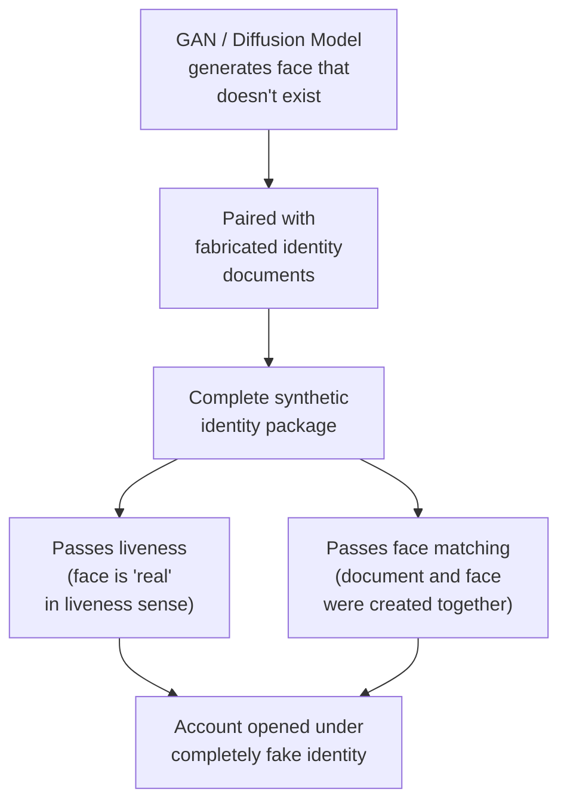

# 3.4 AI & Generative Attacks

---

## Overview

AI-powered attacks represent the **fastest-evolving threat** to face liveness systems. The quality of AI-generated facial content improves dramatically every few months, consistently outpacing detection capabilities.

---

## Deepfake Subtypes

### Face Swap

Replaces one person's face with another's while maintaining original head movements.

| Tool | Quality | Real-time? | Free? |
|------|---------|-----------|-------|
| DeepFaceLab | Very High | No (offline) | Yes |
| FaceSwap | High | No (offline) | Yes |
| Roop / ReActor | High | Near real-time | Yes |
| InsightFace inswapper | Very High | Yes | Yes |
| DeepFaceLive | High | Yes (real-time) | Yes |

### Face Reenactment

Transfers expressions from attacker to target face identity in real-time.

| Tool | Quality | Latency | Key Risk |
|------|---------|---------|----------|
| First Order Motion Model | Good | ~100ms | Can drive any face from a single photo |
| LivePortrait | Very High | ~50ms | Extremely realistic expression transfer |
| MegaPortraits | Excellent | ~80ms | State-of-the-art quality |
| Thin-Plate Spline Motion | Good | ~120ms | Works from a single source image |

### Lip Sync

Synchronizes mouth movements to arbitrary audio — used to bypass speech-based liveness challenges.

| Tool | Quality | Use Case |
|------|---------|---------|
| Wav2Lip | Good | Lip sync to any audio |
| SadTalker | Very Good | Full head animation + lip sync |
| VideoReTalking | Excellent | High-fidelity talking head |
| EMO | Excellent | Emotion-preserving animation |

---

## Synthetic Identity Generation

**Detection approaches:**
- **GAN fingerprint detection**: GANs leave characteristic frequency-domain artifacts
- **Face quality anomaly**: Synthetic faces often have subtle quality anomalies (too perfect symmetry, unusual ear/hair detail)
- **Cross-database checks**: Duplicate face across multiple identities
- **Document forensics**: Detect the fabricated document independently

---

## Morphing Attacks

Blending two faces so the resulting image matches both identities. Used primarily for **document fraud** (putting a morphed photo on an ID that can verify against two different people).

| Morphing Method | Quality | Detection Difficulty |
|----------------|---------|---------------------|
| Landmark-based warping | Moderate | 🟡 Medium — visible artifacts at blending boundaries |
| GAN-based morphing (MorGAN, MIPGAN) | High | 🔴 High — fewer visible artifacts |
| Diffusion-based morphing | Very High | 🔴🔴 Very High — state of the art quality |

---

## Defense Strategy

!!! success "Multi-Layer AI Attack Defense"
    1. **Temporal consistency**: Analyze frame-to-frame consistency — deepfakes flicker at face boundaries
    2. **Physiological signals (rPPG)**: Blood flow detection is extremely hard to synthesize
    3. **Forensic frequency analysis**: GAN fingerprints, upsampling artifacts detectable in FFT
    4. **Environmental consistency**: Lighting, reflections, and background should be physically plausible
    5. **Ensemble detection**: Multiple detectors trained on different architectures
    6. **Continuous retraining**: Monthly model updates with latest attack samples
    7. **Active challenges**: Randomized, multi-modal challenges increase attack difficulty

---

*Next: [Deepfakes — The Evolving Threat →](deepfakes.md)*
