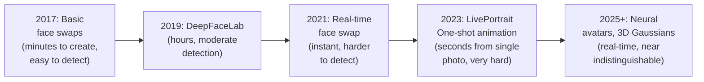
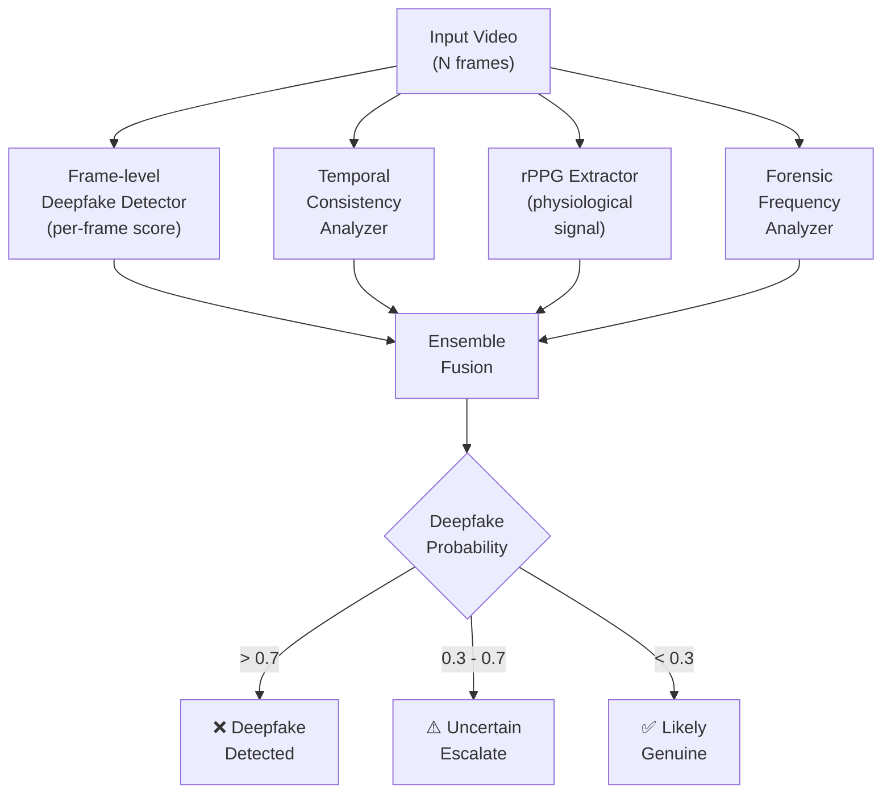

# 3.5 Deepfakes — The Evolving Threat

---

## The Arms Race

---

## Why Deepfakes Are Uniquely Dangerous for Banking

1. **Low barrier to entry**: Free tools, consumer GPUs, tutorial videos
2. **Real-time capability**: Can respond to active liveness challenges live
3. **Scalability**: One model can generate unlimited attack attempts
4. **Improving faster than detection**: Generative AI advances outpace defensive AI
5. **Cross-modal**: Can combine face + voice for multi-modal bypass

---

## Detection Signals

| Signal | What To Look For | Reliability |
|--------|-----------------|-------------|
| **Temporal flickering** | Face boundary flickers between frames | Good for lower-quality deepfakes; fading for state-of-the-art |
| **Blending boundary** | Visible seam where swapped face meets original | Good — most swaps still show subtle boundaries |
| **Frequency artifacts** | GAN upsampling creates checkerboard patterns in FFT | Good but increasingly addressed by newer models |
| **Eye reflection inconsistency** | Reflections in left vs right eye should match; deepfakes often don't | Moderate — improving in newer methods |
| **Physiological absence (rPPG)** | No detectable heart rate signal in synthetic face | Excellent — extremely hard to fake |
| **Lip sync quality** | Subtle timing/shape mismatches between audio and mouth | Moderate — tools like Wav2Lip are very good |
| **Hair/ear/neck artifacts** | Deepfakes struggle with fine hair detail, ear consistency, neck blending | Good supplementary signal |
| **Background consistency** | Face processing may leave background untouched, creating lighting/color mismatch | Moderate |

---

## Anti-Deepfake Architecture

---

## Recommended Research Papers

- FaceForensics++ (Rössler et al., 2019) — benchmark dataset
- Thinking in Frequency (Qian et al., 2020) — frequency analysis approach
- Multi-Attentional Deepfake Detection (Zhao et al., 2021) — attention-based
- DeepfakeBench (Yan et al., 2023) — comprehensive benchmark
- Implicit Identity Leakage (Dong et al., 2023) — identity-based detection

---

*Next: [Social Engineering & Process Attacks →](social-engineering.md)*
