# 3.3 Digital & Injection Attacks

---

## Overview

Digital attacks **bypass the physical camera entirely**, injecting manipulated content into the capture pipeline at various points. These are particularly dangerous because they circumvent all physical-level defenses (texture, specularity, depth from structured light).

---

## Virtual Camera Injection

### Attack Flow

```mermaid
graph TD
    A["Attacker installs\nvirtual camera software\n(OBS, ManyCam, v4l2loopback)"] --> B["Feeds pre-recorded\nor deepfake video\nas camera input"]
    B --> C["Banking app opens\n'camera' — sees\nvirtual camera feed"]
    C --> D["Liveness system\nreceives injected\nframes"]
```

### Detection Methods

| Method | How It Works | Effectiveness |
|--------|-------------|---------------|
| **Virtual camera driver detection** | Enumerate camera devices; flag known virtual camera names (OBS, ManyCam, DroidCam) | 🟡 Moderate — can be renamed |
| **Camera API integrity check** | Verify frames come from hardware camera API, not software source | 🟡 Moderate — hookable |
| **Device attestation** | SafetyNet (Android) / DeviceCheck (iOS) confirms device integrity | 🟢 High — hard to bypass on non-rooted devices |
| **Root/Jailbreak detection** | Detect rooted Android or jailbroken iOS | 🟢 High — required for most injection attacks |
| **Frame metadata validation** | Check EXIF, camera sensor metadata, frame timing consistency | 🟡 Moderate — metadata can be faked |
| **Sensor correlation** | Correlate camera frames with gyroscope/accelerometer data (hand movement should match video motion) | 🟢 High — very difficult to fake |

---

## Camera API Hooking

### Android (Frida / Xposed)

```mermaid
graph LR
    A["Camera\nHardware"] --> B["Camera HAL\n(Hardware Abstraction)"]
    B --> C["Camera2 API\n/ CameraX"]
    C --> D["⚠️ HOOK POINT:\nFrida/Xposed\nintercepts here"]
    D --> E["Banking App\n(receives modified frames)"]
```

**Defense layers:**

1. **SDK integrity verification** — Detect if SDK code has been modified
2. **Anti-debugging** — Detect Frida, GDB, LLDB, and other debuggers
3. **Anti-hooking** — Detect Xposed, Magisk, and substrate frameworks
4. **Code obfuscation** — Make hooking targets harder to identify
5. **Server-side validation** — Never trust client-side liveness results alone

---

## API & Network Attacks

| Attack | Description | Defense |
|--------|-------------|---------|
| **API Replay** | Capture and replay a valid liveness request | Session-bound nonces, timestamp validation, one-time tokens |
| **Man-in-the-Middle** | Intercept and modify video frames in transit | TLS certificate pinning, end-to-end frame encryption |
| **Parameter Tampering** | Modify liveness scores in API requests | Server-side score computation, signed payloads, HMAC verification |
| **Rate Limiting Bypass** | Brute-force multiple attack attempts | Per-device, per-IP, per-session rate limiting with exponential backoff |

---

## SDK Tampering

| Attack | Description | Defense |
|--------|-------------|---------|
| **APK Repackaging** | Decompile app, disable liveness, recompile | Code obfuscation (ProGuard/R8), integrity checks, Google Play Integrity API |
| **Runtime Method Hooking** | Hook liveness SDK methods to return "pass" | Anti-hooking detection, method integrity verification |
| **WebRTC Manipulation** | Modify browser media stream for web liveness | Server-side analysis, challenge-response binding, no client-side trust |

---

## Relay / Proxy Attacks

A **legitimate person** completes liveness at Location A, but their camera feed is relayed to Location B where the KYC is being performed.

!!! danger "Particularly Dangerous"
    Relay attacks pass all liveness checks because a real person IS performing them. The system must detect that the **location/device context is wrong**, not that the face is fake.

**Detection:**
- Geolocation verification (GPS + IP + cell tower triangulation)
- Network latency analysis (relay introduces measurable delay)
- Device fingerprinting (ensure consistent device across session)

---

*Next: [AI & Generative Attacks →](ai-generative-attacks.md)*
