# 3.2 Physical Presentation Attacks

---

## Overview

Physical presentation attacks involve presenting a **tangible artifact** to the camera sensor. These are the most common attack type, accounting for approximately **70-80% of real-world liveness attack attempts** against banking systems.

---

## 2D Flat Attacks

### Print Attacks

```mermaid
graph TD
    subgraph "Print Attack Variants"
        A["Standard office<br>print (A4)<br>🟢 Easy to detect"]
        B["Photo lab print<br>(glossy/matte)<br>🟡 Moderate"]
        C["Large format<br>poster print<br>🟡 Moderate"]
        D["Curved/bent<br>photo on form<br>🟡 Medium"]
        E["Photo with eye<br>cutouts (attacker<br>blinks through)<br>🟡 Medium"]
    end
```

| Variant | Detection Signals | Recommended Defenses |
|---------|------------------|---------------------|
| **Standard print** | Halftone dot patterns visible in frequency analysis; paper texture in micro-texture; flat depth map; no blink/motion; paper edges visible | Texture CNN + frequency analysis + depth estimation |
| **Photo lab print (glossy)** | Glossy surface reflections differ from skin specularity; still shows printer artifacts at high magnification; flat depth | Specularity analysis + depth estimation + Moiré detection |
| **Photo lab print (matte)** | Matte paper lacks skin subsurface scattering; paper fiber texture detectable; flat depth | Texture analysis + subsurface scattering estimation |
| **Large format** | Same as standard but more detail available; may have visible seams/folds | Same as standard — larger prints don't fool modern systems |
| **Curved photo** | Partial depth signal present but doesn't match anatomical facial geometry; creasing/folding visible; unnatural curvature | Depth consistency check (is depth map anatomically valid?) |
| **Eye cutout mask** | Discontinuity at eye boundary (real eyes in paper face); lighting mismatch between real eyes and printed face; unnatural face boundary | Edge discontinuity detection + lighting consistency + face boundary analysis |

### Screen Replay Attacks

| Variant | Detection Signals | Recommended Defenses |
|---------|------------------|---------------------|
| **Phone screen (photo)** | Screen Moiré patterns; pixel grid in frequency domain; screen bezel visible; color gamut limited; screen reflections | Moiré detection + frequency analysis + bezel detection |
| **Phone screen (video)** | Same as photo + video may show compression artifacts; temporal patterns from screen refresh rate | Above + refresh rate detection + compression artifact analysis |
| **Tablet screen (photo/video)** | Higher resolution makes Moiré weaker; larger display more convincing; same fundamental artifacts | More sensitive Moiré detection + multi-scale frequency analysis |
| **Monitor screen (photo/video)** | Highest resolution; weakest Moiré; but color temperature, viewing angle effects detectable | Advanced frequency analysis + color temperature analysis + environmental reflection detection |
| **4K/OLED screen** | Minimal Moiré; wide color gamut; deep blacks; hardest screen to detect | rPPG analysis + active challenges + color illumination response + device attestation |

!!! warning "4K OLED Screens Are a Growing Threat"
    As screen technology improves, texture and frequency-based screen detection becomes less reliable. **Multi-signal approaches** (rPPG, active challenges, device attestation) become essential when facing high-end screen replay attacks.

---

## 3D Attacks

### Mask Attack Hierarchy

### Detection Signals by Mask Type

| Signal | Paper Mask | Latex Mask | Rigid 3D | Silicone Mask | Animatronic |
|--------|-----------|------------|----------|---------------|-------------|
| **Skin texture** | Paper texture | Latex sheen | Plastic/resin texture | Close to real but too uniform | Very close to real |
| **Depth map** | Mostly flat | Conforms to attacker's face | Fixed 3D shape | Very realistic | Very realistic |
| **Skin deformation** | None | Some (stretchy material) | None (rigid) | Limited (silicone is less elastic) | Can simulate |
| **Boundary detection** | Obvious edges | Visible at hairline, neck | Visible at edges | Can be concealed with makeup | Can be concealed |
| **rPPG signal** | None | None (blocks blood flow) | None | None (blocks blood flow) | None |
| **Material classification** | Easy — paper | Moderate — latex vs skin | Moderate — plastic vs skin | Hard — silicone mimics skin | Very hard |
| **Eye region** | Cutouts or printed | Printed or cutouts | Printed or separate eyes | Can have realistic eye holes | Can have moving eyes |
| **NIR response** | Paper (high reflectance) | Latex (different from skin) | Resin/plastic | Different from skin (detectable with NIR) | Different from skin |
| **Thermal** | Ambient temperature | Attacker's warmth partially transmitted | Cold | Attacker's warmth partially transmitted | Warm |

### Mannequin & Dummy Attacks

| Type | Detection | Difficulty |
|------|-----------|-----------|
| **Basic mannequin** | No skin texture, unrealistic eyes, uniform surface | 🟢 Low |
| **Mannequin with photo applied** | Photo texture on 3D form — combination of print and 3D signals | 🟡 Medium |
| **Mannequin with realistic makeup** | Better texture but still lacks pores, subsurface scattering | 🟡 Medium-High |
| **Wax figure** | Realistic geometry but waxy texture, no rPPG, no motion | 🔴 High |

---

## Partial & Hybrid Physical Attacks

These are **combination attacks** that use real human elements alongside fake ones.

### Partial Face Overlay

Attacker covers part of their face with a screen or print showing the target's features while keeping part of their own face visible.

**Detection approach:**

- Analyze **texture consistency** across face regions
- Look for **boundary discontinuities** (lighting mismatch, resolution change, color temperature shift)
- Verify **geometric consistency** (do the face halves form a valid 3D face?)
- Check for **Moiré patterns** in only part of the face

### Prosthetic Augmentation

SFX-grade prosthetic pieces (nose, chin, cheekbones, brow ridge) applied over the attacker's real face to alter bone structure appearance.

| Feature Modified | Difficulty to Detect | Why |
|-----------------|---------------------|-----|
| Nose shape | 🔴 High | Realistic silicone prosthetics match skin texture |
| Chin/jaw | 🔴 High | Blends with natural jaw movement |
| Cheekbones | 🔴🔴 Very High | Subtle change, hard to distinguish |
| Brow ridge | 🔴 High | Doesn't affect eye region liveness signals |

!!! info "This Is Identity Fraud, Not Liveness Spoofing"
    Prosthetic attacks pass liveness because the person IS live — they're just altering their appearance to match someone else's identity. This is primarily a **face matching** problem, not a liveness problem. Defense lies in high-precision face recognition and document-face cross-verification.

---

## Defense Summary

| Attack Level | Primary Defense | Secondary Defense | Tertiary Defense |
|-------------|----------------|-------------------|-----------------|
| **L1: Basic prints/screens** | Texture CNN | Frequency analysis | Depth estimation |
| **L2: Quality prints/video/paper masks** | Multi-signal passive + active challenge | Moiré + specularity analysis | Device attestation |
| **L3: 3D rigid masks/latex** | Material classification + rPPG | Active multi-challenge | NIR imaging (if available) |
| **L4: Silicone masks** | rPPG (strongest signal) + thermal (if available) | Multi-frame temporal analysis | Environmental consistency |
| **L5: Animatronic/high-end** | Multi-modal ensemble + manual review | Behavioral biometrics | Physical presence verification |

---

*Next: [Digital & Injection Attacks →](digital-attacks.md)*
