# 3.1 Attack Taxonomy Overview

---

## The Complete Attack Landscape

Understanding every possible attack vector is **the foundation of building a secure liveness system**. This section provides the most comprehensive classification of face liveness attacks, organized by category, sophistication level, and delivery method.

---

## Master Taxonomy

```mermaid
graph TD
    ROOT["Face Liveness<br>Attack Vectors"] --> A["🖼️ Physical<br>Presentation Attacks"]
    ROOT --> B["💻 Digital &<br>Injection Attacks"]
    ROOT --> C["🤖 AI & Generative<br>Attacks"]
    ROOT --> D["🧠 Social Engineering<br>& Process Attacks"]
    ROOT --> E["⚔️ Adversarial<br>ML Attacks"]
    
    A --> A1["2D Attacks"]
    A --> A2["3D Attacks"]
    A --> A3["Partial/Hybrid<br>Physical"]
    
    B --> B1["Virtual Camera<br>Injection"]
    B --> B2["API/Network<br>Attacks"]
    B --> B3["SDK/App<br>Tampering"]
    
    C --> C1["Deepfakes"]
    C --> C2["Synthetic<br>Identity"]
    C --> C3["Face Morphing"]
    C --> C4["AI Enhancement"]
    
    D --> D1["Coercion &<br>Collusion"]
    D --> D2["Process<br>Manipulation"]
    D --> D3["Identity<br>Exploitation"]
    
    E --> E1["White-box<br>Attacks"]
    E --> E2["Black-box<br>Attacks"]
    E --> E3["Model<br>Extraction"]
```

---

## Sophistication Levels

All attacks are classified into **5 levels** of sophistication. Each level assumes access to the tools and expertise of the previous levels.

| Level | Name | Attacker Profile | Tools Required | Cost | Prevalence |
|-------|------|-----------------|----------------|------|------------|
| **L1** | Script Kiddie | No technical expertise; opportunistic | Printer, smartphone | $0-50 | Very High (70% of attempts) |
| **L2** | Informed Amateur | Basic technical knowledge; follows online tutorials | HD screen, basic software, paper masks | $50-500 | High (20% of attempts) |
| **L3** | Skilled Attacker | Strong technical skills; experience with ML/CV tools | GPU, deepfake software, 3D printer | $500-5,000 | Moderate (8% of attempts) |
| **L4** | Professional / Organized Crime | Dedicated team with specialized skills and resources | Custom hardware, ML expertise, inside knowledge | $5,000-50,000 | Low (1.5% of attempts) |
| **L5** | State Actor / APT | Unlimited resources, access to cutting-edge research | Custom silicon masks, neural rendering, zero-day exploits | $50,000+ | Very Low (0.5% of attempts) |

!!! danger "Don't Ignore Low-Sophistication Attacks"
    While L4-L5 attacks get media attention, **L1-L2 attacks account for 90% of real-world attempts**. A system that defends against deepfakes but fails against printed photos is fundamentally broken.

---

## Attack Category Summary

### A. Physical Presentation Attacks

Attacks involving a **physical artifact** presented to the camera.

#### A1. 2D Flat Attacks

| # | Attack | Description | Sophistication | Materials | Detection Difficulty |
|---|--------|-------------|---------------|-----------|---------------------|
| A1.1 | **Printed Photo (Standard)** | A4/Letter printed photo held in front of camera | L1 | Home printer, paper ($2) | 🟢 Low |
| A1.2 | **Printed Photo (Professional)** | High-quality photo lab print on glossy/matte stock | L1 | Photo lab print ($5-15) | 🟢 Low-Medium |
| A1.3 | **Large Format Print** | Poster-size print for more realistic size and detail | L2 | Large format printer ($20-50) | 🟡 Medium |
| A1.4 | **Screen Replay (Phone)** | Photo displayed on smartphone screen | L1 | Smartphone ($0) | 🟢 Low-Medium |
| A1.5 | **Screen Replay (Tablet)** | Photo/video on tablet (higher resolution, larger) | L1 | Tablet ($200-500) | 🟡 Medium |
| A1.6 | **Screen Replay (Monitor)** | Photo/video on HD/4K monitor | L2 | HD monitor ($200-800) | 🟡 Medium |
| A1.7 | **Video Replay (Pre-recorded)** | Pre-recorded video showing natural motion, blinking | L2 | Camera + screen ($200-500) | 🟡 Medium-High |
| A1.8 | **Video Replay (Looping)** | Short loop designed to repeat blinks and micro-movements | L2 | Video editing software ($0) | 🟡 Medium |
| A1.9 | **Warped/Bent Photo** | Photo curved around a cylinder to simulate 3D curvature | L2 | High-quality print + backing ($20) | 🟡 Medium |
| A1.10 | **Photo on Transparent OLED** | Face displayed on a transparent screen overlaid on real scene | L3 | Transparent display ($500+) | 🔴 High |

#### A2. 3D Attacks

| # | Attack | Description | Sophistication | Materials | Detection Difficulty |
|---|--------|-------------|---------------|-----------|---------------------|
| A2.1 | **Paper Mask (Basic)** | Printed face cut out and worn as a flat mask | L1 | Printer, scissors ($5) | 🟢 Low |
| A2.2 | **Paper Mask (Eye/Mouth Cutouts)** | Print with holes for eyes and mouth — attacker blinks/speaks through | L1 | Printer, scissors ($5) | 🟡 Medium |
| A2.3 | **Mannequin/Dummy Head** | Department store mannequin with photo or makeup applied | L2 | Mannequin head ($50-200) | 🟡 Medium |
| A2.4 | **Wax Figure Head** | Custom wax sculpture of target's face | L4 | Wax sculpting ($2000+) | 🔴 High |
| A2.5 | **3D-Printed Rigid Mask** | Hard plastic mask 3D-printed from a 3D face scan | L3 | 3D scanner + printer ($500-2000) | 🔴 High |
| A2.6 | **Resin/Plaster Cast Mask** | Rigid mask cast from a mold | L3 | Casting materials ($200-500) | 🔴 High |
| A2.7 | **Latex Mask (Commercial)** | Off-the-shelf latex mask (realistic Halloween-type) | L2 | Commercial mask ($50-200) | 🟡 Medium-High |
| A2.8 | **Silicone Mask (Custom)** | Custom-made full-face silicone mask with realistic skin texture, hand-painted | L4 | Custom fabrication ($3000-15000) | 🔴🔴 Very High |
| A2.9 | **Silicone Mask (Animatronic)** | Custom silicone mask with embedded servos for eye/mouth movement | L5 | Advanced fabrication ($10000+) | 🔴🔴🔴 Extreme |
| A2.10 | **Projection on 3D Form** | Face projected onto a white 3D head form or mannequin | L3 | Projector + head form ($300-1000) | 🔴 High |

#### A3. Partial & Hybrid Physical Attacks

| # | Attack | Description | Sophistication | Detection Difficulty |
|---|--------|-------------|---------------|---------------------|
| A3.1 | **Fake Eyes on Photo** | Glass/doll eyes placed on a printed photo to simulate eye reflection and blink | L2 | 🟡 Medium |
| A3.2 | **Partial Face Overlay** | Screen/print covering upper face while lower face is real (or vice versa) | L2 | 🔴 High |
| A3.3 | **Contact Lens Attacks** | Patterned/colored lenses to alter iris appearance for iris-involved checks | L2 | 🟡 Medium |
| A3.4 | **Makeup/Prosthetic Transformation** | SFX makeup to transform the attacker's face to resemble the target | L3 | 🔴 High |
| A3.5 | **Prosthetic Augmentation** | Prosthetic nose, chin, cheekbones to alter bone structure appearance | L4 | 🔴🔴 Very High |

---

### B. Digital & Injection Attacks

Attacks that **bypass the physical camera** entirely by injecting digital content into the capture pipeline.

| # | Attack | Description | Sophistication | Detection Difficulty |
|---|--------|-------------|---------------|---------------------|
| B1.1 | **Virtual Camera (OBS/ManyCam)** | Virtual camera driver feeds pre-recorded or generated video as camera input | L2 | 🟡 Medium |
| B1.2 | **Camera API Hooking (Android)** | Frida/Xposed framework intercepts camera API calls and injects modified frames | L3 | 🔴 High |
| B1.3 | **Camera API Hooking (iOS)** | Substrate/Frida intercepts iOS camera pipeline (requires jailbreak) | L3 | 🔴 High |
| B1.4 | **Emulator-Based Attack** | Running mobile app in Android emulator with virtual camera feed | L2 | 🟡 Medium |
| B1.5 | **Frame Buffer Manipulation** | OS-level interception of frame buffer to inject modified frames | L4 | 🔴🔴 Very High |
| B2.1 | **API Replay Attack** | Capturing and replaying a valid liveness API request to the server | L2 | 🟡 Medium |
| B2.2 | **Man-in-the-Middle (MitM)** | Intercepting video stream between client and server, modifying frames in transit | L3 | 🔴 High |
| B2.3 | **API Parameter Tampering** | Modifying liveness scores or decision parameters in API requests | L2 | 🟡 Medium |
| B3.1 | **Repackaged APK/IPA** | Decompiled app with liveness checks disabled, recompiled and signed | L3 | 🔴 High |
| B3.2 | **Runtime Hooking** | Hooking liveness SDK functions at runtime to return fake "pass" results | L3 | 🔴 High |
| B3.3 | **Browser WebRTC Manipulation** | Modifying WebRTC media stream in browser for web-based liveness | L3 | 🔴 High |
| B3.4 | **Screen Sharing Injection** | Using screen sharing or remote desktop to inject content into camera feed | L2 | 🟡 Medium |
| B3.5 | **Relay/Proxy Attack** | Real person's camera feed relayed to another device at a different location | L2 | 🔴 High |

---

### C. AI & Generative Attacks

Attacks using **artificial intelligence** to generate or manipulate facial content.

| # | Attack | Description | Sophistication | Detection Difficulty |
|---|--------|-------------|---------------|---------------------|
| C1.1 | **Face Swap (Offline)** | Face replacement in pre-recorded video using DeepFaceLab, FaceSwap, Roop | L3 | 🔴 High |
| C1.2 | **Face Swap (Real-time)** | Live face swap during camera capture using InsightFace, DeepFaceLive | L3 | 🔴🔴 Very High |
| C1.3 | **Face Reenactment** | Expression transfer from attacker to target face (First Order Motion, LivePortrait) | L3 | 🔴🔴 Very High |
| C1.4 | **Lip Sync Deepfake** | Mouth animation synchronized to arbitrary audio (Wav2Lip, SadTalker, VideoReTalking) | L3 | 🔴🔴 Very High |
| C1.5 | **Full Face Animation** | Single photo animated to full video (MegaPortraits, Thin-Plate Spline Motion) | L3 | 🔴 High |
| C1.6 | **Audio-Visual Deepfake** | Synchronized face + voice generation for speech-based liveness bypass | L4 | 🔴🔴 Very High |
| C2.1 | **GAN-Generated Face** | Completely synthetic face (StyleGAN2/3) — non-existent person | L3 | 🟡 Medium |
| C2.2 | **Diffusion-Generated Face** | Face generated via Stable Diffusion / SDXL fine-tuned on faces | L3 | 🟡 Medium-High |
| C2.3 | **Synthetic Identity Package** | GAN face + fabricated document + manufactured personal history | L4 | 🔴🔴 Very High |
| C3.1 | **Face Morphing** | Blending two faces so the result matches both identities (for document fraud) | L3 | 🔴 High |
| C3.2 | **Age Manipulation** | De-aging or aging a face to match an older/newer document photo | L3 | 🟡 Medium |
| C4.1 | **Super-Resolution Enhancement** | Upscaling low-quality spoof images to appear more genuine | L3 | 🟡 Medium |
| C4.2 | **Style Transfer** | Transferring "live skin" texture characteristics onto spoof images | L4 | 🔴 High |
| C4.3 | **Neural Radiance Field (NeRF)** | Full 3D neural rendering of a face, viewable from any angle | L5 | 🔴🔴🔴 Extreme |
| C4.4 | **3D Gaussian Splatting** | Real-time 3D face rendering from multi-view captures | L5 | 🔴🔴🔴 Extreme |

---

### D. Social Engineering & Process Attacks

Attacks that exploit **human factors and process weaknesses** rather than technology.

| # | Attack | Description | Sophistication | Detection Difficulty |
|---|--------|-------------|---------------|---------------------|
| D1.1 | **Coercion** | Forcing a legitimate person to complete liveness verification under duress | L2 | 🔴🔴 Very High (tech can't detect) |
| D1.2 | **Insider Collusion** | Bank employee manipulates the review process or overrides liveness results | L3 | 🔴🔴 Very High |
| D1.3 | **Bribery/Social Engineering of Reviewer** | Convincing a manual reviewer to approve a failed liveness check | L3 | 🔴 High |
| D2.1 | **Session Hijacking** | Taking over a legitimate user's session after they pass liveness | L3 | 🔴 High |
| D2.2 | **Process Timing Exploit** | Exploiting the gap between liveness pass and face matching to substitute data | L3 | 🔴 High |
| D2.3 | **Fallback Exploitation** | Deliberately failing liveness to trigger a weaker fallback verification method | L2 | 🟡 Medium |
| D3.1 | **Identical Twin** | Twin sibling passing liveness and face matching on behalf of the other | L1 | 🔴🔴 Very High |
| D3.2 | **Lookalike/Doppelganger** | Person with similar appearance attempting to pass as the target | L1 | 🔴 High |
| D3.3 | **Account Mule (Willing Participant)** | Legitimate person knowingly opens account for criminal use | L1 | 🔴🔴 Very High (passes all checks) |

---

### E. Adversarial Machine Learning Attacks

Attacks specifically targeting the **ML models** powering the liveness system.

| # | Attack | Description | Sophistication | Detection Difficulty |
|---|--------|-------------|---------------|---------------------|
| E1.1 | **White-box Adversarial Perturbation** | Attacker has full model access; crafts optimal pixel perturbations to flip prediction | L5 | 🔴🔴🔴 Extreme |
| E1.2 | **Adversarial Patch** | Visible patch placed on/near the face that causes model misclassification | L4 | 🔴🔴 Very High |
| E1.3 | **Adversarial Glasses/Accessories** | Specially designed glasses, makeup, or accessories with adversarial patterns | L4 | 🔴🔴 Very High |
| E2.1 | **Black-box Query Attack** | Iteratively queries the API with modified inputs to find adversarial examples | L3 | 🔴 High |
| E2.2 | **Transfer Attack** | Adversarial examples crafted on a surrogate model transfer to target model | L3 | 🔴 High |
| E2.3 | **Score-based Attack** | Uses returned liveness scores to optimize attack images via gradient estimation | L3 | 🔴 High |
| E3.1 | **Model Extraction** | Reverse-engineers the liveness model through API queries to create a local copy | L4 | 🔴🔴 Very High |
| E3.2 | **Model Extraction + Adversarial** | Extracts model, then crafts targeted adversarial attacks against the extracted model | L4 | 🔴🔴🔴 Extreme |

---

## Attack-to-Defense Mapping

| Attack Category | Primary Defenses | Secondary Defenses |
|----------------|-----------------|-------------------|
| **2D Flat Attacks (A1)** | Texture analysis, frequency analysis, depth estimation | Moiré detection, reflection analysis |
| **3D Masks (A2)** | Skin texture analysis, material classification, rPPG | Active challenges, NIR imaging (if available) |
| **Injection Attacks (B1-B3)** | Device attestation, virtual camera detection, SDK integrity | Certificate pinning, session binding, root/jailbreak detection |
| **Deepfakes (C1)** | Temporal consistency analysis, forensic frequency analysis, rPPG | Multi-frame analysis, physiological signal detection |
| **Synthetic Identity (C2-C3)** | GAN fingerprint detection, face quality analysis | Cross-database duplicate checks, document-face consistency |
| **Social Engineering (D)** | Multi-factor verification, behavioral analytics | Process controls, audit trails, insider monitoring |
| **Adversarial ML (E)** | Adversarial training, input preprocessing, ensemble models | Rate limiting, score distribution monitoring, model diversity |

---

## Attack Prevalence by Banking Context

| Context | Most Common Attacks | Most Dangerous Attacks |
|---------|-------------------|----------------------|
| **Digital Onboarding** | Screen replay (A1.4-A1.6), printed photo (A1.1-A1.2) | Synthetic identity (C2.3), deepfake (C1.2) |
| **Transaction Auth** | Session hijacking (D2.1), API replay (B2.1) | Real-time deepfake (C1.2), coercion (D1.1) |
| **Video KYC** | Video replay (A1.7), face reenactment (C1.3) | Audio-visual deepfake (C1.6), relay (B3.5) |
| **Loan Disbursement** | Synthetic identity (C2.3), lookalike (D3.2) | Organized fraud ring with multiple vectors |
| **Account Recovery** | Screen replay (A1.4), virtual camera (B1.1) | Deepfake of account holder (C1.2) |

---

!!! danger "The Arms Race Reality"
    The attack landscape evolves continuously. Any static defense will eventually be bypassed. **Continuous model updates, red team exercises, and threat intelligence sharing are mandatory** — not optional — for banking deployments.

---

*Detailed exploration of each category continues in the following pages:*

- *[Physical Presentation Attacks →](physical-attacks.md)*
- *[Digital & Injection Attacks →](digital-attacks.md)*
- *[AI & Generative Attacks →](ai-generative-attacks.md)*
- *[Deepfakes — The Evolving Threat →](deepfakes.md)*
- *[Social Engineering & Process Attacks →](social-engineering.md)*
- *[Adversarial ML Attacks →](adversarial-ml.md)*
