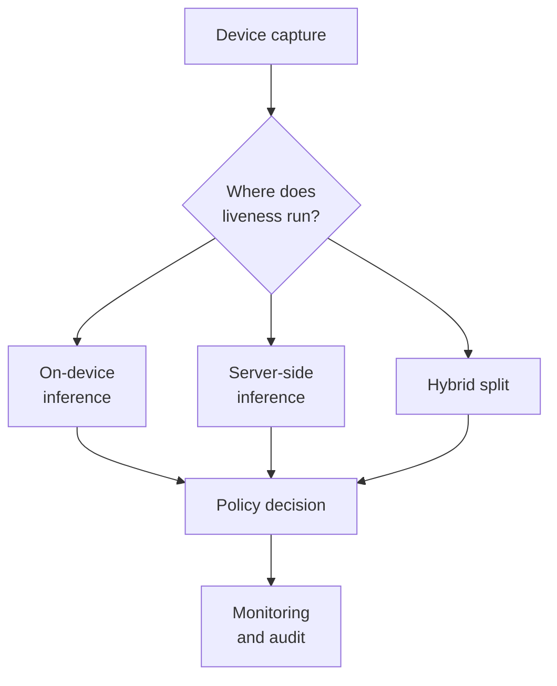

# 03. Deployment Guide

## Who should read this page

This page is most useful for ML engineers, mobile and web engineers, backend teams, platform teams, and solution architects taking face liveness into production.

---

## What this page covers

This page focuses on the practical work of taking face liveness from a model or SDK into a real production environment.

A system that looks good in a demo can still fail in production because of:

- poor device coverage
- unstable network conditions
- weak browser capture
- high latency
- missing injection defenses
- weak monitoring
- badly tuned thresholds

---

## First deployment decision: where should liveness run?

| Option | Main strengths | Main challenges | Good fit |
|--------|----------------|-----------------|----------|
| On-device | lower round-trip latency, can help in unstable networks, can support stronger privacy posture in some designs | device variability, model management complexity, app integration effort | mobile-heavy flows |
| Server-side | centralized control, easier updates, unified policy and logging | more bandwidth use, network-sensitive latency, stronger transport requirements | centralized operations |
| Hybrid | balanced control split, common in eKYC, flexible policy design | more moving parts, interface design complexity | many real production systems |

### On-device

**Strengths**

- lower round-trip latency
- can work better when the network is unstable
- can support stronger privacy posture in some designs

**Challenges**

- device performance varies a lot
- model management is harder
- app integration can be more complex

### Server-side

**Strengths**

- centralized control
- easier model updates
- unified logging and policy enforcement

**Challenges**

- more bandwidth use
- stronger transport security requirements
- latency depends more on network quality

### Hybrid

**Strengths**

- balanced design
- common in real eKYC systems
- allows some capture control on device with centralized policy on the backend

**Challenges**

- more moving parts
- careful interface design is needed

For many production systems, a hybrid design is the most practical choice.

---

## Deployment architecture view

---

## Mobile vs web deployment

| Area | Mobile app | Web |
|------|------------|-----|
| Camera control | usually stronger | more browser-dependent |
| Anti-tampering options | usually better | weaker and more variable |
| Reach and rollout | app install/update dependent | easier reach and rollout |
| Capture consistency | often better | more variable across devices and browsers |

### Mobile app deployment
Usually gives better control over:

- camera capture behavior
- device context
- anti-tampering controls
- guided user experience

### Web deployment
Often wins on reach and rollout speed, but requires stronger attention to:

- browser variability
- virtual camera and injection risk
- camera API behavior
- cross-device inconsistency

Neither is automatically better. The right choice depends on risk level, user base, and integration constraints.

---

## Runtime considerations

### Latency
Users notice delay quickly, especially in onboarding flows.

Latency can come from:

- capture time
- upload time
- preprocessing
- model inference
- policy or fraud services
- retries

A system with good model accuracy but poor end-to-end responsiveness can still fail from a product perspective.

### Bandwidth
Video-based or multi-frame capture can perform badly on weak networks. Frame selection, adaptive capture, and media compression matter.

### Device performance
Low-end devices may struggle with:

- autofocus
- stable exposure
- challenge rendering
- memory pressure
- high-resolution processing

This is why testing only on flagship phones is dangerous.

---

## Capture quality and UX

Good deployment depends heavily on capture design.

Recommended controls include:

- guide the user on face position and size
- warn about low light and backlight
- detect blur early
- prevent multi-face capture
- keep instructions short and visible
- distinguish quality problems from spoof suspicion

A strong model is easier to trust when the capture experience is also well controlled.

---

## Thresholds and policy

Do not deploy a liveness model without a production policy around it.

You should define:

- pass threshold
- uncertain band
- retry rules
- max attempts
- manual review conditions
- model version ownership
- rollback conditions

The model output and the policy output should be treated as different things.

A score is not a business decision until policy turns it into one.

---

## Monitoring and observability

A production team should monitor at least:

- pass, retry, and fail rates
- device-wise performance
- browser or app-version performance
- latency percentiles
- traffic spikes
- environment-specific failures
- manual review rate
- drift in score distribution

A sudden score shift can indicate:

- a model issue
- a capture UX regression
- a new attack pattern
- device-specific breakage
- a bad release

---

## Model updates and rollout safety

Model updates should be treated like controlled releases, not simple file replacements.

Recommended practice:

- keep versioning explicit
- track evaluation results per version
- use canary or shadow rollout where possible
- compare old and new score distributions
- keep a rollback path ready

---

## Security around deployment

A face liveness system should not blindly trust any media it receives.

Deployment should consider:

- anti-injection protections
- replay resistance
- secure transport
- secure session binding where relevant
- device integrity signals
- validation of expected media properties
- safe logging with minimal sensitive retention

For deeper detail, see [Appendix A5 — Security and Privacy](appendix/A5-security-and-privacy.md).

---

## A practical rollout plan

| Phase | Goal | What to focus on |
|------|------|------------------|
| Phase 1 | controlled pilot | limited traffic, strong instrumentation, more review support |
| Phase 2 | threshold tuning | fraud outcomes, retry policy, device and browser splits |
| Phase 3 | wider rollout | gradual traffic expansion, daily regression checks, feature flags |
| Phase 4 | continuous improvement | red-team, new devices, new spoof patterns, segment review |

---

## Practical takeaway

Good deployment is not just about selecting a model. It is about making the whole runtime system dependable under real conditions.

That means thinking about:

- capture quality
- device diversity
- network variability
- threshold policy
- monitoring
- secure integration
- safe rollout

A face liveness feature only becomes production-ready when all of those parts work together.

---

## Related docs

- [04. Best Practices](04-best-practices.md)
- [Appendix A3 — Metrics and Evaluation](appendix/A3-metrics-and-evaluation.md)
- [Appendix A5 — Security and Privacy](appendix/A5-security-and-privacy.md)

## Read next

Go to [04. Best Practices](04-best-practices.md).
