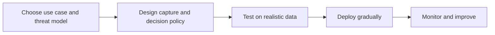

# 04. Best Practices

## Who should read this page

This page is most useful for teams preparing to select, deploy, govern, or review a face liveness capability in a real eKYC flow.

---

## How to use this page

Use this page as a practical checklist for planning, evaluating, deploying, and maintaining a face liveness system for eKYC.

---

## Lifecycle view

---

## Before choosing a model or vendor

### Be clear about the use case
A low-risk login flow and a high-risk remote onboarding flow should not use the same assumptions.

Define the actual business scenario first:

- account opening
- video KYC
- transaction step-up
- account recovery
- fraud investigation support

### Define the threat model
List the attacks you care about most.

At minimum, consider:

- print attacks
- replay attacks
- injection attacks
- mask attacks
- AI-generated content
- weak fallback abuse

### Ask for evidence, not only claims
A vendor claim like “99% accuracy” is not enough.

Ask for evidence by:

- attack type
- device type
- capture condition
- region or environment
- evaluation protocol

---

## During system design

### Put quality checks early
Bad input should be handled before expensive or decisive steps.

### Separate uncertain cases from hard fails
A three-way policy is usually better than a binary one:

- pass
- retry or escalate
- fail

### Keep face match and liveness logically separate
Do not mix them so early that teams cannot explain why a case failed.

### Design fallback carefully
Fallback is important, but a weak fallback can become the easiest path for fraud.

---

## During deployment

### Start with controlled rollout
Pilot first, then expand gradually.

### Monitor by segment, not just overall average
Track outcomes by:

- device model
- OS version
- app version
- browser family
- region
- network quality

### Keep model and policy version visible
If outcomes change, the team should know exactly what changed.

---

## After go-live

### Monitor drift continuously
Watch for changes in:

- score distribution
- retry rate
- fail rate
- manual review rate
- fraud outcomes

### Retest against new attacks
Attackers adapt. Screen quality changes, new generative tools appear, and injection methods evolve.

### Review fairness and accessibility impact
A secure system that blocks too many genuine users creates real business and operational problems.

---

## Common mistakes to avoid

| Mistake | Why it hurts |
|--------|---------------|
| trusting a single benchmark number | hides segment weakness and operational gaps |
| ignoring injection attacks | strong photo defense is not enough |
| testing only on high-end devices | production traffic is much messier |
| allowing too many retries | attackers can probe and learn the system |
| weak incident response planning | teams react too slowly to regressions or attack waves |

---

## Recommended production checklist

- [ ] clear threat model documented
- [ ] target use case defined
- [ ] quality gate defined
- [ ] liveness thresholds defined
- [ ] uncertain band defined
- [ ] retry cap defined
- [ ] manual review policy defined
- [ ] device coverage tested
- [ ] low-light and edge cases tested
- [ ] injection risk reviewed
- [ ] logging and monitoring in place
- [ ] model and policy versioning in place
- [ ] rollback plan ready
- [ ] privacy and retention policy reviewed
- [ ] post-launch monitoring owner assigned

---

## A simple rule of thumb

A face liveness system is much healthier when the team can clearly answer these questions:

1. What attacks are we trying to stop?
2. What happens when the result is uncertain?
3. What happens when the system starts drifting?
4. How do we know a new model version is actually safer?
5. What is our safest fallback path?

If those answers are unclear, the system is probably not ready yet.

---

## Final takeaway

The best face liveness systems are not only accurate. They are also:

- understandable
- measurable
- secure against realistic attacks
- usable for genuine customers
- manageable after launch

That is why successful teams treat face liveness as a product and platform capability, not just a model output.

---

## Related docs

- [01. Face Liveness Guide](01-face-liveness-guide.md)
- [03. Deployment Guide](03-deployment-guide.md)
- [05. Real-World Examples](05-real-world-examples.md)
- [07. Decision Logic](07-decision-logic.md)
- [Appendix A6 — Vendor Evaluation Checklist](appendix/A6-vendor-evaluation-checklist.md)
- [Appendix A7 — References](appendix/A7-references.md)

## Read next

Go to [05. Real-World Examples](05-real-world-examples.md).
