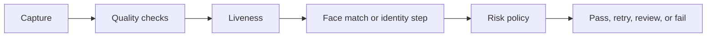
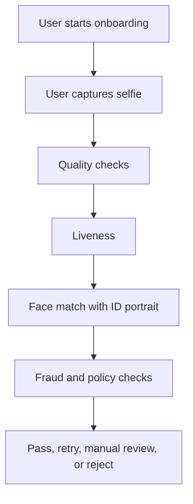
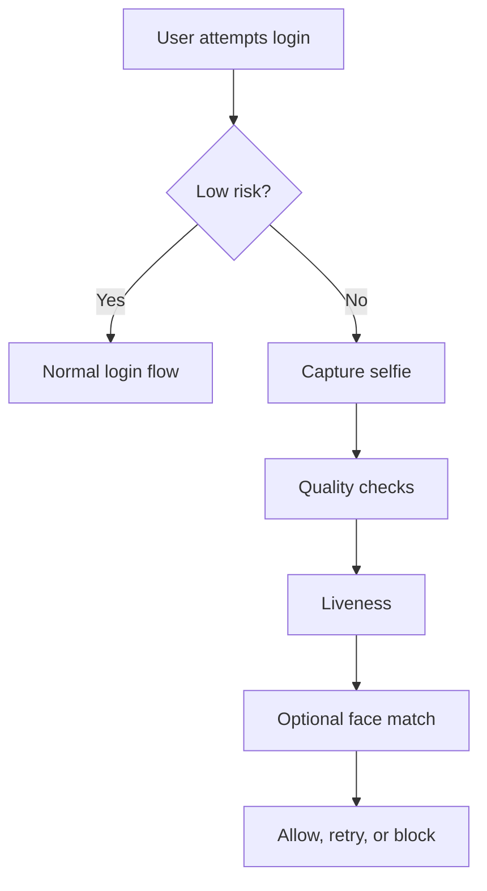
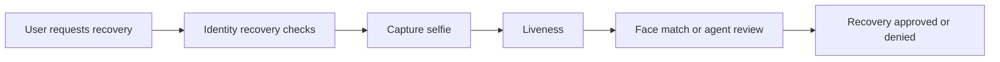

# 05. Real-World Examples

## Who should read this page

This page is useful for product managers, solution architects, backend engineers, fraud teams, and anyone who wants to see how face liveness is used in real eKYC flows.

---

## Why this page exists

Many face liveness documents explain methods and metrics, but readers still ask a practical question:

> Where exactly do we use liveness in a real journey, and what do we do with the result?

This page answers that question with simple, reusable examples.

---

## The common pattern

Most real flows follow the same high-level pattern:

The details change by use case, but the basic idea stays similar.

---

## Example 1: Remote account opening

### Why liveness is used here
Remote account opening is one of the most common and highest-value eKYC journeys. The bank needs confidence that the selfie belongs to a real person who is physically present during capture.

### Example flow

### Simple decision example

| Step | What happens |
|------|---------------|
| Capture | user provides a selfie image or short video |
| Quality checks | system checks blur, lighting, pose, and face size |
| Liveness | system estimates whether the input comes from a live person |
| Face match | system compares selfie to ID portrait |
| Risk policy | business rules combine liveness, match, and risk context |
| Final decision | pass, retry, review, or fail |

### What can go wrong

- low-light selfie causes false reject
- replay attack on another phone screen passes basic quality checks
- good liveness score but poor face match due to bad ID crop
- multiple retries become a fraud probe path

### Best practice
Keep liveness and face match logically separate so teams can explain why a case passed or failed.

---

## Example 2: Login or step-up authentication

### Why liveness is used here
In many systems, a regular login may not need strong liveness every time. But high-risk logins or step-up events often do.

### Example trigger conditions

- new device login
- unusual location
- suspicious account behavior
- password reset after failed attempts
- sensitive profile change

### Example flow

### Best practice
Use stricter policies only where risk is higher. Applying the strongest friction to every login may hurt user experience without enough security benefit.

---

## Example 3: High-value transaction approval

### Why liveness is used here
A customer may already be logged in, but the bank still wants stronger proof before approving a high-value or suspicious transaction.

### Example flow

| Step | Example action |
|------|-----------------|
| Transaction starts | user initiates a large transfer |
| Risk engine flags risk | amount, device, location, or payee pattern triggers step-up |
| Biometric challenge starts | user is asked for selfie or short video |
| Liveness runs | spoof defense is checked |
| Optional face match runs | confirms the user matches the enrolled identity |
| Final approval | transaction approved, delayed, reviewed, or blocked |

### Best practice
Treat the transaction amount and fraud context as part of policy. A threshold that is acceptable for low-value actions may be too weak for high-value transfers.

---

## Example 4: Account recovery

### Why liveness is used here
Account recovery is often attacked because it can bypass the normal login path.

### Example flow

### Best practice
Keep recovery flows stricter than normal convenience flows. Attackers often target the weakest fallback path, not the strongest one.

---

## Example 5: Video KYC or agent-assisted onboarding

### Why liveness is used here
Human review can help, but human review alone is not a complete spoof defense. Liveness can support both the agent and the automated risk process.

### Common uses

- pre-check before a live video session
- support signal during the session
- post-session review evidence
- alerting when video quality is suspicious

### Best practice
Use liveness as part of the workflow, not as a replacement for all human judgment.

---

## Example 6: Web onboarding versus mobile app onboarding

| Area | Mobile app | Web browser |
|------|------------|-------------|
| device trust | usually stronger app controls | browser environment is more variable |
| capture consistency | often better camera flow control | browser and hardware differences are wider |
| anti-injection options | usually stronger | often harder |
| friction management | can be optimized in SDK | may require more UI guidance |

### Best practice
Do not assume a model that works well in a mobile app will behave the same way in a browser flow.

---

## A reusable decision template

You can map many journeys to this simple template:

| Result pattern | Suggested action |
|----------------|------------------|
| strong quality + strong liveness + strong face match | approve |
| weak quality but no clear fraud signal | ask user to retry |
| uncertain liveness or conflicting signals | escalate to review or stronger challenge |
| strong spoof signal | fail and trigger fraud handling |

This keeps the policy understandable.

---

## Common lessons across all examples

1. Liveness is most valuable when it is tied to a specific use case and threat model.
2. Quality controls are not optional. Bad input creates avoidable errors.
3. Retry logic matters almost as much as the model.
4. High-risk flows should use stricter policy than convenience flows.
5. Weak fallback paths can undo strong liveness controls.

---

## Related docs

- [02. eKYC Integration](02-ekyc-integration.md)
- [03. Deployment Guide](03-deployment-guide.md)
- [07. Decision Logic](07-decision-logic.md)
- [09. Common Failures](09-common-failures.md)

## Read next

Go to [06. API and Response Examples](06-api-and-response-examples.md).
