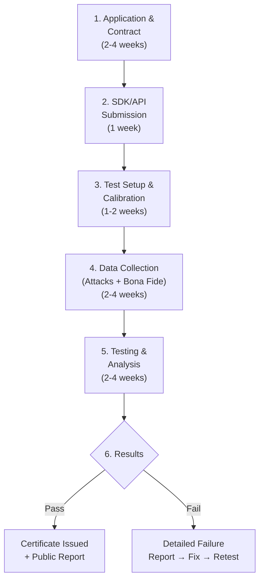

# 5.2 iBeta Certification (Level 1 & Level 2)

---

## Overview

**iBeta Quality Assurance** (Aurora, Colorado, USA) is the most widely recognized independent testing laboratory for biometric Presentation Attack Detection (PAD). Their certification follows **ISO/IEC 30107-3:2023** and has become the **de facto industry standard** for validating face liveness in banking.

!!! info "Why iBeta Matters"
    When a bank evaluates liveness vendors, **iBeta certification is often the first filter**. Vendors without it are typically eliminated from regulated financial services procurement.

---

## Level 1: 2D Attack Testing

Tests against **printed photos and screen displays** — the most common real-world attack vectors.

### PAI Species Tested

| ID | Type | Description | Specifications |
|----|------|-------------|----------------|
| P.1 | Print | Color laser print, A4/Letter | 600 DPI, standard office paper |
| P.2 | Print | Color inkjet, A4/Letter | High-quality inkjet, photo paper |
| P.3 | Print | Photo lab print, 4×6, glossy | Professional lab print |
| P.4 | Print | Photo lab print, 4×6, matte | Professional lab print |
| P.5 | Print | Photo lab print, 8×10 | Larger format |
| P.6 | Print | Life-size poster print | Full face-size |
| P.7 | Print | Curved/bent photo on form | Simulating 3D curvature |
| S.1 | Screen | Smartphone (5-7"), photo | Various models, max brightness |
| S.2 | Screen | Smartphone (5-7"), video | Pre-recorded video with movement |
| S.3 | Screen | Tablet (9-12"), photo | iPad-class devices |
| S.4 | Screen | Tablet (9-12"), video | HD video with natural motion |
| S.5 | Screen | Laptop/monitor (13"+), photo | HD/FHD monitors |
| S.6 | Screen | Laptop/monitor (13"+), video | HD video playback |

### Testing Protocol

| Parameter | Specification |
|-----------|--------------|
| **Test subjects** | Minimum 50 unique individuals |
| **Demographics** | Diversity in age, gender, skin tone |
| **Attacks per species** | Minimum 150 per PAI species |
| **Total attacks** | 1,500-2,500+ across all species |
| **Bona fide presentations** | Minimum 300 genuine presentations |
| **Environment** | Controlled indoor lighting + variable conditions |
| **Devices** | Multiple capture devices representative of deployment |

### Pass Criteria

!!! danger "Critical: Zero Tolerance"
    - **APCER = 0%** across ALL Level 1 PAI species (zero successful attacks in entire test set)
    - **BPCER ≤ 5%** (no more than 5% of genuine users incorrectly rejected)
    - A single successful attack on any species = **FAIL**

---

## Level 2: 2D + 3D Attack Testing

Extends Level 1 with **three-dimensional attack instruments** — masks, mannequins, and sculptural reproductions.

### Additional PAI Species (Beyond Level 1)

| ID | Type | Description | Specifications |
|----|------|-------------|----------------|
| M.1 | Mask | Paper mask with eye cutouts | Printed, worn by attacker |
| M.2 | Mask | Paper mask without cutouts | Full face coverage |
| M.3 | Mask | Latex mask (commercial) | Off-the-shelf realistic mask |
| M.4 | Mask | Resin/plaster cast mask | Custom-cast rigid mask |
| M.5 | Mask | Silicone mask (custom) | Custom-fabricated, hand-painted, realistic skin texture |
| M.6 | Mannequin | Mannequin head with photo | Photo attached to mannequin |
| M.7 | Mannequin | Mannequin with makeup | Makeup applied to match target |
| M.8 | 3D Print | 3D-printed face from scan | FDM or SLA 3D print, painted |

### Level 2 Pass Criteria

- Same 0% APCER requirement across **ALL species** (Level 1 + Level 2)
- BPCER ≤ 5% maintained
- Significantly harder to achieve — many vendors pass Level 1 but fail Level 2

---

## Testing Process & Timeline

| Phase | Duration | Cost (Approximate) |
|-------|----------|-------------------|
| Application & contracting | 2-4 weeks | — |
| Level 1 testing | 4-8 weeks | $20,000 - $35,000 |
| Level 2 testing | 6-12 weeks | $35,000 - $60,000 |
| Combined L1 + L2 | 8-14 weeks | $45,000 - $80,000 |
| Retest (after failure) | 4-6 weeks | $10,000 - $25,000 |

---

## Preparing for iBeta Testing

!!! success "Pre-Testing Checklist"
    1. **Internal testing** against all known PAI species before submission
    2. **Threshold calibration**: Ensure BPCER < 3% internally (leave margin for iBeta's stricter conditions)
    3. **Device coverage**: Test on the exact devices iBeta will use (ask them for their device list)
    4. **Environmental robustness**: Test under varying lighting — iBeta tests aren't always in perfect conditions
    5. **Demographic diversity**: Ensure your model performs consistently across skin tones and ages
    6. **Edge cases**: Test with glasses, beards, hijabs, masks (medical), and other face variations
    7. **Documentation**: Prepare integration guide, API docs, and configuration instructions for iBeta engineers
    8. **Regression testing**: Run full regression after any model update before submission

### Common Failure Reasons

| Reason | Frequency | Prevention |
|--------|-----------|------------|
| High-quality screen replay accepted | 35% of failures | Strengthen Moiré detection and frequency analysis |
| Specific print type accepted | 25% of failures | Ensure training data covers glossy, matte, and large formats |
| BPCER too high | 20% of failures | Calibrate threshold with demographic-diverse validation set |
| 3D mask accepted (Level 2) | 15% of failures | Add material classification and NIR-simulated features |
| Inconsistent results across devices | 5% of failures | Test across device diversity before submission |

---

## Post-Certification Maintenance

!!! warning "Certification Is Not Permanent"
    - Certificate applies to the **specific algorithm version tested**
    - **Major model updates** require re-certification
    - Minor updates (threshold adjustments, preprocessing changes) may not require retesting — consult iBeta
    - **Annual review** recommended even without changes
    - Some banks require **re-certification every 2 years** as a contractual requirement

---

## iBeta vs Other Testing Labs

| Lab | Location | Standard | Strengths | Limitations |
|-----|----------|----------|-----------|-------------|
| **iBeta** | USA | ISO 30107-3 | Most widely recognized, comprehensive PAI species coverage | US-centric, long wait times |
| **BioLab** | Italy | ISO 30107-3 | European recognition, strong 3D mask testing | Less recognition in US/APAC markets |
| **CLR Labs** | France | ISO 30107-3, PVID | French regulatory alignment, video identification testing | Primarily European market |
| **NIST (FRVT PAD)** | USA | Custom protocol | Free, government authority, ongoing evaluation | Not a pass/fail certification |
| **FIDO Alliance** | Global | FIDO Biometric Cert | Authentication-focused, device-level testing | Narrower scope than iBeta |

---

*Next: [NIST FRVT PAD & FATE →](nist.md)*
