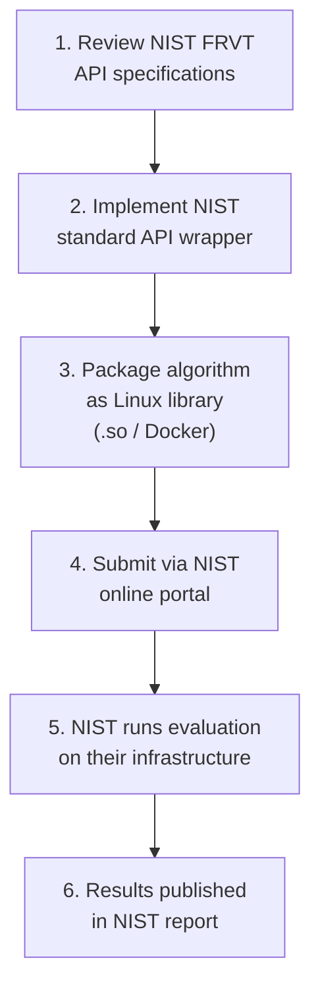
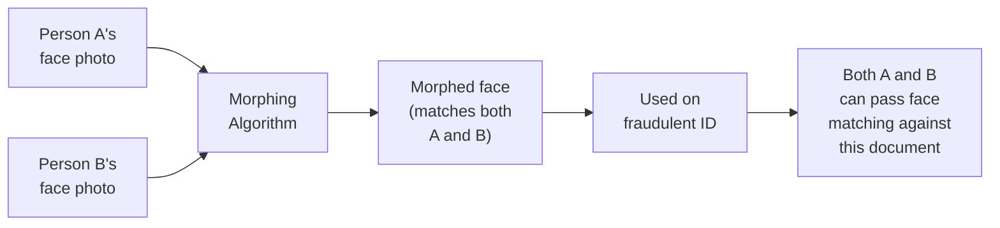
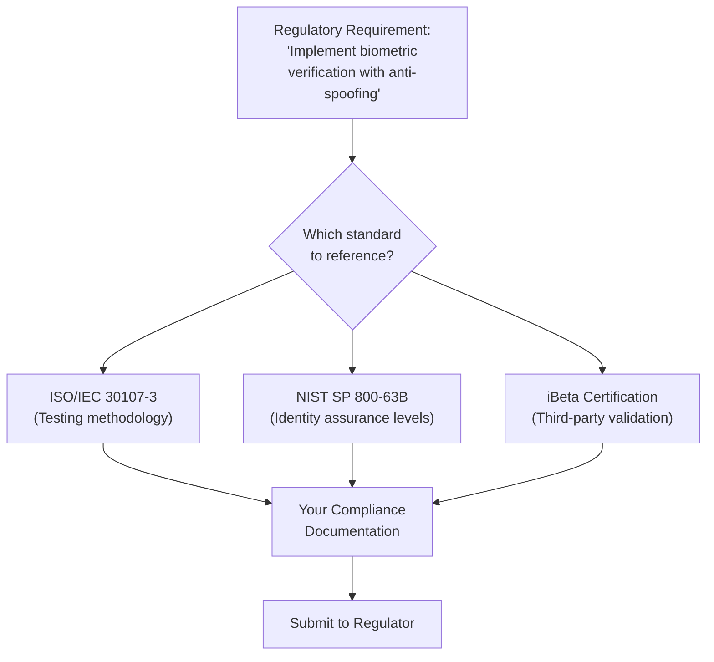

# 5.3 NIST FRVT PAD & FATE

---

## Overview

The **National Institute of Standards and Technology (NIST)** operates the most authoritative government-backed evaluation programs for face recognition and presentation attack detection technology. Unlike iBeta (which provides pass/fail certification), NIST provides **continuous, comparative evaluation** — ranking all participants against each other.

---

## NIST FRVT (Face Recognition Vendor Test)

### What It Is

FRVT is NIST's **ongoing evaluation** of face recognition technology. It has multiple tracks:

| Track | Focus | PAD Relevance |
|-------|-------|---------------|
| **FRVT 1:1 (Verification)** | Face matching accuracy for identity verification | Indirect — measures the face matching component of eKYC |
| **FRVT 1:N (Identification)** | Face search against large galleries | Less relevant for eKYC liveness |
| **FRVT Quality** | Face image quality assessment | Directly relevant — quality impacts liveness accuracy |
| **FRVT PAD** | Presentation attack detection | **Directly relevant** — evaluates liveness detection |
| **FRVT Demographics** | Accuracy across demographics | Critical for bias assessment in liveness systems |

### FRVT PAD Track

!!! info "Status"
    NIST FRVT PAD was announced and has been collecting submissions. Check [NIST FRVT page](https://pages.nist.gov/frvt/) for the latest status and results.

**Key differences from iBeta:**

| Aspect | NIST FRVT PAD | iBeta |
|--------|--------------|-------|
| **Type** | Comparative evaluation (ranking) | Pass/fail certification |
| **Cost** | Free to participate | $20,000 - $80,000 |
| **Duration** | Ongoing (submit anytime) | Project-based (8-14 weeks) |
| **Result** | Detailed performance report with rankings | Certificate + summary report |
| **Dataset** | NIST-curated (proprietary, very large) | iBeta-collected (per ISO 30107-3) |
| **PAI Species** | Comprehensive, including advanced attacks | Defined by level (L1: 2D, L2: 2D+3D) |
| **Public Results** | Published online with vendor names | Published with vendor consent |
| **Regulatory Weight** | Highest authority (US government) | Industry standard |
| **Threshold Control** | NIST evaluates at multiple operating points | Vendor sets their threshold |

### How to Submit to NIST FRVT

**Submission requirements:**

| Requirement | Details |
|-------------|---------|
| **Format** | Linux shared library (.so) or Docker container |
| **API** | Must implement NIST-specified C/C++ API |
| **Dependencies** | All dependencies must be self-contained; no network access during evaluation |
| **Processing** | Must run on NIST's hardware (specified CPU/GPU configurations) |
| **Timing** | Must process within specified time limits per image/video |
| **Size** | Model + library size limits apply |

---

## NIST FATE (Face Analysis Technology Evaluation)

### What It Is

FATE is NIST's broader evaluation framework covering multiple face analysis capabilities beyond just recognition:

| FATE Component | Description | Relevance to Liveness |
|----------------|-------------|----------------------|
| **Morph Detection** | Detecting face morphing attacks in ID photos | Directly relevant — morphing is an attack vector |
| **Age Estimation** | Estimating age from face images | Indirect — age affects liveness system performance |
| **PAD** | Presentation attack detection | **Core relevance** |
| **Quality** | Face image quality assessment | Impacts liveness system performance |
| **Attribute Detection** | Detecting face attributes (glasses, makeup, etc.) | Relevant for edge case handling |

### FATE Morph Detection

Particularly relevant for banking because morphed photos are used in **document fraud**:

**NIST FATE Morph Detection evaluates:**

- **Differential morph detection**: Given a trusted live photo AND the document photo, detect if the document photo is morphed
- **Single-image morph detection**: Given only the document photo, detect if it's morphed (harder)
- **Print-scan resilience**: Detection after the morphed image has been printed, used in a document, and then scanned/photographed

---

## NIST SP 800-63B: Digital Identity Guidelines

This is NIST's **prescriptive standard** for digital identity verification, directly applicable to banking.

### Identity Assurance Levels (IAL)

| Level | Description | Biometric/PAD Requirement | Banking Applicability |
|-------|-------------|--------------------------|----------------------|
| **IAL1** | Self-asserted identity | No biometric required | Not suitable for banking |
| **IAL2** | Remote or in-person proofing with evidence verification | **Biometric required with PAD** for remote proofing | Standard banking onboarding |
| **IAL3** | In-person or supervised remote proofing | **Biometric required with PAD** + in-person or supervised | High-value accounts, regulatory-sensitive |

### IAL2 PAD Requirements (Most Relevant for Banking)

!!! danger "Key Requirements"
    NIST SP 800-63B Section 5.2.3 states for IAL2 remote identity proofing:
    
    - **Liveness detection is MANDATORY** for remote biometric verification
    - The system must implement PAD that meets the requirements of ISO/IEC 30107
    - PAD must detect **at minimum**: printed photos, screen display attacks, and video replay attacks
    - **Testing must be performed** by an accredited laboratory (iBeta satisfies this)
    - Results must demonstrate **resistance to presentation attacks** across specified PAI species

### IAL3 Additional Requirements

- **Supervised remote** or **in-person** proofing required
- Biometric comparison with PAD is mandatory
- Operator must be trained in detecting presentation attacks
- Physical document inspection may be required
- Stronger cryptographic binding of biometric to identity

---

## How to Use NIST in Banking Deployments

### For Vendor Evaluation

| Scenario | Use NIST How |
|----------|-------------|
| Comparing vendors | Request vendors' NIST FRVT scores for 1:1 verification AND PAD (if available) |
| Bias assessment | Review NIST FRVT Demographics results for the vendor's algorithm |
| Regulatory documentation | Reference NIST SP 800-63B IAL2/IAL3 compliance in your regulatory filings |
| Morph detection needs | Check NIST FATE Morph Detection results if document fraud is a concern |

### For Regulatory Compliance

### For In-House Development

If building liveness in-house:

1. **Target NIST SP 800-63B IAL2** as your minimum baseline
2. **Submit to NIST FRVT** for objective benchmarking (it's free)
3. **Use NIST FRVT Demographics** testing to validate fairness
4. **Obtain iBeta certification** for commercial validation
5. Reference all three (NIST guidelines, NIST evaluation, iBeta certification) in regulatory submissions

---

## NIST vs iBeta: When to Use Which

| Need | Use |
|------|-----|
| Pass/fail certification for procurement | iBeta |
| Comparative ranking against competitors | NIST FRVT |
| Regulatory compliance documentation | Both (NIST for framework, iBeta for certification) |
| Bias/fairness assessment | NIST FRVT Demographics |
| Document morphing detection evaluation | NIST FATE |
| Free evaluation with government authority | NIST |
| Fast, definitive result for sales/marketing | iBeta |

!!! success "Best Practice"
    **Use both.** iBeta certification for commercial credibility and procurement compliance. NIST FRVT for continuous benchmarking and detailed performance understanding. Reference NIST SP 800-63B for regulatory framework compliance.

---

*Next: [FIDO Biometric Certification →](fido.md)*
