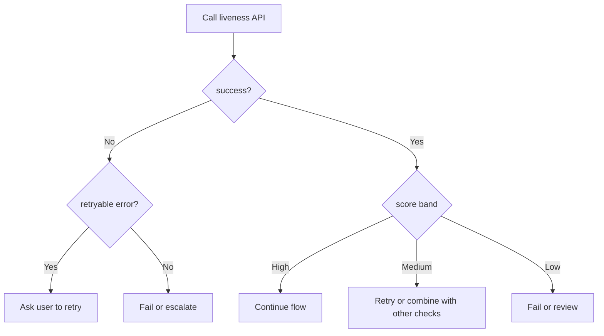

# 06. API and Response Examples

## Who should read this page

This page is mainly for backend engineers, SDK engineers, integrators, product teams, and QA teams who need a practical contract for using a face liveness service.

---

## Why this page exists

A model output is not enough for production use. Teams need a predictable response format, clear status handling, and simple rules for retry, logging, and downstream decisions.

This page shows practical API patterns in plain language.

---

## A simple design principle

A production response should answer these questions clearly:

1. Was the request successful?
2. What is the liveness result?
3. What score or evidence supports that result?
4. How long did it take?
5. Was there an error or warning?
6. What should the caller do next?

---

## Example request pattern

### Example JSON request

```json
{
  "image": "<base64-or-file-reference>",
  "session_id": "8f2d6b70-2be4-4fc2-88a5-6a9c2f6b2a12",
  "flow_type": "account_opening",
  "device_context": {
    "platform": "android",
    "app_version": "2.8.1"
  }
}
```

### What each field is for

| Field | Why it exists |
|------|----------------|
| `image` | capture sent for liveness evaluation |
| `session_id` | ties events together across systems |
| `flow_type` | helps policy and analytics |
| `device_context` | helps debugging and monitoring |

---

## Example success response

```json
{
  "success": true,
  "status": "ok",
  "request_id": "a5fbe0a526554b84b81481251d51b5cc",
  "result": {
    "label": "live",
    "score": 76.451
  },
  "attributes": {
    "gender": {
      "label": "male",
      "confidence": 0.999
    },
    "age": {
      "years": 33,
      "confidence": 0.211
    }
  },
  "latency_ms": 1407.338,
  "error": null,
  "input": {
    "type": "bytes",
    "path": null,
    "filename": null
  },
  "diagnostics": {}
}
```

### Important note about extra attributes
Additional attributes such as age or gender should be treated carefully. They are not the same as liveness, and they should not drive the final liveness decision unless the business has a clear and lawful reason to use them.

---

## How to read the response

| Field | Meaning |
|------|---------|
| `success` | whether the API call completed correctly |
| `status` | service-level status such as `ok` or `error` |
| `request_id` | tracing ID for logs and support cases |
| `result.label` | predicted class such as `live` or `spoof` |
| `result.score` | model output on the service's chosen score scale |
| `latency_ms` | end-to-end service latency |
| `error` | failure details when the request does not succeed |
| `diagnostics` | optional debug or policy details |

---

## Score interpretation

A score should never be shown without explaining what it means.

### Example policy meaning

| Score band | Example meaning | Suggested action |
|------------|-----------------|------------------|
| 80 to 100 | strong live evidence | approve if other checks are also good |
| 50 to 79 | uncertain or moderate confidence | retry or combine with other signals |
| below 50 | weak live evidence or spoof risk | fail or escalate |

### Important caution
The score scale is not universal. A score of 76 in one model does not mean the same thing as 76 in another model. Teams must calibrate policy on their own evaluated data.

---

## Example error response

```json
{
  "success": false,
  "status": "error",
  "request_id": "e31476a59f6d4e92b8a4cefa0f7f1b21",
  "result": null,
  "latency_ms": 184.22,
  "error": {
    "code": "INPUT_QUALITY_TOO_LOW",
    "message": "Face is too blurry for reliable liveness evaluation.",
    "retryable": true
  },
  "diagnostics": {
    "quality": {
      "blur": "high",
      "lighting": "low"
    }
  }
}
```

### Why this matters
The caller should not guess whether to retry. The service should say whether the issue is retryable.

---

## Suggested error categories

| Error code family | Typical meaning | Caller action |
|-------------------|-----------------|--------------|
| input quality | blur, low light, face too small, occlusion | ask user to retry |
| request format | bad payload, missing field, unsupported file type | fix client request |
| auth or permission | invalid token, blocked app, expired credential | re-authenticate or block |
| service failure | timeout, model error, dependency failure | retry or fall back |
| policy failure | spoof result or blocked policy state | fail or escalate |

---

## Example integration logic



---

## Recommended response design principles

### Keep the envelope stable
Even if the model changes, the top-level response shape should remain stable where possible.

### Separate transport success from decision result
An API call can succeed technically while the liveness decision is still `spoof` or `uncertain`.

### Include traceability
Always include a request or correlation ID.

### Keep diagnostics optional but structured
Diagnostics are useful for support and analytics, but they should not break callers when absent.

---

## Logging fields worth keeping

- request ID
- session ID
- model version
- policy version
- device type
- platform
- app or browser version
- latency
- final decision
- retry count

These fields make debugging and post-launch analysis much easier.

---

## Example downstream decision object

Some teams prefer to turn the raw model response into a simpler downstream object:

```json
{
  "decision": "retry",
  "reason": "uncertain_liveness_score",
  "request_id": "a5fbe0a526554b84b81481251d51b5cc",
  "policy_version": "v3.2"
}
```

This keeps business systems simple and readable.

---

## Best practice summary

- do not expose raw model outputs without policy meaning
- do not mix API success with liveness pass/fail meaning
- return retryable errors clearly
- include request tracing fields
- version both model and policy
- keep the response envelope stable

---

## Related docs

- [03. Deployment Guide](03-deployment-guide.md)
- [05. Real-World Examples](05-real-world-examples.md)
- [07. Decision Logic](07-decision-logic.md)
- [09. Common Failures](09-common-failures.md)

## Read next

Go to [07. Decision Logic](07-decision-logic.md).
