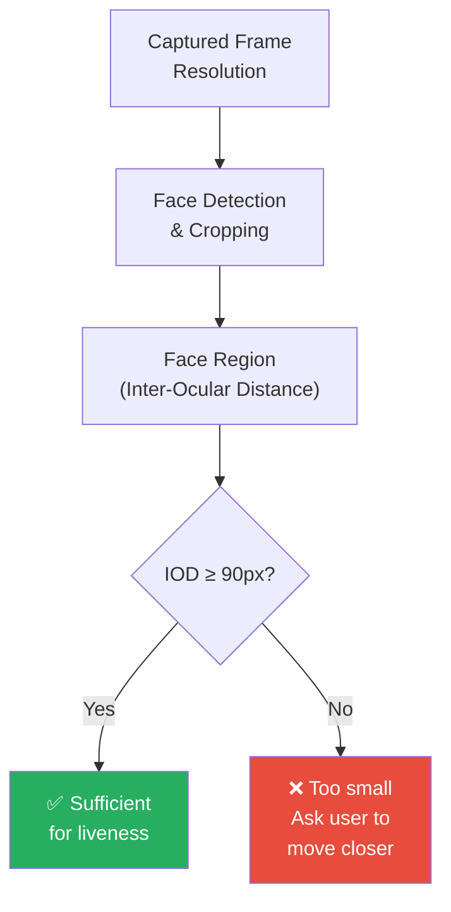
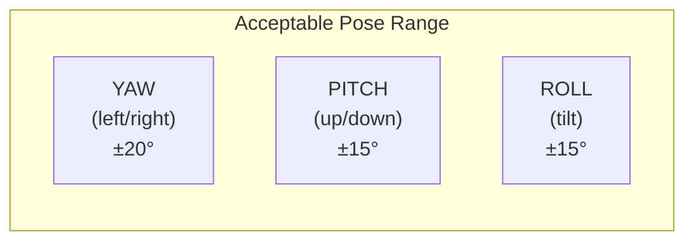
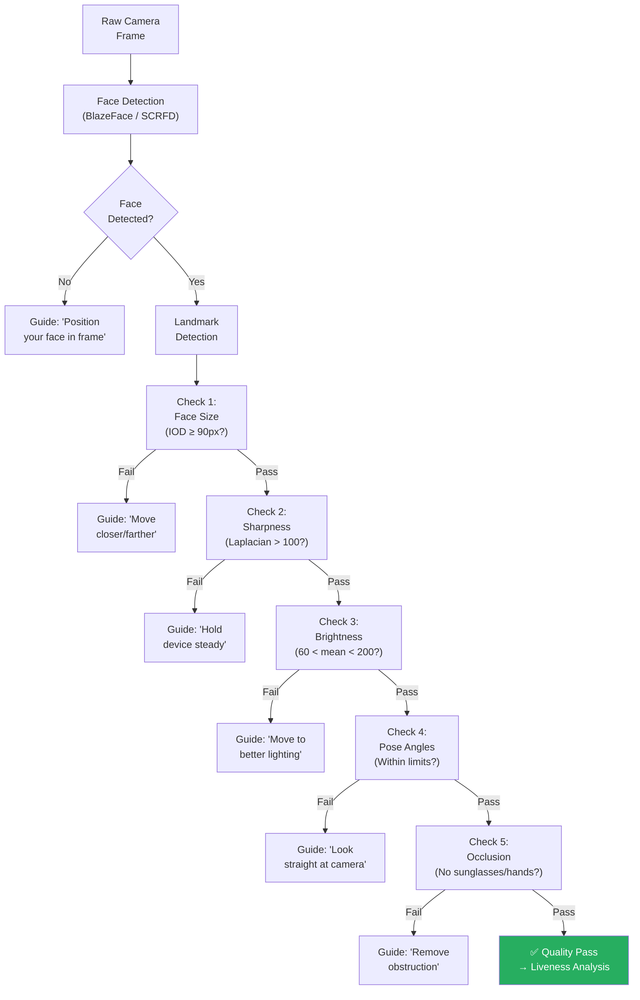

# 6.1 Input Quality Requirements

---

## Overview

The accuracy of any face liveness system is **fundamentally constrained by the quality of the input**. A state-of-the-art liveness model will fail if the input images are blurry, poorly lit, too small, or improperly framed. Defining and enforcing strict input quality requirements is one of the most impactful steps for a successful deployment.

!!! danger "The #1 Deployment Failure"
    The most common cause of high false rejection rates in production is **not model accuracy** — it's **poor input quality** from uncontrolled capture conditions on diverse user devices.

---

## Image Quality Parameters

### Resolution & Face Size

| Parameter | Minimum | Recommended | Ideal | Notes |
|-----------|---------|-------------|-------|-------|
| **Capture resolution** | 640×480 (VGA) | 1280×720 (720p) | 1920×1080 (1080p) | Higher resolution preserves texture detail |
| **Inter-ocular distance (IOD)** | 60 pixels | 90-120 pixels | 150+ pixels | Distance between eye centers in the cropped face |
| **Face size in frame** | 20% of frame width | 30-50% of frame width | 40-60% of frame width | Too small = insufficient detail; too large = face cropping |
| **Face region resolution** | 112×112 | 224×224 | 256×256+ | After cropping and alignment, fed to model |
| **Effective face pixels** | 12,544 (112²) | 50,176 (224²) | 65,536+ (256²) | Total pixels in face region |

### Sharpness / Blur

| Blur Type | Cause | Impact on Liveness | Detection Method |
|-----------|-------|-------------------|-----------------|
| **Motion blur** | Camera or subject movement during capture | Destroys micro-texture and frequency features | Laplacian variance < threshold |
| **Focus blur** | Out-of-focus camera, wrong focal plane | Smooths pore detail, removes fine texture | Gradient magnitude analysis |
| **Compression blur** | Heavy JPEG/H.264 compression | Block artifacts, loss of fine detail | DCT coefficient analysis |

**Sharpness thresholds (Laplacian variance):**

| Laplacian Variance | Quality | Action |
|-------------------|---------|--------|
| < 50 | Very blurry — unusable | Reject, guide user to stabilize |
| 50-100 | Blurry — degraded accuracy | Warn user, attempt processing with lower confidence |
| 100-300 | Acceptable | Process normally |
| > 300 | Sharp — optimal | Process with highest confidence |

### Illumination

| Parameter | Minimum | Recommended | Measurement |
|-----------|---------|-------------|-------------|
| **Ambient illumination** | 50 lux | 200-500 lux | Estimated from face brightness |
| **Face brightness (mean pixel value)** | 60 (0-255 range) | 100-180 | Mean of Y channel in YCbCr |
| **Brightness uniformity** | Ratio < 3:1 (bright/dark side) | Ratio < 2:1 | Compare left/right face halves |
| **No harsh shadows** | Partial face shadow < 30% | No visible shadows | Shadow detection on face mask |
| **No extreme backlighting** | Face not silhouetted | Face brighter than background | Face vs background brightness ratio |

**Lighting condition impact on liveness accuracy:**

| Condition | Impact | BPCER Increase |
|-----------|--------|---------------|
| Well-lit indoor | Baseline (optimal) | 0% (reference) |
| Moderate indoor | Minimal impact | +0.5-1% |
| Dim indoor | Noticeable texture detail loss | +2-5% |
| Harsh overhead lighting | Strong shadows confuse depth estimation | +3-8% |
| Direct sunlight | Overexposure, specular glare | +5-15% |
| Extreme backlight | Face underexposed, features lost | +10-30% |
| Near darkness (< 10 lux) | Camera noise dominates signal | +20-50% |

### Face Pose Angles

| Angle | Acceptable Range | Optimal Range | Impact of Exceeding |
|-------|-----------------|---------------|---------------------|
| **Yaw** (left-right rotation) | ±20° | ±10° | One side of face occluded; asymmetric texture analysis |
| **Pitch** (up-down tilt) | ±15° | ±10° | Forehead or chin occluded; eye region distorted |
| **Roll** (head tilt) | ±15° | ±5° | Face alignment affected; landmark detection degraded |

### Occlusion Handling

| Occlusion Type | Acceptable | Action | Notes |
|---------------|------------|--------|-------|
| **No occlusion** | ✅ Optimal | Process normally | — |
| **Prescription glasses** | ✅ Acceptable | Process with adjusted parameters | Reflections may affect eye analysis |
| **Sunglasses** | ❌ Not acceptable | Request removal | Eyes occluded — critical for liveness |
| **Medical mask (N95/surgical)** | ⚠️ Conditional | Reduced accuracy; may need fallback | Lower face entirely occluded |
| **Religious head covering (hijab)** | ✅ Acceptable | Process normally | Face visible; head covering doesn't affect liveness |
| **Full face covering (niqab)** | ❌ Not processable | Fallback to alternative verification | Face not visible |
| **Hat/cap** | ✅ Usually acceptable | Process if face not shadowed | May shadow upper face |
| **Hand on face** | ❌ Not acceptable | Guide user to remove hand | Partial face occlusion |
| **Hair covering face** | ⚠️ Conditional | Guide user to adjust hair | Depends on coverage extent |

---

## Video Quality Parameters (for Active Liveness)

| Parameter | Minimum | Recommended | Notes |
|-----------|---------|-------------|-------|
| **Frame rate** | 10 FPS | 15-30 FPS | Below 10 FPS loses motion dynamics for active challenges |
| **Duration** | 2 seconds | 3-8 seconds | Enough for challenge completion + rPPG analysis |
| **Codec** | H.264 Baseline | H.264 Main/High | Avoid H.265 — not universally supported |
| **Bitrate** | 500 Kbps | 1-2 Mbps | Below 500 Kbps introduces heavy compression artifacts |
| **Resolution** | 480p | 720p | Higher resolution not needed for video (increases bandwidth) |
| **Audio** | Not required for most | 16KHz mono | Required only for speech-based challenges |
| **Temporal consistency** | No frame drops > 3 consecutive | Smooth, even frame delivery | Frame drops break temporal analysis |

---

## Device Camera Requirements

### Minimum Camera Specifications

| Specification | Minimum | Recommended | Notes |
|--------------|---------|-------------|-------|
| **Sensor resolution** | 2 MP (1920×1080) | 5 MP+ | Higher megapixels don't always mean better quality |
| **Auto-focus** | Fixed focus acceptable | Auto-focus preferred | Fixed focus may not focus at face distance |
| **Focus distance** | 30-60 cm | 25-80 cm range | Must be able to focus at arm's length |
| **Aperture** | f/2.8 or wider | f/2.0 or wider | Wider aperture = better low-light performance |
| **Sensor size** | 1/5" | 1/3" or larger | Larger sensor = lower noise, better dynamic range |
| **Color depth** | 8-bit | 8-bit sufficient | 10-bit provides no meaningful liveness improvement |
| **NIR sensor** | Not required | Beneficial if available | Dramatically improves material classification |

### Platform-Specific Considerations

=== "Android"
    - Camera2 API required (Camera1 API insufficient for frame-level control)
    - Auto-exposure settling time: 300-800ms after camera open (first frames are unusable)
    - Manufacturer-specific image processing: Samsung, Xiaomi, Huawei apply different beautification/HDR
    - **Critical**: Disable beauty mode / face smoothing — it destroys texture features
    - Memory management: Some low-end devices (< 3GB RAM) may OOM with heavy model inference
    - CameraX recommended for SDK development (abstracts manufacturer differences)

=== "iOS"
    - AVFoundation provides consistent, high-quality camera access
    - TrueDepth camera (iPhone X+) provides depth data — use if available
    - Auto-exposure more predictable than Android
    - **No beauty mode by default** — iOS camera output is cleaner for liveness
    - CoreML / Metal for on-device inference (excellent performance)
    - Privacy: Camera permission prompt required (iOS 14+)

=== "Web (Browser)"
    - getUserMedia API for camera access
    - **Highly variable quality** across browsers and devices
    - No control over auto-focus, exposure, or white balance in most browsers
    - WebRTC for video streaming (if server-side processing)
    - Canvas API for frame extraction
    - **Major limitation**: Cannot detect virtual cameras or browser extensions manipulating the feed
    - Recommended: Use native SDK for high-security scenarios; web only for low-risk

---

## Quality Assessment Pipeline

### Real-Time Quality Feedback UI

!!! success "Best Practice: Progressive Quality Guidance"
    Show real-time visual feedback overlaid on the camera preview:
    
    - **Green face outline** = All quality checks passing
    - **Yellow face outline** = Minor issues (lighting, slight blur)
    - **Red face outline** = Major issues (face too small, severe blur, occluded)
    - **Text prompts** = Specific actionable guidance ("Move closer", "Find better lighting")
    - **Progress indicator** = Shows which checks have passed
    
    This reduces average capture time from 15 seconds to 5 seconds and increases first-attempt success rate from 60% to 85%.

---

## Quality Impact on Liveness Accuracy

| Quality Level | Description | Liveness BPCER | Liveness APCER | Recommendation |
|--------------|-------------|---------------|---------------|----------------|
| **Excellent** | All parameters optimal | 0.5-1% | < 0.1% | Proceed with high confidence |
| **Good** | Minor deviations (slight pose, acceptable blur) | 1-3% | 0.1-0.5% | Proceed normally |
| **Acceptable** | Noticeable issues (dim lighting, moderate blur) | 3-8% | 0.5-2% | Proceed with reduced confidence; consider active challenge |
| **Poor** | Significant issues (very dim, blurry, extreme pose) | 8-20% | 2-5% | Reject and re-capture with guidance |
| **Unusable** | Critical failures (no face, extreme blur, fully occluded) | N/A | N/A | Reject immediately |

---

## Key Takeaways

!!! success "Summary"
    1. **Input quality is the single biggest factor** in production liveness accuracy
    2. **IOD ≥ 90 pixels** is the minimum face size for reliable liveness analysis
    3. **Disable beauty mode / face smoothing** on all Android devices — it destroys liveness texture features
    4. **Real-time quality feedback** reduces capture time by 3x and increases success rates by 25%
    5. **Web browser liveness has inherent limitations** — use native SDK for high-security banking
    6. **Camera warm-up time** (300-800ms on Android) means first few frames are unusable — discard them
    7. Define **quality gates** that reject poor input before it reaches the liveness model

---

*Next: [Device & Platform Considerations →](device-platform.md)*
