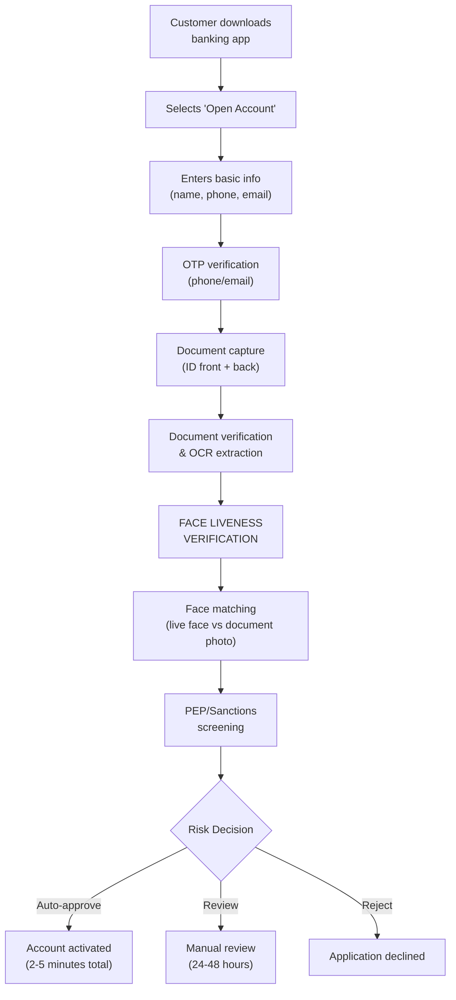

# 7.1 Account Opening (Digital Onboarding)

---

## The Primary Use Case

Digital account opening is the **highest-volume** use case for face liveness verification in banking. It represents 80%+ of all liveness verification transactions.

## Complete Flow

## Liveness Configuration for Onboarding

| Parameter | Recommended Setting | Rationale |
|-----------|-------------------|-----------|
| **Method** | Hybrid (passive-first) | Balance UX with security |
| **Passive threshold (auto-pass)** | ≥ 0.88 | 80% of users pass without active challenge |
| **Active challenge (if needed)** | 1-2 challenges (head turn + smile) | Minimal friction for uncertain cases |
| **Max attempts** | 3 | Prevent brute-force while accommodating genuine failures |
| **Session timeout** | 5 minutes | Enough time without leaving session open for exploitation |
| **Deepfake detection** | Enabled | Essential for digital channel |
| **Device attestation** | Enabled | Detect virtual cameras and rooted devices |

## Conversion Impact

| Metric | Before Liveness (Branch) | After Liveness (Digital) | Improvement |
|--------|------------------------|-------------------------|-------------|
| **Completion rate** | 45% | 82% | +82% |
| **Time to open** | 3-5 days | 4-8 minutes | 99% reduction |
| **Cost per account** | $25-50 | $0.50-2.00 | 95% reduction |
| **Geographic reach** | Branch footprint | Nationwide | Unlimited |
| **Fraud rate** | 0.3% | 0.05% | 83% reduction |

*Next: [Transaction Authentication →](transaction-auth.md)*
