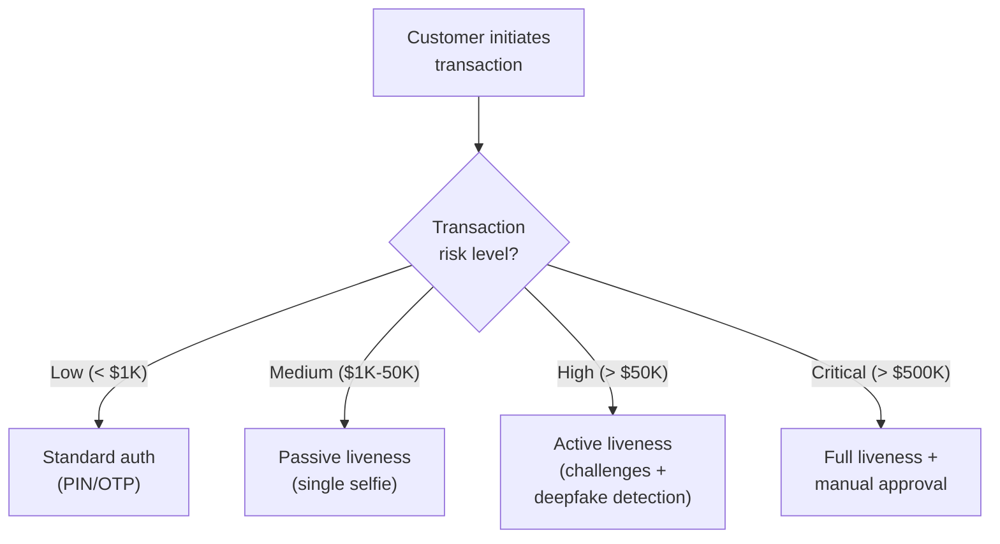

# 7.2 Transaction Authentication

---

## Step-Up Authentication with Liveness

For high-value or high-risk transactions, liveness verification serves as a **step-up authentication** factor.

| Transaction Type | Liveness Requirement | Threshold |
|-----------------|---------------------|-----------|
| Internal transfer < $1,000 | None (standard auth) | — |
| External transfer $1K-$50K | Passive liveness | 0.80 |
| Wire transfer > $50K | Active + passive | 0.90 |
| Beneficiary change | Active liveness | 0.85 |
| Large loan disbursement | Full hybrid + deepfake | 0.92 |

*Next: [Video KYC (V-CIP) →](video-kyc.md)*
