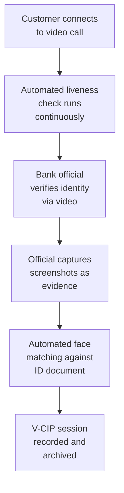

# 7.3 Video KYC (V-CIP)

---

## RBI V-CIP Framework

Video-based Customer Identification Process (V-CIP) is an **RBI-approved method** for remote KYC in India, where a bank official conducts a live video call with the customer.

## How Liveness Integrates with V-CIP

| V-CIP Requirement | Liveness Role |
|-------------------|---------------|
| Real-time interaction | Continuous liveness monitoring throughout call |
| Customer identification | Liveness + face matching against ID |
| Geo-tagging | Verify customer's claimed location matches device GPS |
| Video recording | Ensure recorded video is of live person (not replayed) |
| Official verification | Liveness assists official; doesn't replace human judgment |

*Next: [Loan Disbursement →](loan-disbursement.md)*
