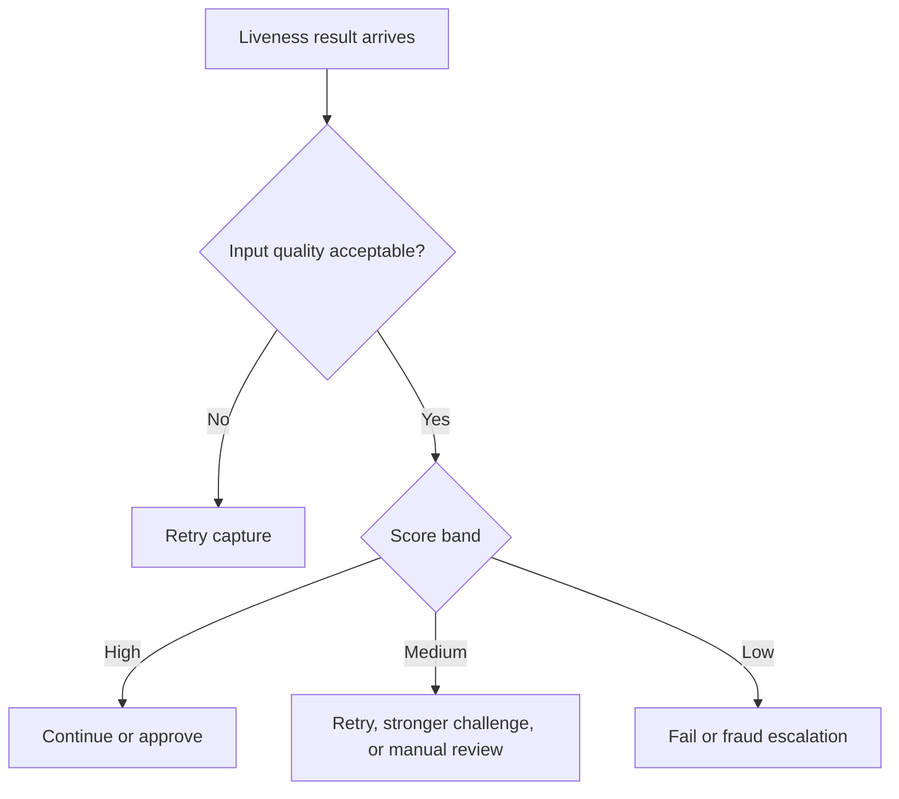

# 07. Decision Logic

## Who should read this page

This page is useful for product teams, backend engineers, risk teams, QA teams, and anyone defining what the system should do after receiving a liveness result.

---

## Why this page exists

A liveness model does not make business decisions by itself. A real system needs decision logic that is understandable, testable, and aligned with risk.

This page explains how to go from score to action.

---

## The key idea

Do not ask only:

> What score did the model return?

Also ask:

> What action should our system take for this use case, risk level, and confidence band?

---

## A simple three-band policy

A very common pattern is:

| Band | Example score range | Action |
|------|---------------------|--------|
| high confidence | 80 to 100 | approve or continue |
| uncertain | 50 to 79 | retry, combine, or review |
| low confidence | below 50 | fail or escalate |

These score ranges are only an example. Teams must calibrate them using their own evaluated data.

---

## Why three bands are often better than two

A strict pass/fail split can be too crude. Many production systems benefit from a middle band for uncertain cases.

| Policy style | Benefit | Risk |
|-------------|---------|------|
| pass/fail only | simple to explain | can force too many bad decisions |
| pass/retry/fail | handles uncertainty better | slightly more policy complexity |
| pass/review/fail | good for higher-risk flows | adds operational workload |

---

## Example decision flow

---

## Factors that should influence policy

### 1. Use case risk
A login convenience flow and a new-account opening flow do not have the same fraud impact.

### 2. Other signals
Liveness should be combined with other signals when appropriate:

- face match quality
- device risk
- behavioral risk
- geo or network anomalies
- previous fraud history

### 3. User friction tolerance
Some flows can support a retry or step-up challenge more easily than others.

---

## Example policy by use case

| Use case | Typical policy direction |
|----------|--------------------------|
| low-risk login | lower friction, more retry tolerance |
| new account opening | stronger liveness and stricter uncertain handling |
| account recovery | strict policy because fallback abuse is common |
| high-value transaction | strongest policy and more escalation options |

---

## Retry policy examples

### Safe retry pattern

- allow 1 or 2 guided retries
- change the capture guidance on each retry
- stop after the retry cap
- log retry counts for analysis

### Unsafe retry pattern

- unlimited retries
- no quality guidance
- same threshold every time with no monitoring

Unlimited retries can become a feedback loop for attackers.

---

## Combining liveness with other checks

### Example combined decision view

| Liveness | Face match | Device/risk context | Suggested action |
|----------|------------|---------------------|------------------|
| strong | strong | low risk | approve |
| strong | weak | low risk | retry or manual review |
| uncertain | strong | high risk | stronger challenge or review |
| weak | any | any | fail or escalate |

This kind of matrix often explains policy better than a single threshold.

---

## Decision logic for passive, active, and hybrid methods

| Method | Policy note |
|--------|-------------|
| passive | easiest user experience, but thresholding must be tested carefully |
| active | challenge result may deserve stronger trust in higher-risk flows |
| hybrid | useful when balancing user experience and attack resistance |

---

## Manual review policy

Manual review should be intentional, not accidental.

### Good candidates for review

- uncertain liveness with high business value
- conflicting liveness and face match signals
- edge-case device or environment conditions
- high-risk customers with incomplete evidence

### Not ideal for review

- obvious input quality failure that should just trigger retry
- massive traffic volumes without review capacity

---

## Version your policy

A system becomes hard to manage when the model changes but the policy history is not tracked.

Track at least:

- model version
- threshold set or score band policy
- retry policy version
- fallback rule version

This makes later analysis possible.

---

## Example policy table for documentation

| Condition | Decision | Reason |
|-----------|----------|--------|
| quality too low | retry | evidence not strong enough |
| liveness high and other checks good | approve | low spoof risk |
| liveness medium | retry or review | uncertain evidence |
| liveness low | fail | spoof risk too high |
| repeated uncertain attempts | escalate | risk of probing or attack |

---

## Common mistakes

- copying threshold values from another vendor without local testing
- treating score as universal truth
- allowing too many retries
- mixing model output and business decision too early
- not documenting why a rule exists

---

## Final takeaway

Good decision logic is:

- simple enough to explain
- strong enough for the threat model
- measured on real data
- versioned over time
- clear about retry, review, and failure paths

That is what turns a liveness score into a production-ready control.

---

## Related docs

- [05. Real-World Examples](05-real-world-examples.md)
- [06. API and Response Examples](06-api-and-response-examples.md)
- [08. Evaluation Playbook](08-evaluation-playbook.md)
- [09. Common Failures](09-common-failures.md)

## Read next

Go to [08. Evaluation Playbook](08-evaluation-playbook.md).
