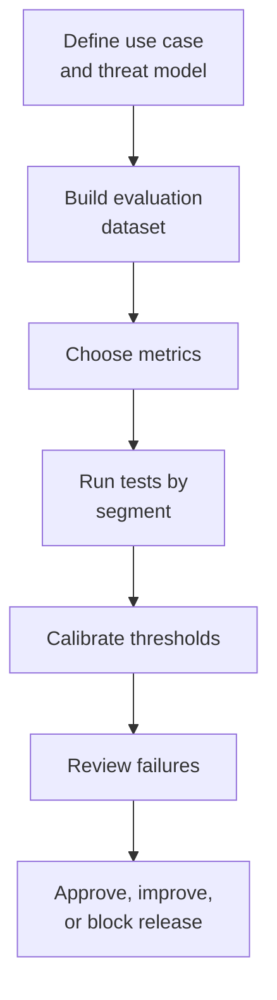

# 08. Evaluation Playbook

## Who should read this page

This page is mainly for ML engineers, evaluators, QA teams, fraud teams, and decision-makers who need to know whether a liveness system is actually ready for production.

---

## Why this page exists

Many face liveness discussions stop at model training or a few benchmark numbers. That is not enough for a real deployment.

Evaluation should answer a harder question:

> How well does the system behave on the attacks, devices, conditions, and users that matter in our environment?

---

## What good evaluation should cover

A strong evaluation should cover at least these dimensions:

- genuine live traffic conditions
- attack diversity
- device diversity
- capture quality variation
- environment variation
- fairness and accessibility impact
- operational metrics such as latency and retry rate

---

## A simple evaluation flow

---

## Step 1: Define the evaluation question

Before measuring anything, define the use case clearly.

Examples:

- account opening on Android and iPhone app
- browser onboarding on lower-end webcams
- high-risk transaction step-up with short selfie video
- account recovery with passive liveness only

The same model can behave very differently across these settings.

---

## Step 2: Build the right dataset

### Include both bona fide and attack data
At minimum, your dataset should contain:

- genuine live captures
- print attacks
- replay attacks
- injection-style attacks if relevant
- mask or 3D attack types where risk exists
- AI-generated or manipulated content where relevant

### Include realistic variation
Do not make the dataset too clean.

Include variation in:

- lighting
- camera quality
- blur
- pose
- occlusion
- background
- network or compression effects when relevant

---

## Step 3: Segment the data

Overall averages are not enough.

Useful segmentation examples:

| Segment type | Example |
|--------------|---------|
| device | low-end Android, flagship Android, iPhone, laptop webcam |
| channel | mobile app, mobile web, desktop web |
| environment | indoor bright, low light, outdoor mixed light |
| attack type | print, replay, injection, deepfake |
| user journey | onboarding, login step-up, recovery |

A model can look good overall while failing badly in one segment.

---

## Step 4: Use metrics that matter

### Core PAD metrics

- APCER: how often attack presentations are incorrectly accepted
- BPCER: how often genuine users are incorrectly rejected
- ACER: average of APCER and BPCER

### Operational metrics

- latency
- retry rate
- completion rate
- manual review rate
- device-specific failure rate

### Why both matter
A model can look strong on ACER but still create a bad user journey if retry or completion rates are poor.

---

## Step 5: Calibrate thresholds

Threshold choice is not just a model question. It is a business and risk decision.

### Good threshold calibration process

1. evaluate score distributions on live and spoof data
2. compare results by segment
3. choose a threshold or score bands for the target use case
4. test the policy with retry logic included
5. review business impact before release

---

## Step 6: Review failures, not just metrics

Look at examples where the system failed and group them by reason.

### Common failure buckets

- low light
- blur
- occlusion
- reflective screen replay
- weak browser capture quality
- unusual camera angle
- model confusion on AI-generated content

Failure review often teaches more than one more decimal point in a benchmark table.

---

## Example test matrix

| Dimension | Example values |
|-----------|----------------|
| app channel | Android app, iOS app, web |
| device class | low-end, mid-range, high-end |
| capture type | still image, short video |
| attack type | print, replay, injection, deepfake |
| environment | bright indoor, dim indoor, outdoor |

This kind of matrix helps teams see coverage gaps early.

---

## Release readiness checklist

- [ ] use case defined clearly
- [ ] threat model documented
- [ ] attack types mapped to evaluation data
- [ ] live data covers real capture conditions
- [ ] results reviewed by key segment
- [ ] thresholds calibrated on local data
- [ ] retry policy evaluated with model outputs
- [ ] failure analysis completed
- [ ] rollback criteria defined
- [ ] monitoring plan ready for launch

---

## What not to do

| Weak practice | Why it is risky |
|--------------|-----------------|
| testing only on clean lab data | hides real-world failure modes |
| using only one overall metric | hides segment weakness |
| copying another team's threshold | may be wrong for your use case |
| ignoring browser and low-end devices | causes production surprises |
| skipping post-launch re-evaluation | attackers and data drift change over time |

---

## After launch: evaluation never fully stops

Real systems need ongoing checks.

Monitor for:

- score distribution drift
- sudden changes in retry rate
- model regressions after updates
- new attack patterns
- segment-specific degradation

Evaluation should continue after deployment, not end there.

---

## Final takeaway

A good liveness evaluation is not just “How accurate is the model?”

It is:

- how accurate on our attacks
- how accurate on our devices
- how accurate in our environments
- how usable for our customers
- how stable after release

That is what makes evaluation useful.

---

## Related docs

- [03. Deployment Guide](03-deployment-guide.md)
- [07. Decision Logic](07-decision-logic.md)
- [09. Common Failures](09-common-failures.md)
- [Appendix A3 — Metrics and Evaluation](appendix/A3-metrics-and-evaluation.md)

## Read next

Go to [09. Common Failures](09-common-failures.md).
