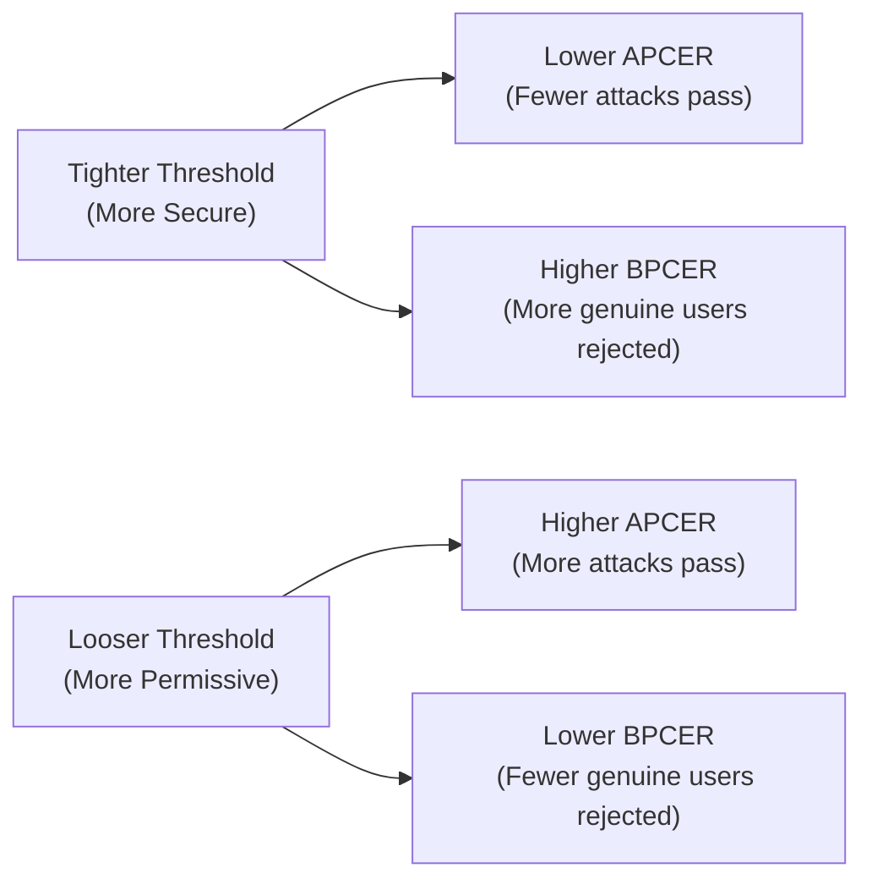

# 8.1 Performance Metrics Deep Dive

---

## Core Metrics

### The APCER-BPCER Tradeoff

### Metrics Reference

| Metric | Formula | Banking Target | What It Means |
|--------|---------|---------------|---------------|
| **APCER** | Attacks accepted / Total attacks (per species) | < 1% (iBeta requires 0%) | How many attacks get through |
| **BPCER** | Genuine rejected / Total genuine | < 5% | How many real users are blocked |
| **ACER** | (APCER + BPCER) / 2 | < 3% | Overall balanced error |
| **EER** | Point where APCER = BPCER | < 2% | System's inherent accuracy |
| **TDR @ BPCER=1%** | Attack detection rate at 1% false rejection | > 99% | Security at practical operating point |
| **AUC** | Area under ROC curve | > 0.999 | Overall discriminative power |

### Reporting Best Practices

!!! danger "Always Report Per-Species APCER"
    Aggregate APCER is misleading. A system might have 0% APCER for prints but 15% for screen replays. Always report APCER broken down by PAI species, as required by ISO 30107-3.

## Threshold Tuning

| Banking Context | Recommended Operating Point | Expected BPCER |
|----------------|---------------------------|----------------|
| Mass-market onboarding | APCER < 2% | 2-3% |
| Premium account opening | APCER < 0.5% | 3-5% |
| High-value transactions | APCER < 0.1% | 5-8% |
| Regulatory-critical (V-CIP) | APCER = 0% (target) | 8-12% |

*Next: [Testing Methodology →](testing-methodology.md)*
