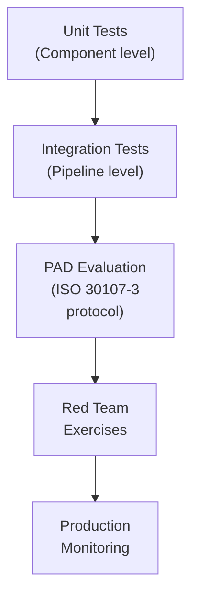

# 8.2 Testing Methodology

---

## Testing Layers

## Internal PAD Test Protocol

Before submitting to iBeta, conduct comprehensive internal testing:

| Phase | What | How | Minimum Scale |
|-------|------|-----|---------------|
| **Phase 1: Lab testing** | Controlled environment, known attacks | Internal team generates attacks | 50 subjects × 10 species = 500 attacks |
| **Phase 2: Extended testing** | Multiple environments, more subjects | Recruit diverse test subjects | 200 subjects × 15 species = 3,000 attacks |
| **Phase 3: Red team** | Adversarial testing by security team | Team actively tries to bypass system | Ongoing, document all findings |
| **Phase 4: Field pilot** | Real-world conditions with real users | Limited deployment with monitoring | 10,000+ genuine + track attack attempts |

## Test Matrix Template

| PAI Species | # Attempts | # Accepted | APCER | Status |
|-------------|-----------|------------|-------|--------|
| Print (laser, A4) | 150 | 0 | 0.00% | ✅ Pass |
| Print (photo lab, glossy) | 150 | 0 | 0.00% | ✅ Pass |
| Screen (phone, photo) | 150 | 0 | 0.00% | ✅ Pass |
| Screen (phone, video) | 150 | 1 | 0.67% | ⚠️ Review |
| Screen (tablet, video) | 150 | 0 | 0.00% | ✅ Pass |
| Screen (4K monitor, video) | 150 | 3 | 2.00% | ❌ Fail |
| Paper mask (cutouts) | 150 | 0 | 0.00% | ✅ Pass |
| Latex mask | 150 | 2 | 1.33% | ❌ Fail |
| **Bona fide** | **300** | **285 accepted** | **BPCER = 5%** | ⚠️ Borderline |

*Next: [Red Team & Penetration Testing →](red-team.md)*
