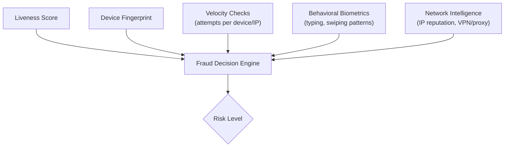

# 9.2 Anti-Fraud Intelligence

---

## Beyond Liveness: Fraud Signal Integration

## Key Anti-Fraud Signals

| Signal | What It Detects | Implementation |
|--------|----------------|----------------|
| **Device fingerprinting** | Same device used for multiple identities | Device ID hash (hardware IDs, screen, OS version) |
| **Velocity checks** | Brute-force attempts, fraud rings | Max 3 attempts/session, 10/day/device, 50/day/IP |
| **Face clustering** | Same face attempting multiple identities | Compare face embeddings across recent applications |
| **Geo-velocity** | Impossible travel (two applications from distant locations within short time) | GPS + IP geolocation comparison |
| **IP reputation** | Known VPN, proxy, data center IPs | Commercial IP intelligence feeds |
| **Behavioral biometrics** | Bot-like interaction patterns | Touch pressure, typing speed, scrolling patterns |
| **Dark web monitoring** | Liveness bypass tools being sold | Threat intelligence feeds, underground forum monitoring |

*Next: [Privacy & Data Protection →](privacy.md)*
