# 9.4 Incident Response Playbook

---

## When a Liveness Bypass Is Discovered

```mermaid
graph TD
    A["🚨 Bypass<br>Detected"] --> B["1. CONTAIN<br>(Disable affected<br>attack vector)"]
    B --> C["2. ASSESS<br>(How many accounts<br>affected?)"]
    C --> D["3. NOTIFY<br>(Regulator, CISO,<br>Board)"]
    D --> E["4. REMEDIATE<br>(Patch model,<br>update thresholds)"]
    E --> F["5. RE-VERIFY<br>(Review affected<br>accounts)"]
    F --> G["6. REPORT<br>(Root cause,<br>lessons learned)"]
```

## Response Timeline

| Action | SLA | Responsible |
|--------|-----|-------------|
| Initial detection and triage | < 1 hour | Security Operations Center |
| Contain (disable vulnerable vector) | < 4 hours | Engineering + SecOps |
| Impact assessment (how many affected) | < 24 hours | Fraud + Engineering |
| Regulator notification (if required) | < 72 hours (GDPR), varies by jurisdiction | Compliance |
| Model patch deployed | < 1 week | ML Engineering |
| Affected account re-verification | < 2 weeks | Operations + Fraud |
| Root cause analysis report | < 30 days | Security + Engineering |

## Communication Templates

!!! warning "Regulator Notification (Template)"
    **Subject:** Biometric Verification System Security Incident Notification
    
    **Key information to include:**
    - Date and time of discovery
    - Nature of the vulnerability
    - Number of potentially affected accounts
    - Immediate containment actions taken
    - Remediation plan and timeline
    - Customer impact assessment
    - Ongoing monitoring measures

*Next: [Legal & Contractual Framework →](legal-framework.md)*
