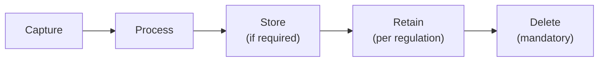

# 9.3 Privacy & Data Protection

---

## Biometric Data Lifecycle

## Regulatory Requirements

| Regulation | Classification | Consent | Storage | Retention | Deletion |
|-----------|---------------|---------|---------|-----------|----------|
| **GDPR (EU)** | Special category (Art. 9) | Explicit consent required | Encrypted, within EU/adequate country | Purpose-limited | Right to erasure (Art. 17) |
| **DPDPA (India)** | Sensitive personal data | Informed consent | Within India (data localization) | Per purpose + regulatory need | On withdrawal of consent |
| **BIPA (Illinois)** | Biometric identifier | Written informed consent | N/A (don't sell/lease) | Max 3 years or purpose completion | Upon achieving purpose |
| **CCPA (California)** | Biometric information | Notice at collection | Reasonable security | 12 months minimum record | Right to delete |

## Privacy-by-Design Principles

| Principle | Implementation |
|-----------|---------------|
| **Data minimization** | Process liveness without storing raw face images when possible |
| **Purpose limitation** | Use biometric data only for identity verification, not marketing |
| **Encryption at rest** | AES-256 encryption for any stored biometric data |
| **Encryption in transit** | TLS 1.3 for all biometric data transmission |
| **Access controls** | Strict RBAC; biometric data accessible only to verification pipeline |
| **Audit trails** | Log all access to biometric data for compliance auditing |
| **Retention limits** | Delete raw images after verification; retain only scores/decisions |
| **Consent management** | Obtain explicit consent before biometric capture; allow withdrawal |

*Next: [Incident Response Playbook →](incident-response.md)*
