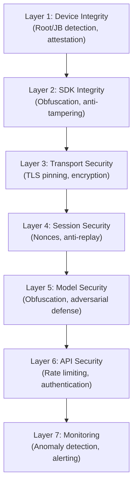

# 9.1 Security Hardening

---

## Defense Layers

## Implementation Checklist

| Control | Priority | Implementation |
|---------|----------|---------------|
| TLS 1.3 with certificate pinning | P0 | Pin to leaf or intermediate certificate |
| Device attestation | P0 | SafetyNet/Play Integrity (Android), DeviceCheck (iOS) |
| Session nonces | P0 | Cryptographically random, single-use, time-bound |
| Frame encryption | P0 | AES-256-GCM with session-derived keys |
| Anti-replay tokens | P0 | One-time tokens bound to session + timestamp |
| Root/jailbreak detection | P1 | Multiple detection methods (not just one check) |
| Code obfuscation | P1 | ProGuard/R8 (Android), bitcode (iOS), LLVM obfuscation |
| Anti-debugging | P1 | Detect Frida, GDB, LLDB, Cycript |
| Model encryption | P1 | Encrypt model weights at rest, decrypt in memory |
| Rate limiting | P1 | Per-device, per-IP, per-session limits |
| API authentication | P1 | OAuth 2.0 / API keys with rotation |
| Score obfuscation | P2 | Return binary decisions to client, never raw scores |
| Sensor correlation | P2 | Verify camera motion matches gyroscope data |

*Next: [Anti-Fraud Intelligence →](anti-fraud.md)*
