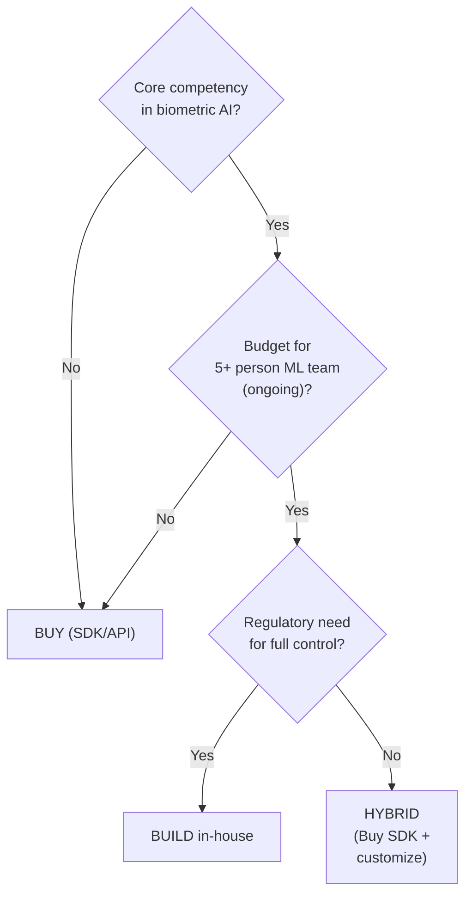

# 10.1 Build vs Buy Analysis

---

## Decision Framework

## Comparison

| Factor | Build In-House | Buy (SDK/API) | Hybrid |
|--------|---------------|---------------|--------|
| **Time to market** | 12-24 months | 2-4 weeks | 2-6 months |
| **Initial cost** | $500K-2M | $50K-200K | $200K-500K |
| **Annual cost** | $300K-1M (team) | $100K-500K (license) | $200K-600K |
| **Team required** | 5-10 ML engineers | 1-2 integration engineers | 2-4 engineers |
| **iBeta certification** | Your responsibility ($30K-80K) | Vendor provides | Shared |
| **Model updates** | Your responsibility (continuous) | Vendor provides | Shared |
| **Customization** | Full control | Limited | Good |
| **Data sovereignty** | Full control | Depends on vendor architecture | Better control |
| **Risk** | High (technical + regulatory) | Low (vendor responsibility) | Medium |

## When to Build

!!! success "Build If:"
    - You have 100M+ annual verifications (cost efficiency at scale)
    - Biometric AI is a core business differentiator
    - Regulatory requirements demand full data and model control
    - You have established ML infrastructure and team

## When to Buy

!!! success "Buy If:"
    - You need to launch within 3 months
    - Annual verification volume < 10M
    - You don't have ML engineering capacity
    - You want proven iBeta-certified solution

*Next: [Vendor Evaluation Framework →](vendor-evaluation.md)*
