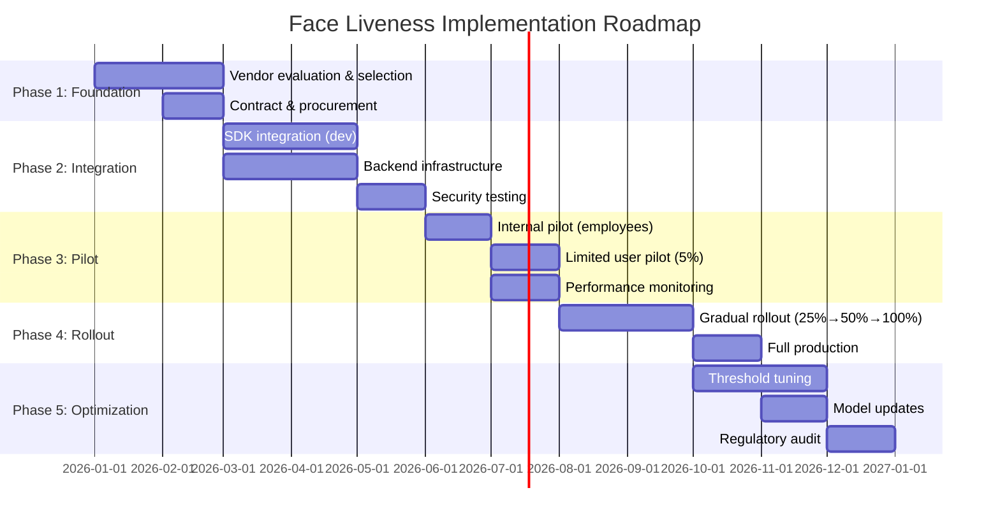

# 10.4 Implementation Roadmap

---

## Phased Deployment Plan

## Go-Live Checklist

- [ ] iBeta Level 1 certification obtained (or vendor-provided)
- [ ] Internal security testing passed (all PAI species)
- [ ] Red team exercise completed
- [ ] BPCER < 5% confirmed on production device mix
- [ ] Deepfake detection enabled and tested
- [ ] Device attestation enabled
- [ ] Audit logging verified and compliant
- [ ] Fallback flows tested (what happens when liveness fails)
- [ ] Manual review queue configured and staffed
- [ ] Monitoring dashboards live
- [ ] Regulatory documentation prepared
- [ ] Customer communication prepared
- [ ] Support team trained on liveness failure handling
- [ ] Data privacy impact assessment completed
- [ ] Incident response playbook documented

*Next: [Case Studies →](case-studies.md)*
