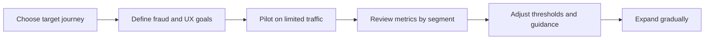

# 10. Product Guide

## Who should read this page

This page is mainly for product managers, business owners, solution leads, fraud leaders, and stakeholders who need to decide how face liveness should be used in a customer journey.

---

## Why this page exists

Many technical documents explain how face liveness works, but product teams need a different view:

- Where should we use it?
- How much friction is acceptable?
- What metrics matter most?
- How do we balance security and conversion?

This page answers those questions in simple product language.

---

## The core product trade-off

Face liveness always sits between two goals:

| Goal | What it means |
|------|----------------|
| security | stop spoofing, fraud, and abuse |
| user experience | minimize friction, retries, and abandonment |

A stronger policy often increases friction. A looser policy often increases risk. Product teams must choose intentionally.

---

## Where product teams usually use liveness

### Common journeys

- remote account opening
- login step-up for risky sessions
- high-value transaction approval
- account recovery
- agent-assisted or video KYC flow

### Product question to ask first

Which journeys create the highest fraud cost if spoofing succeeds?

That is often where face liveness adds the most value.

---

## Metrics product teams should track

### Security metrics

- spoof detection effectiveness
- fraud rate by journey
- review escalation rate

### User experience metrics

- completion rate
- retry rate
- abandonment rate
- average time to complete capture

### Operational metrics

- latency
- support contact rate
- device-specific failure rate
- manual review volume

A healthy product review usually looks at all three groups together.

---

## Example product trade-off table

| Product choice | Security effect | UX effect |
|----------------|-----------------|-----------|
| stricter threshold | reduces spoof acceptance risk | increases false reject risk |
| more retries | may help genuine users recover | may give attackers more probes |
| stronger step-up on risky flows | improves protection where needed | adds friction only when risk is high |
| passive-only everywhere | easy user journey | may be weaker in some high-risk scenarios |

---

## Questions a product team should answer

1. Which journeys really need liveness?
2. Which journeys can tolerate retry or step-up friction?
3. What is the acceptable false reject level for each flow?
4. What is the fallback path when liveness is uncertain?
5. How will we know if the experience is getting worse after release?

---

## Suggested product rollout approach

Gradual rollout is safer than enabling a new liveness policy for every user at once.

---

## Product guidance for retry design

### Good retry design

- clear user guidance
- small retry limit
- visible progress feedback
- quality-specific suggestions such as “move to better light”

### Poor retry design

- generic “verification failed” message
- no explanation or guidance
- repeated hard failure with no alternative path

Retry UX design strongly affects completion rate.

---

## Product guidance for fallback design

Fallback should be available, but it should not quietly become the weakest security path.

### Examples of fallback

- manual review
- agent-assisted verification
- delayed approval
- stronger second factor

### Product reminder
A weak fallback can erase the value of a strong liveness model.

---

## Product review checklist

- [ ] target journey defined
- [ ] fraud risk level defined
- [ ] acceptable friction level defined
- [ ] completion and retry targets defined
- [ ] fallback path defined
- [ ] rollout plan defined
- [ ] monitoring dashboard defined
- [ ] support team prepared for failure scenarios

---

## Final takeaway

From a product perspective, face liveness is not just a model feature. It is a journey-control tool.

Its success depends on:

- where it is placed in the journey
- how thresholds and retries are designed
- how fallback works
- how security and conversion are balanced over time

That is why product ownership matters.

---

## Related docs

- [05. Real-World Examples](05-real-world-examples.md)
- [07. Decision Logic](07-decision-logic.md)
- [09. Common Failures](09-common-failures.md)
- [04. Best Practices](04-best-practices.md)

## Read next

Go to [11. Advanced Topics](11-advanced-topics.md).
