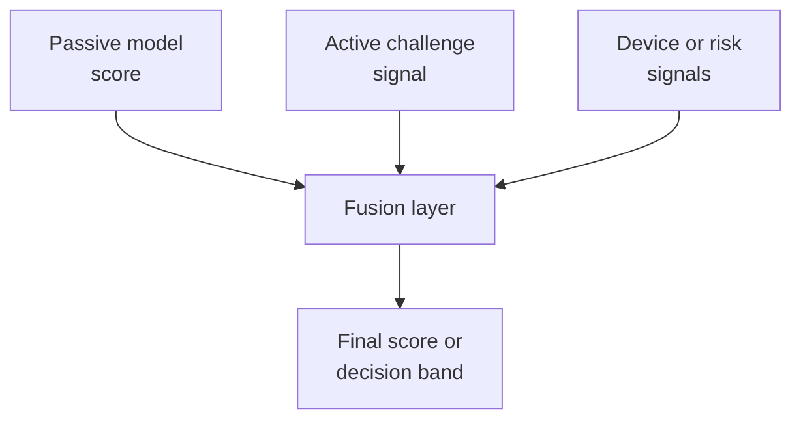

# 11. Advanced Topics

## Who should read this page

This page is mainly for ML engineers, solution architects, platform leads, and advanced readers who want to go beyond a single-model view of face liveness.

---

## Why this page exists

A strong production system often needs more than one raw model score.

Advanced teams start asking questions like:

- Should we combine multiple liveness models?
- How do we fuse passive and active signals?
- How do we calibrate scores from different models?
- How do we update systems safely without breaking policy?

This page introduces those topics in a practical way.

---

## Multi-model thinking

A single model can be strong, but different models often have different strengths.

Examples:

- one model may be stronger on replay attacks
- another may be stronger on low-light live samples
- one signal may work better on still images
- another may work better on video or challenge-response flows

This is why teams sometimes use model fusion.

---

## Simple fusion idea

The fusion layer can be simple or advanced.

---

## Common fusion approaches

| Approach | What it means | When it helps |
|----------|----------------|---------------|
| rule-based fusion | combine scores with clear hand-written rules | useful early when explainability matters |
| weighted average | combine calibrated scores by weight | useful when signals are comparable |
| meta-model | train a model on top of model outputs and context | useful when enough labeled data exists |
| risk-policy fusion | keep model outputs separate and combine at decision stage | useful when business rules are important |

---

## Why calibration matters

Two model scores are rarely comparable by default.

A score of 0.8 from one model may not mean the same thing as 0.8 from another model. Before combining models, teams usually need calibration or normalization.

### Practical reminder
Do not average raw scores from different models unless you have verified that this makes sense.

---

## Meta-models for liveness fusion

A meta-model uses outputs from several base models as input features.

### Possible meta-model inputs

- passive liveness score
- active liveness score
- frame-quality indicators
- face-match strength
- device risk features
- retry count
- flow type

### Possible outputs

- final live/spoof label
- calibrated score
- decision band such as pass, retry, fail

### Why this can help
A meta-model can learn patterns that a single threshold cannot capture.

### Why this can go wrong
A meta-model can also overfit, hide explainability, or create maintenance burden if not evaluated carefully.

---

## Fusion design questions

1. What weakness of the current system are we trying to improve?
2. Do we have enough labeled data for fusion training?
3. Are the input signals stable across devices and releases?
4. Can we still explain final decisions?
5. How will we version and monitor the fusion layer?

If these answers are weak, a simpler rule-based policy may be better at first.

---

## Advanced deployment topics

### Score calibration and threshold migration
When a model version changes, score ranges may shift. Policy should not assume score stability forever.

### Channel-specific policy
Mobile app, mobile web, and desktop web may each need different thresholds or fusion rules.

### Attack-aware policy
Some teams use different decision handling when strong evidence suggests replay versus injection versus simple quality failure.

### Continuous monitoring
Advanced systems monitor not only final decisions, but also shifts in individual model scores and fusion behavior.

---

## A practical maturity ladder

| Maturity level | Typical setup |
|----------------|---------------|
| level 1 | single model with one threshold |
| level 2 | single model with score bands and retry logic |
| level 3 | multiple signals combined by rules |
| level 4 | calibrated multi-model fusion |
| level 5 | fusion plus continuous adaptation and advanced monitoring |

This helps teams grow without jumping too fast into complexity.

---

## When not to add complexity

Do not add fusion or meta-models just because they sound advanced.

Avoid unnecessary complexity when:

- your current single-model system is not yet well evaluated
- your response schema and policy are still unstable
- your labeled data is weak or noisy
- your monitoring is not mature enough to detect regressions

In these cases, strong basics usually matter more than clever fusion.

---

## Final takeaway

Advanced liveness systems often win by combining:

- better signals
- better calibration
- better policy
- better monitoring

Not by adding complexity blindly.

That is why advanced design should build on strong foundations, not replace them.

---

## Need term help?

If any technical terms on this page feel dense, use [Appendix A1 — Key Terms](appendix/A1-key-terms.md) first and then jump to the relevant appendix page for deeper detail.

---

## Related docs

- [03. Deployment Guide](03-deployment-guide.md)
- [07. Decision Logic](07-decision-logic.md)
- [08. Evaluation Playbook](08-evaluation-playbook.md)
- [Appendix A3 — Metrics and Evaluation](appendix/A3-metrics-and-evaluation.md)

## Read next

Go to [12. Fusion and Meta-Model](12-fusion-and-meta-model.md), or jump to [Appendix A1 — Key Terms](appendix/A1-key-terms.md) for deep reference.
