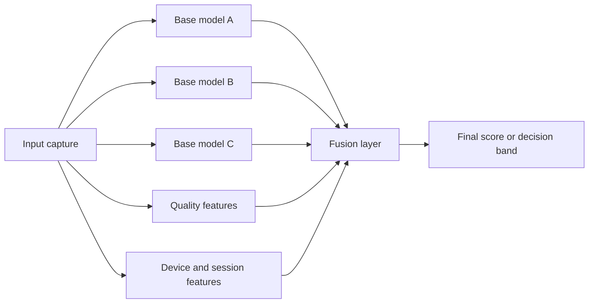
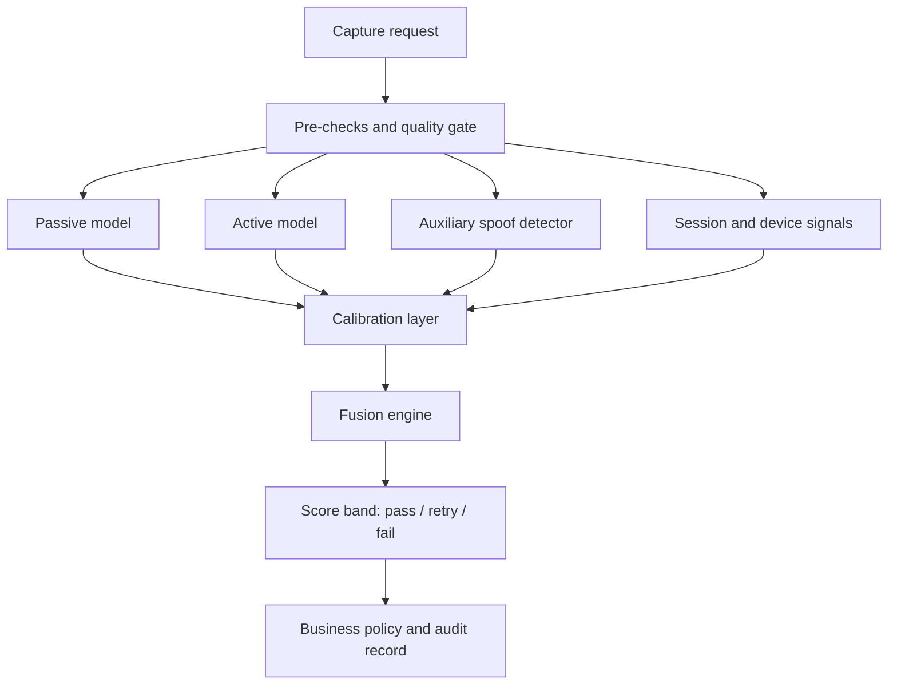

# 12. Fusion and Meta-Model

## Who should read this page

This page is mainly for ML engineers, solution architects, fraud teams, and technical leads who want to combine multiple liveness signals into one stronger decision layer.

---

## Why this page exists

A single liveness model can be strong and still miss some attacks, fail on some devices, or become unstable in some environments.

Fusion tries to improve that by combining multiple signals instead of trusting one score alone.

That can include:

- multiple liveness models
- capture quality signals
- device risk signals
- challenge-response outputs
- business context such as flow type or transaction risk

Used well, fusion can improve stability and attack coverage.

Used badly, it can add latency, hide errors, and become hard to maintain.

---

## The problem fusion is trying to solve

A real production system often sees situations like these:

- model A is strong on replay but weak on poor lighting
- model B is strong on low-light but noisy on web cameras
- challenge-response helps, but only in active flows
- device and capture quality affect every score

Fusion gives the system a way to reason across these signals instead of treating each one in isolation.

---

## A simple fusion view



---

## Types of fusion

| Fusion type | What it does | Good for | Main risk |
|-------------|--------------|----------|-----------|
| rule-based fusion | combines signals with explicit if/then rules | early systems, strong explainability needs | can become brittle |
| weighted score fusion | combines calibrated scores using fixed weights | when models are stable and comparable | weak if weights are poorly tuned |
| stacked meta-model | trains a second model on top of base-model outputs and context | mature systems with enough labeled data | can overfit and hide logic |
| policy-stage fusion | keeps scores separate and combines them only at decision time | strong business-policy control | may leave accuracy gains unused |

---

## Recommended maturity path

Do not start with a complex meta-model on day one.

A safer maturity path is:

1. single model with threshold
2. single model with score bands and retry logic
3. calibrated multi-signal rules
4. weighted fusion of calibrated signals
5. learned meta-model when data quality is strong

This reduces the chance of building a complicated system before the basics are proven.

---

## What can feed the fusion layer

### Base-model outputs

- passive liveness score
- active liveness score
- texture-based spoof score
- motion-based spoof score
- challenge-response success probability

### Capture quality features

- face size
- blur score
- brightness score
- pose score
- occlusion score
- frame stability

### Device and session features

- platform type
- app version
- SDK version
- browser family
- virtual camera signal
- emulator / rooted device signals
- network and compression hints

### Flow context

- onboarding vs login vs transaction approval
- risk tier
- retry count
- previous failed attempt count

---

## A practical fusion feature table

| Feature group | Example fields |
|---------------|----------------|
| base model scores | `model_a_score`, `model_b_score`, `model_c_score` |
| quality | `blur_score`, `brightness_score`, `pose_score`, `face_size_ratio` |
| context | `flow_type`, `risk_tier`, `retry_count` |
| device | `platform`, `device_class`, `sdk_version`, `browser_family` |
| security | `root_signal`, `emulator_signal`, `virtual_camera_signal` |
| optional identity signal | `face_match_score`, `id_match_status` |

Do not feed raw identity data into the fusion layer unless governance and privacy policy explicitly allow it.

---

## Proposed architecture for a practical system



### Why this architecture is practical

- it keeps pre-checks separate from model scoring
- it allows calibration before combination
- it supports both explainable rules and learned fusion
- it gives a clean place for audit logs and decision policy

---

## Rule-based fusion example

A strong first version can be rule-based.

```text
If passive_score is high AND quality is acceptable AND no device-risk flag exists,
then accept.

If passive_score is medium AND active challenge passes,
then accept.

If any strong injection or virtual-camera signal exists,
then reject or route to manual review.

If quality is poor,
then retry instead of labeling as spoof.
```

This is often better than jumping directly to a hidden meta-model.

---

## Meta-model example

A meta-model can be trained on top of the base signals.

### Example inputs

- calibrated passive score
- calibrated active score
- blur score
- brightness score
- face size ratio
- device class
- flow type
- retry count
- challenge success flag

### Example outputs

- final probability of live
- final probability of spoof
- score band recommendation

### Common model choices

- logistic regression for strong interpretability
- gradient-boosted trees for flexible tabular fusion
- shallow neural network when feature interactions are richer

In many cases, a well-designed gradient-boosted tree or logistic regression is enough.

---
## Example fusion feature payload

A practical fusion system often works with a tabular feature record like this:

```json
{
  "request_id": "8c4d3f9a",
  "flow_type": "account_opening",
  "risk_tier": "high",
  "platform": "android",
  "device_class": "mid_range",
  "model_scores": {
    "passive": 0.81,
    "active": 0.72,
    "aux_spoof": 0.18
  },
  "quality": {
    "blur_score": 0.14,
    "brightness_score": 0.63,
    "pose_score": 0.91,
    "face_size_ratio": 0.34
  },
  "security": {
    "root_signal": false,
    "emulator_signal": false,
    "virtual_camera_signal": false
  },
  "context": {
    "retry_count": 1,
    "challenge_passed": true
  }
}
```

This is the kind of row that later becomes training data for a meta-model.

---

## Example fusion decision record

The output should stay explainable enough for monitoring and review.

```json
{
  "request_id": "8c4d3f9a",
  "fusion_score": 0.87,
  "decision_band": "pass",
  "reason_codes": [
    "passive_score_high",
    "challenge_passed",
    "quality_ok",
    "no_high_risk_security_signal"
  ],
  "model_versions": {
    "passive": "v2.3.0",
    "active": "v1.9.1",
    "fusion": "v0.6.4"
  }
}
```

Even if the fusion layer is learned, keep reason fields or score components where possible. That makes incident review and policy tuning much easier.

---

## When fusion should **not** be added yet

Fusion is usually premature when:

- base-model behavior is not yet stable
- labels are noisy or incomplete
- device metadata is unreliable
- teams are not logging enough intermediate signals
- thresholding and retry logic are still changing weekly

In these cases, strong basics usually matter more than a clever second-stage model.

---

## Need term help?

For terms used on this page, keep these references nearby:

- [Appendix A1 — Key Terms](appendix/A1-key-terms.md)
- [Appendix A3 — Metrics and Evaluation](appendix/A3-metrics-and-evaluation.md)
- [13. Dataset Strategy](13-dataset-strategy.md)

---

## Training target design

You should decide what the fusion layer is trying to predict.

Possible targets:

- binary live vs spoof
- three-way pass / retry / fail band
- risk score used by a separate policy engine

For most production systems, binary training plus decision bands at policy time is easier to maintain.

---

## Dataset needed for fusion

Fusion training needs more than images and labels.

Each row should include:

- final label
- attack type when available
- base-model outputs
- quality measurements
- device metadata
- flow context
- challenge result if active liveness is used

Example row:

| Field | Example |
|-------|---------|
| `sample_id` | `cap_001234` |
| `person_id` | `p_093` |
| `label` | `spoof` |
| `attack_type` | `replay_screen` |
| `device_class` | `mid_android` |
| `lighting_bucket` | `dim_indoor` |
| `model_a_score` | `0.41` |
| `model_b_score` | `0.77` |
| `blur_score` | `0.32` |
| `brightness_score` | `0.28` |
| `challenge_passed` | `false` |

More on this is covered in [13. Dataset Strategy](13-dataset-strategy.md).

---

## Calibration before fusion

Fusion should not combine raw scores blindly.

Why:

- one model may output scores in a narrow range
- another may output overconfident scores
- a third may shift after retraining

A strong pattern is:

1. calibrate each base model first
2. validate score stability by segment
3. then combine the calibrated outputs

See [14. Score Calibration and Thresholding](14-score-calibration-and-thresholding.md).

---

## Inference-time flow

A practical inference sequence looks like this:

1. capture input
2. run quality gate
3. execute available base models
4. collect device and session features
5. calibrate base-model scores
6. execute fusion layer
7. map final score to pass / retry / fail
8. store audit record with explanation fields

---

## Failure handling in fusion systems

Fusion systems need clear fallback rules.

### Examples

- if one base model times out, continue with a reduced-signal policy
- if quality is too poor, return retry instead of spoof
- if security signal is severe, bypass fusion and block
- if active challenge is unavailable on web, use the channel-specific policy

Do not let the fusion layer silently guess when major upstream pieces fail.

---

## How to measure whether fusion helped

Fusion is useful only if it improves real outcomes.

Track at least:

- APCER / BPCER changes by attack type
- retry rate
- completion rate
- latency increase
- segment stability across devices and channels
- calibration quality
- explainability and audit quality

A fusion system that improves a benchmark but damages latency, monitoring, or explainability may not be worth shipping.

---

## Risks and limitations

| Risk | Why it matters | Mitigation |
|------|----------------|------------|
| overfitting | fusion model learns training quirks, not general behavior | strict holdout sets and segment tests |
| hidden leakage | same people or attack setup appears across splits | person-disjoint and scenario-aware splits |
| score instability | upstream model changes break fusion assumptions | per-model calibration and release gates |
| poor explainability | teams cannot explain final decisions | keep feature logs and explanation fields |
| latency creep | multiple models slow the user journey | budget latency and support degraded mode |

---

## Practical recommendation

Start with the simplest fusion layer that solves a real weakness.

Usually that means:

- calibrated scores
- a small number of trusted features
- explicit decision bands
- strong monitoring

Then add a learned meta-model only when your labels, operations, and evaluation process are mature enough.

---

## Related docs

- [11. Advanced Topics](11-advanced-topics.md)
- [13. Dataset Strategy](13-dataset-strategy.md)
- [14. Score Calibration and Thresholding](14-score-calibration-and-thresholding.md)
- [15. Error Analysis](15-error-analysis.md)
- [23. System Architecture](23-system-architecture.md)

## Read next

Go to [13. Dataset Strategy](13-dataset-strategy.md).
