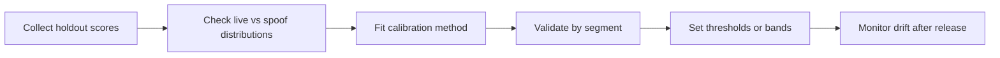

# 14. Score Calibration and Thresholding

## Who should read this page

This page is mainly for ML engineers, platform engineers, risk teams, and anyone deciding how model scores should turn into pass, retry, or fail decisions.

---

## Why this page exists

A model score is not a business decision.

A score must be:

- interpreted correctly
- calibrated when needed
- converted into thresholds or bands
- tested against the real use case

This matters even more when multiple models are combined.

---

## Raw score vs calibrated score

### Raw score
A raw score is the direct output of a model.

### Calibrated score
A calibrated score is adjusted so it better matches observed probability or decision behavior.

Two models may both output `0.80`, but those numbers may not mean the same thing.

---

## Why calibration matters in liveness

Calibration helps when:

- different models use different score scales
- model retraining shifts score distributions
- one channel behaves differently from another
- fusion needs comparable signals
- risk teams want consistent decision bands

---

## A practical calibration flow



---

## Common calibration methods

| Method | Good for | Main caution |
|--------|----------|--------------|
| min-max normalization | simple score scaling | does not fix probability meaning |
| z-score normalization | stable internal comparisons | weak when distributions drift |
| Platt scaling | smooth probability mapping | assumes sigmoid-like behavior |
| isotonic regression | flexible calibration | can overfit on small data |
| quantile banding | practical risk bands | less precise as probability |

For many production systems, a simple and well-tested calibration approach is more useful than a mathematically fancy one.

---

## Thresholds should match the use case

Different use cases often need different thresholds.

| Use case | Typical goal | Usual bias |
|----------|--------------|------------|
| account opening | strong fraud control with reasonable completion | slightly stricter |
| login step-up | strong usability with targeted security | balanced |
| high-value transaction | low attack acceptance | stricter |
| account recovery | strong fraud control and auditability | strict plus fallback |

Do not assume one threshold is correct everywhere.

---

## Score bands are often better than one hard threshold

A simple banded policy is easier to operate.

| Band | Meaning | Typical action |
|------|---------|----------------|
| high confidence live | strong evidence of genuine user | accept |
| uncertain | mixed or weak evidence | retry or step-up |
| high risk spoof | strong spoof evidence or severe security flag | reject or review |

This gives the system room to treat ambiguity differently from clear fraud.

---

## Example threshold policy

```text
If calibrated_score >= 0.85 and quality is acceptable:
    accept

If 0.55 <= calibrated_score < 0.85:
    retry once or trigger stronger challenge

If calibrated_score < 0.55:
    reject or route to manual review depending on flow risk
```

The exact numbers should come from local evaluation, not from generic advice.

---

## Segment-aware calibration

A good calibration review should check whether scores behave differently across:

- platform
- device class
- app vs web
- low light vs bright light
- attack type
- model version

If one segment behaves very differently, the answer may be:

- segment-specific calibration
- segment-specific threshold
- or a product decision to reduce exposure in that segment

---

## Calibration for fusion systems

When multiple models feed a fusion layer:

1. calibrate each model individually when needed
2. validate score stability by segment
3. combine the calibrated signals
4. then set the final fusion thresholds

This is usually safer than combining raw scores directly.

---

## Threshold migration across releases

Thresholds should be versioned with the model or policy.

A useful release question is:

> If the model changed, do the old thresholds still behave the same way?

Many teams miss this and accidentally shift user experience or fraud exposure after a model update.

---

## Retry threshold vs reject threshold

A common mistake is treating every low-confidence result as fraud.

Poor quality and spoof are not the same thing.

A stronger policy separates them:

- retry threshold for uncertain cases
- reject threshold for high-risk spoof cases
- separate quality-gate threshold where needed

---

## What to monitor after release

Calibration work is not finished at launch.

Monitor:

- score distribution shift
- pass / retry / reject rates
- segment-specific drift
- attack-type failures
- release-to-release threshold behavior

This is closely tied to [16. Monitoring and Operations](16-monitoring-and-operations.md).

---

## Common mistakes

| Mistake | Why it is risky |
|---------|-----------------|
| using one threshold for all channels | hides channel-specific behavior |
| averaging uncalibrated scores | creates unstable fusion |
| copying thresholds from a vendor demo | rarely fits local risk |
| recalibrating on test data | contaminates final evaluation |
| treating quality failures as spoof | hurts user experience and analysis |

---

## Final takeaway

Good thresholding is not just about picking a number.

It is about:

- understanding score meaning
- calibrating where needed
- mapping score to policy
- validating by segment
- monitoring drift after release

That is what turns model output into a trustworthy decision process.

---

## Related docs

- [07. Decision Logic](07-decision-logic.md)
- [12. Fusion and Meta-Model](12-fusion-and-meta-model.md)
- [15. Error Analysis](15-error-analysis.md)
- [16. Monitoring and Operations](16-monitoring-and-operations.md)

## Read next

Go to [15. Error Analysis](15-error-analysis.md).
