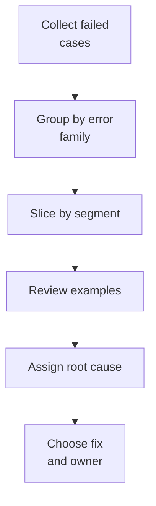

# 15. Error Analysis

## Who should read this page

This page is mainly for ML engineers, QA teams, fraud analysts, and release owners who need to understand why the system failed, not just how often it failed.

---

## Why this page exists

A benchmark number tells you that errors happened.

Error analysis tells you:

- what kind of errors happened
- where they happened
- why they happened
- what should be fixed next

That is why strong teams spend time reviewing failure cases, not only summary metrics.

---

## Start with the two main error families

| Error family | Meaning |
|--------------|---------|
| false accept | spoof was accepted as live |
| false reject | genuine user was rejected or routed into bad friction |

Both matter, but the business impact is different.

---

## A practical error-analysis workflow

---

## Useful segmentation axes

Do not review all failures as one pile.

Good segment views include:

- attack type
- platform and device class
- app vs web
- lighting condition
- blur or quality bucket
- model version
- SDK version
- geography or environment if relevant
- demographic segment if policy allows and it is appropriate

---

## Root-cause buckets

A simple triage taxonomy helps teams act faster.

| Root-cause bucket | Examples |
|-------------------|----------|
| model issue | score too high on replay, weak on deepfake, unstable under blur |
| data issue | missing attack type in training, poor low-light coverage, noisy labels |
| threshold issue | too strict on one channel, retry band too narrow |
| capture UX issue | user guidance weak, face too small, challenge unclear |
| infrastructure issue | timeout, frame drop, browser camera mismatch |
| security issue | injection not blocked, virtual camera not detected |

---

## False-accept review template

When a spoof is accepted, record:

- attack family and exact attack style
- device and platform
- score from each model
- quality metrics
- whether any security signal fired
- whether the attack is new or already known
- whether this should have been blocked by policy instead of the model

This helps separate model weakness from missing controls.

---

## False-reject review template

When a real user is rejected, record:

- platform and device
- lighting and blur conditions
- quality gate result
- liveness score and identity-match context if relevant
- retry count
- whether a better user instruction could have fixed the issue

Many false rejects come from poor capture conditions, not from a bad spoof detector.

---

## A simple investigation matrix

| Question | Why it matters |
|----------|----------------|
| Was the input genuinely poor quality? | may point to UX or quality gate |
| Did one model disagree strongly with others? | may reveal fusion or calibration issue |
| Is the failure concentrated on one device or channel? | may reveal platform problem |
| Did the same issue increase after a release? | may reveal regression |
| Is the attack new? | may require new data or new security control |

---

## What to save for every reviewed case

A good review package should preserve:

- request ID or sample ID
- final decision
- intermediate scores
- quality signals
- device/session metadata
- model and threshold versions
- screenshot or capture reference where policy allows
- human review notes
- fix category and owner

Without this, the same problem gets rediscovered later.

---

## Example error-analysis outputs

| Output | Use |
|--------|-----|
| top false-accept patterns | fraud-risk prioritization |
| top false-reject patterns | user-friction prioritization |
| affected channels | platform or SDK fixes |
| attack gaps | new collection and benchmark plans |
| calibration drift findings | threshold or release policy changes |

---

## Common findings and likely actions

| Finding | Likely action |
|---------|---------------|
| replay attacks accepted mostly on desktop web | improve web-specific policy and security controls |
| live users rejected in dim indoor conditions | collect more low-light data and improve capture guidance |
| one model dominates wrong decisions | recalibrate or reduce its weight in fusion |
| failures spike after release | rollback or hotfix threshold / SDK / model |
| same attack family keeps appearing | create focused challenge set and mitigation plan |

---

## Turn error analysis into a regular ritual

A useful cadence is:

- weekly failure review during active rollout
- release review before every major model or policy change
- monthly attack-gap and friction review

This keeps the program learning instead of reacting late.

---

## Final takeaway

Error analysis should answer:

- what failed
- where it failed
- why it failed
- who owns the fix
- how success will be checked next time

That is how teams turn incidents into improvement.

---

## Need term help?

If any technical terms on this page feel dense, use [Appendix A1 — Key Terms](appendix/A1-key-terms.md) first and then jump to the relevant appendix page for deeper detail.

---

## Related docs

- [08. Evaluation Playbook](08-evaluation-playbook.md)
- [14. Score Calibration and Thresholding](14-score-calibration-and-thresholding.md)
- [16. Monitoring and Operations](16-monitoring-and-operations.md)
- [21. Troubleshooting](21-troubleshooting.md)

## Read next

Go to [16. Monitoring and Operations](16-monitoring-and-operations.md).
