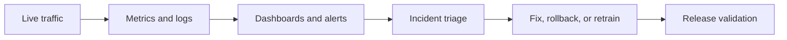

# 16. Monitoring and Operations

## Who should read this page

This page is mainly for platform teams, ML operations teams, fraud operations teams, backend engineers, and release owners.

---

## Why this page exists

A liveness system is not finished when it goes live.

After launch, the real job becomes:

- monitoring behavior
- spotting drift
- detecting incidents
- protecting the user journey
- controlling regressions after updates

---

## What should be monitored

A good monitoring plan covers four layers.

| Layer | What to monitor |
|-------|-----------------|
| user journey | pass rate, retry rate, completion rate |
| security | spoof acceptance trends, attack spikes, security-signal events |
| model behavior | score distributions, calibration drift, disagreement between models |
| infrastructure | latency, timeouts, API errors, device/platform failures |

---

## A simple monitoring loop

---

## Core business and UX metrics

| Metric | Why it matters |
|--------|----------------|
| pass rate | overall flow success |
| retry rate | hidden friction and ambiguity |
| completion rate | customer conversion impact |
| manual review rate | operational burden |
| abandonment rate | whether users leave mid-flow |

These are often more visible to product teams than model-specific metrics.

---

## Core security metrics

| Metric | Why it matters |
|--------|----------------|
| spoof acceptance trend | direct fraud exposure signal |
| attack-type concentration | shows what attackers are trying |
| injection / virtual-camera detections | indicates advanced attack activity |
| high-risk session rate | shows pressure on step-up flow |

---

## Core model and policy metrics

| Metric | Why it matters |
|--------|----------------|
| live score distribution | shows drift in genuine traffic |
| spoof score distribution | shows whether attacks are getting harder |
| calibration drift | thresholds may be aging |
| per-segment pass/retry/reject | catches hidden regressions |
| model disagreement rate | useful in fusion systems |

---

## Core infrastructure metrics

| Metric | Why it matters |
|--------|----------------|
| p50 / p95 / p99 latency | affects user experience |
| request failure rate | API stability |
| timeout rate | can look like model failure |
| SDK crash or camera error rate | client reliability |
| platform-specific failure rate | device and browser health |

---

## Dashboard slices that matter

Dashboards are more useful when they can be segmented by:

- flow type
- platform
- device class
- browser family
- SDK version
- app version
- geography if relevant
- model version
- policy version

Without slicing, major problems stay hidden inside averages.

---

## Alerting examples

| Alert example | Why it matters |
|---------------|----------------|
| retry rate jumps 30% on web | likely UX, threshold, or browser regression |
| spoof acceptance spikes in one channel | possible active attack campaign |
| p95 latency doubles after release | infrastructure or model-load issue |
| model disagreement jumps sharply | possible calibration or fusion regression |
| one SDK version has high capture failure | client release quality issue |

---

## Drift to watch for

Not all drift is fraud. Some drift is normal environmental change.

Useful drift categories:

- traffic mix drift
- device mix drift
- score distribution drift
- quality drift
- attack-pattern drift
- seasonal or campaign-based drift

The goal is to separate normal movement from dangerous change.

---

## Incident handling playbook

When a serious issue appears, teams should know the response path.

### Example incident flow

1. confirm the signal is real
2. identify affected channels and versions
3. classify as fraud, model, policy, SDK, or infrastructure issue
4. reduce impact with rollback or policy change if needed
5. run focused error analysis
6. document follow-up actions and owners

---

## Release gating and operations

Monitoring works best when tied to release policy.

Before a major release, define:

- key launch metrics
- rollback thresholds
- who approves release
- how long the guarded rollout lasts
- what traffic slices will be watched first

More on this is covered in [19. Model Governance](19-model-governance.md).

---

## What to log for safe operations

A useful operational record often includes:

- request ID
- channel and platform
- SDK / app / model version
- final decision
- intermediate scores or score bands
- quality signals
- latency
- retry count
- security signal summary

Keep privacy policy and retention rules in mind when designing logs.

---

## Common operational mistakes

| Mistake | Why it hurts |
|---------|--------------|
| only monitoring overall pass rate | hides device and channel problems |
| not versioning thresholds and policy | makes regression analysis harder |
| no alert for disagreement or drift | fusion failures can stay invisible |
| no rollback plan | incidents take longer to control |
| keeping no post-launch review cadence | issues accumulate quietly |

---

## Final takeaway

A strong liveness deployment needs more than a strong model.

It needs:

- clear metrics
- segmented dashboards
- alerting
- incident response
- release discipline
- a feedback loop into data and model improvement

That is what turns a model into a reliable service.

---

## Related docs

- [15. Error Analysis](15-error-analysis.md)
- [17. Security Hardening](17-security-hardening.md)
- [19. Model Governance](19-model-governance.md)
- [21. Troubleshooting](21-troubleshooting.md)

## Read next

Go to [17. Security Hardening](17-security-hardening.md).
