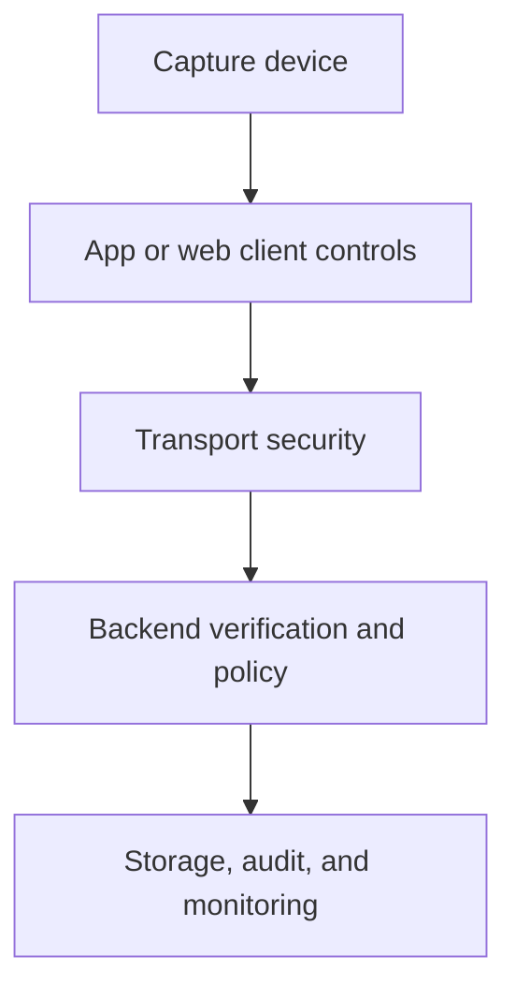
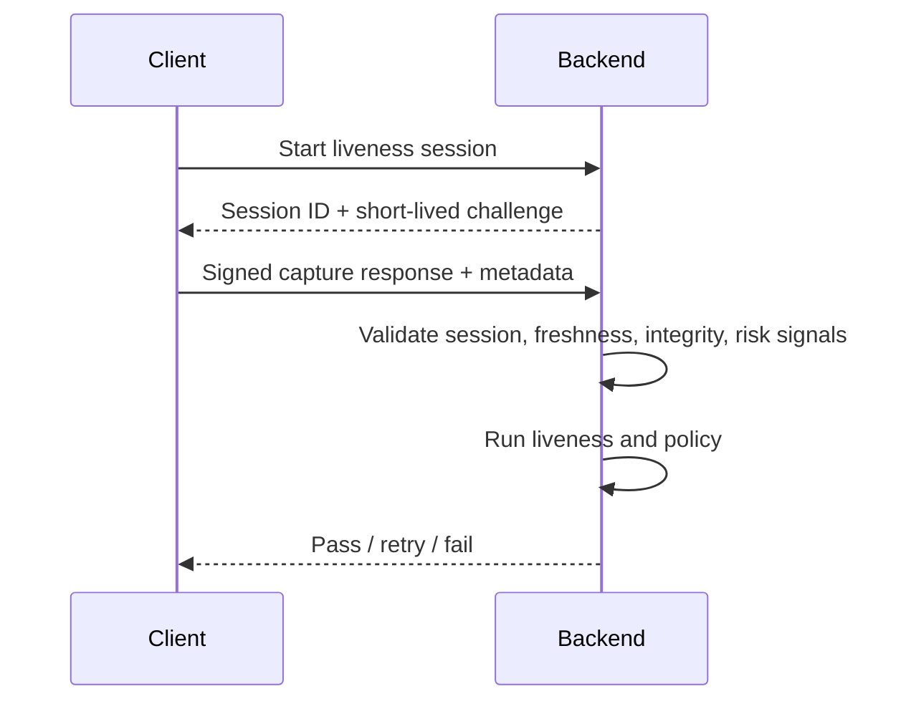

# 17. Security Hardening

## Who should read this page

This page is mainly for security engineers, platform engineers, backend teams, and technical leads responsible for attack resistance beyond model quality alone.

---

## Why this page exists

A liveness model does not protect the whole system by itself.

Attackers may try to bypass the camera, inject media, tamper with the app, automate sessions, or exploit weak backend trust assumptions.

Security hardening adds the controls around the model that make the full system safer.

---

## Think in layers

If one layer is weak, attackers may bypass the stronger ones.

---

## Main security threat surfaces

| Surface | Example threat |
|---------|----------------|
| client device | rooted device, emulator, hooked app |
| media input path | virtual camera, injected stream, modified frames |
| session flow | replayed requests, stolen tokens, automation |
| backend API | tampered payloads, missing validation, abuse bursts |
| operations | weak logging, weak key handling, poor rollout control |

---

## Client-side hardening ideas

### Mobile apps

- root / jailbreak detection where policy allows
- app integrity checks
- debugger and hook detection where appropriate
- secure SDK packaging and signing
- anti-tamper and runtime checks

### Web flows

- browser capability validation
- virtual camera and suspicious media-device checks where feasible
- stronger session binding and challenge freshness
- controlled fallback behavior for unsupported environments

---

## Media-path hardening

A model should not simply trust that the camera input is genuine.

Useful controls include:

- challenge freshness for active flows
- timestamp and session binding
- frame consistency checks
- media origin and capture-path checks where possible
- injection detection or replay-signal heuristics

---

## Transport and API hardening

| Control | Why it matters |
|---------|----------------|
| TLS and certificate validation | protects data in transit |
| signed or authenticated requests | reduces tampering risk |
| nonce or one-time challenge | reduces replay risk |
| short-lived session tokens | limits stolen-token value |
| rate limiting | slows automation and abuse |
| request schema validation | blocks malformed or manipulated payloads |

---

## Backend trust boundaries

A good backend should not assume:

- the client is honest
- device metadata is complete
- one score is enough for a high-risk decision
- every channel has equivalent security strength

Instead, design explicit trust boundaries and policy checks.

---

## Security signals that may feed policy or fusion

- root or jailbreak signal
- emulator signal
- virtual camera signal
- impossible device metadata combination
- repeated failed attempts in one session
- replay-token or stale challenge signal

These should usually influence policy even if the liveness score looks good.

---

## High-level secure session flow

---

## Storage and retention principles

Security hardening should also reduce unnecessary storage risk.

Good practices usually include:

- encrypt data at rest
- minimize stored media where possible
- separate logs from sensitive content
- use role-based access control
- define retention policy clearly
- log access to sensitive review tools

---

## Common gaps in real systems

| Gap | Why it matters |
|-----|----------------|
| strong model, weak session binding | replay and automation risk stays high |
| no client integrity checks | app tampering becomes easier |
| no rate limiting | bots can probe thresholds |
| broad media retention | privacy and breach risk increase |
| no security-event monitoring | attacks can continue unnoticed |

---

## Practical hardening priorities

If the system is still maturing, start with:

1. strong session binding and challenge freshness
2. transport security and request validation
3. rate limiting and abuse controls
4. device and environment integrity signals
5. monitoring and incident workflows

This often gives more value than adding one more weak detector.

---

## Final takeaway

Security hardening means protecting the full decision path, not only the model.

A secure liveness system should resist:

- spoof media
- injected media
- session replay
- client tampering
- API abuse
- weak operational controls

That is what turns liveness into a dependable security control.

---

## Related docs

- [03. Deployment Guide](03-deployment-guide.md)
- [16. Monitoring and Operations](16-monitoring-and-operations.md)
- [18. Device and Platform Matrix](18-device-and-platform-matrix.md)
- [Appendix A5 — Security and Privacy](appendix/A5-security-and-privacy.md)

## Read next

Go to [18. Device and Platform Matrix](18-device-and-platform-matrix.md).
