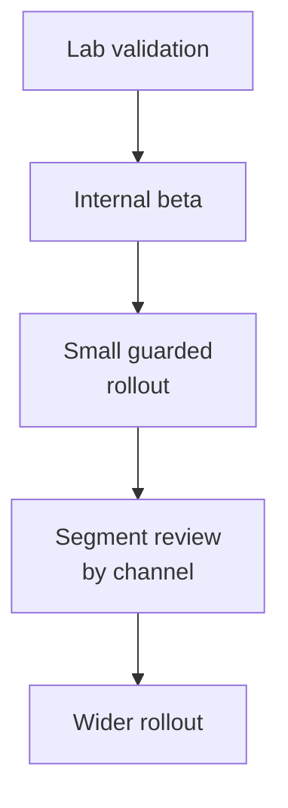

# 18. Device and Platform Matrix

## Who should read this page

This page is mainly for SDK teams, mobile engineers, web engineers, QA teams, and product owners deciding which channels and device classes the liveness system must support.

---

## Why this page exists

Liveness performance is not only a model issue.

It is also a platform issue.

The same system can behave very differently across:

- Android app
- iOS app
- mobile web
- desktop web
- kiosk or assisted devices

That is why a device and platform matrix should be part of planning, evaluation, and rollout.

---

## A simple platform view

| Platform | Typical strengths | Typical risks |
|----------|-------------------|---------------|
| Android app | good camera access, device signals available | wide device diversity |
| iOS app | more controlled environment, strong capture consistency | fewer deep device controls in some cases |
| mobile web | broad reach, lower install friction | browser and camera limitations |
| desktop web | easy onboarding access | weaker camera quality and higher replay risk |
| kiosk / assisted | controlled hardware possible | operational complexity |

---

## Main dimensions to track

A useful platform matrix should include:

- platform
- OS version
- app version or browser family
- device class
- front camera quality
- supported capture type
- expected latency range
- known limitations
- policy differences

---

## Example compatibility matrix

| Channel | Capture style | Common limitations | Operational note |
|---------|---------------|--------------------|------------------|
| Android app | image or short video | huge hardware spread | evaluate low-end devices carefully |
| iOS app | image or short video | device-integrity signals may differ from Android | usually stable but still segment by model |
| mobile web | image or short video depending on browser | browser permission and camera quality variance | strong fallback and UX guidance matter |
| desktop web | webcam video or image | low-quality webcams, screen replay exposure | stricter policy may be needed |

---

## Low-end vs high-end device behavior

Device class matters because it affects:

- camera noise
- exposure control
- focus stability
- frame rate
- CPU / GPU speed
- latency and battery behavior

A model that is fine on flagship phones can behave much worse on low-end devices.

---

## Browser-specific concerns

Web deployments should explicitly consider:

- media-device permissions
- browser family and version
- secure context requirements
- webcam resolution and frame-rate limits
- tab switching and session interruption
- virtual camera exposure and spoof risk

Do not treat “web” as one uniform channel.

---

## Policy may differ by platform

A realistic program may use:

- different thresholds by channel
- stronger retry guidance on web
- stricter policy for desktop replay risk
- active challenge on some channels but not others
- reduced feature set where one platform lacks support

This is normal if it is documented and evaluated.

---

## What to test for every platform

| Test area | Examples |
|-----------|----------|
| capture quality | blur, low light, backlight, face size |
| user flow | permission denial, retry guidance, recovery path |
| security | replay, virtual camera, injection where relevant |
| performance | latency, CPU use, memory use, crash rate |
| release stability | app version / browser version regression |

---

## Suggested rollout matrix

This is especially important when supporting mobile web or desktop web for the first time.

---

## Common mistakes

| Mistake | Why it hurts |
|---------|--------------|
| testing only flagship devices | poor field readiness |
| treating web as one channel | browser-specific problems stay hidden |
| using one threshold everywhere | platform differences get ignored |
| not logging device and browser versions | debugging becomes slower |
| shipping to all channels at once | rollout risk increases |

---

## Final takeaway

A good liveness system should know where it is running.

Platform differences affect:

- capture quality
- attack exposure
- latency
- reliability
- policy design

That is why device and platform thinking should be built into evaluation, release, and monitoring.

---

## Need term help?

If any technical terms on this page feel dense, use [Appendix A1 — Key Terms](appendix/A1-key-terms.md) first and then jump to the relevant appendix page for deeper detail.

---

## Related docs

- [03. Deployment Guide](03-deployment-guide.md)
- [08. Evaluation Playbook](08-evaluation-playbook.md)
- [16. Monitoring and Operations](16-monitoring-and-operations.md)
- [17. Security Hardening](17-security-hardening.md)

## Read next

Go to [19. Model Governance](19-model-governance.md).
