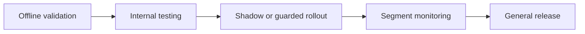

# 19. Model Governance

## Who should read this page

This page is mainly for technical leads, ML platform teams, QA leads, security reviewers, and managers responsible for release discipline and auditability.

---

## Why this page exists

A liveness system changes over time.

Models change. Thresholds change. data changes. SDKs change. Threats change.

Without governance, a team can improve accuracy in one place while silently breaking user experience or increasing risk somewhere else.

---

## What governance should cover

A good governance process usually covers:

- model versioning
- dataset versioning
- threshold and policy versioning
- release approvals
- rollback rules
- audit evidence
- post-release monitoring

---

## Version the full decision stack

Do not version only the model file.

Version these together when possible:

| Component | Example |
|-----------|---------|
| model version | `live_v3.2` |
| fusion version | `fusion_v1.1` |
| threshold policy version | `policy_risk_a_v4` |
| SDK version | `android_sdk_2.3.0` |
| dataset version | `dataset_2026_q1_r2` |
| evaluation report | `eval_release_2026_03_18` |

This makes release analysis much clearer.

---

## Release gate example

A practical release gate may require:

- benchmark results above target
- no major regression in protected segments
- latency within budget
- calibration reviewed
- error analysis on top failures completed
- rollback path ready
- owners and approvers recorded

---

## Model card / release note basics

Each release should have a short record of:

- what changed
- why it changed
- which data was used
- which channels were tested
- expected benefits
- known risks
- rollback trigger

This becomes very helpful during incidents.

---

## Change categories that should trigger formal review

| Change | Why review is needed |
|--------|----------------------|
| new model architecture | behavior may shift broadly |
| new fusion logic | decision path changes |
| threshold or policy update | user experience and fraud risk change |
| SDK major change | capture path may change |
| expansion to new channel | device and threat model change |
| major dataset refresh | calibration and leakage assumptions may shift |

---

## Rollout strategy

A safe rollout is usually staged.

Guarded rollout is especially useful for web, fusion updates, and threshold changes.

---

## Rollback policy

A rollback plan should be written before release, not during an incident.

Useful rollback triggers may include:

- retry rate spike above threshold
- spoof acceptance incident
- p95 latency breach
- one protected segment degrades sharply
- disagreement spike in fusion system

---

## Governance and audit evidence

A mature program should be able to answer:

- which model and threshold made this decision?
- which evaluation approved the release?
- what changed since the last version?
- who approved the rollout?
- how was drift monitored after launch?

That is important for internal review and for regulated environments.

---

## Common governance gaps

| Gap | Why it is dangerous |
|-----|----------------------|
| model file versioned, threshold not versioned | decision behavior becomes unclear |
| release notes missing | incidents take longer to debug |
| no guarded rollout | broad regressions hit all users |
| no rollback owner | incident response slows down |
| no approval record | accountability weakens |

---

## Final takeaway

Model governance is how teams keep a liveness system understandable and controllable as it evolves.

It protects against:

- silent regressions
- unclear ownership
- hard-to-debug incidents
- weak auditability

That is what makes a technically good system operationally mature.

---

## Related docs

- [14. Score Calibration and Thresholding](14-score-calibration-and-thresholding.md)
- [16. Monitoring and Operations](16-monitoring-and-operations.md)
- [21. Troubleshooting](21-troubleshooting.md)
- [Appendix A10 — Experiment Design](appendix/A10-experiment-design.md)

## Read next

Go to [20. FAQ](20-faq.md).
