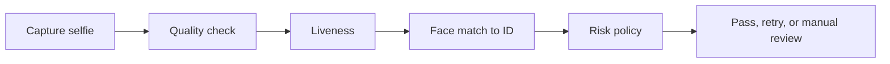

# 22. Case Studies

## Who should read this page

This page is mainly for product teams, solution architects, fraud teams, and client-facing stakeholders who want realistic examples of how liveness fits into different journeys.

---

## Why this page exists

Case studies make the playbook easier to apply.

Instead of talking only about theory, this page shows how liveness strategy changes with the use case.

---

## Case study 1: remote account opening

### Goal

Stop common spoof attacks without creating too much onboarding friction.

### Typical flow

### Common concerns

- replay attacks with the real person's media
- low-quality first-time captures
- conversion drop from strict policy

### Good design pattern

- clear capture guidance
- retry band instead of hard fail for ambiguous cases
- stronger policy for risky segments

---

## Case study 2: login step-up verification

### Goal

Confirm that a returning user is genuinely present during a sensitive action.

### Common concerns

- users expect speed
- mobile app and web may behave differently
- too much friction harms trust

### Good design pattern

- use liveness only when risk triggers it
- keep latency budget tight
- monitor retry rate carefully

---

## Case study 3: high-value transaction approval

### Goal

Reduce fraud on high-risk money movement or profile-change events.

### Common concerns

- stricter security needed
- strong audit trail required
- attackers may be more determined

### Good design pattern

- tighter threshold or stronger challenge
- extra device and session checks
- clear fallback path for genuine users

---

## Case study 4: account recovery

### Goal

Prevent attacker takeover when the user has lost normal credentials.

### Common concerns

- higher fraud pressure than normal login
- weak fallback design can be abused
- support burden rises if policy is too strict

### Good design pattern

- stricter policy than standard login
- strong monitoring and review path
- careful session security and logging

---

## Case study 5: browser-first onboarding

### Goal

Support wide reach without forcing app install.

### Common concerns

- webcam quality varies widely
- browser support differs
- replay exposure may be higher on desktop

### Good design pattern

- channel-specific thresholding
- browser-aware capture guidance
- clear fallback or assisted path for weak setups

---

## Compare the use cases

| Use case | Security pressure | UX pressure | Typical policy strength |
|----------|-------------------|-------------|-------------------------|
| account opening | high | medium | balanced to slightly strict |
| login step-up | medium to high | high | balanced |
| high-value transaction | very high | medium | strict |
| account recovery | very high | medium | strict plus fallback |
| browser-first onboarding | medium to high | high | channel-aware |

---

## Final takeaway

The right liveness design depends on:

- the risk of the journey
- the tolerance for friction
- the platform constraints
- the attack pressure

That is why a single universal policy rarely works across all journeys.

---

## Related docs

- [05. Real-World Examples](05-real-world-examples.md)
- [10. Product Guide](10-product-guide.md)
- [18. Device and Platform Matrix](18-device-and-platform-matrix.md)
- [23. System Architecture](23-system-architecture.md)

## Read next

Go to [23. System Architecture](23-system-architecture.md).
