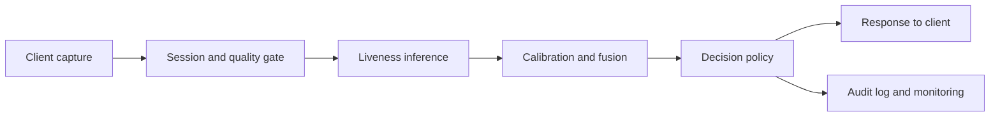
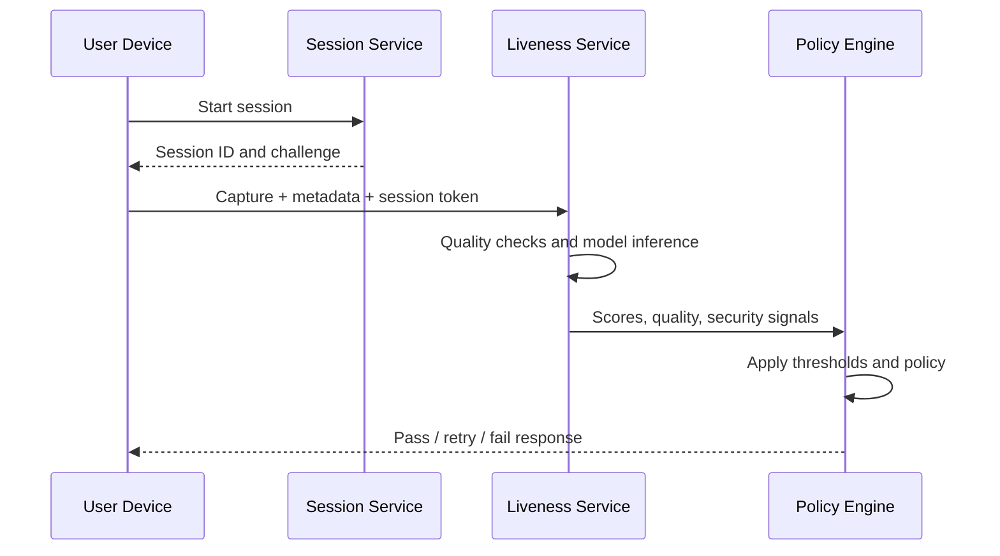
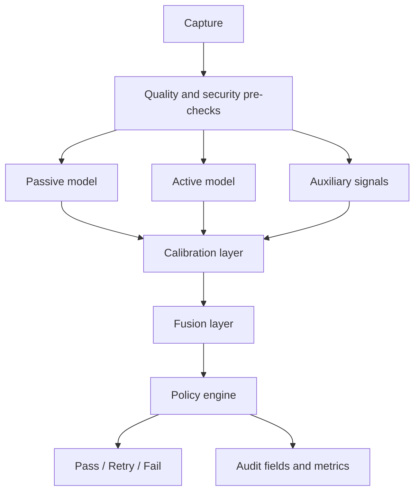

# 23. System Architecture

## Who should read this page

This page is mainly for solution architects, backend engineers, ML platform teams, and technical leads designing the end-to-end liveness service.

---

## Why this page exists

A face liveness system is more than one model endpoint.

A practical architecture needs to connect:

- capture and SDK behavior
- quality checks
- liveness models
- optional face match
- decision policy
- logging and monitoring
- release and governance workflows

---

## A simple end-to-end architecture

---

## Main runtime components

| Component | Main role |
|-----------|-----------|
| client or SDK | capture media and local signals |
| session service | create challenge, bind session, enforce freshness |
| quality gate | reject unusable inputs early |
| liveness service | run one or more liveness models |
| calibration and fusion layer | normalize and combine signals |
| policy engine | map outputs into pass / retry / fail |
| logging and analytics | support audit, monitoring, and debugging |

---

## Example request path

---

## Architecture choices

### On-device heavy

- lower network dependency
- faster immediate feedback possible
- stronger offline behavior in some cases
- harder release and model-control discipline

### Server-side heavy

- easier centralized control
- simpler model updates
- stronger centralized monitoring
- more network dependency

### Hybrid

- local pre-checks plus server-side final decision
- often a practical balance for mature deployments

---

## Where fusion fits

If you have multiple liveness signals, the fusion layer should sit after raw inference and before final policy.

That allows:

- calibration first
- clean signal combination
- separate explainability fields
- policy control after fusion

This connects directly to [12. Fusion and Meta-Model](12-fusion-and-meta-model.md).

---

## Recommended explanation-friendly architecture

---

## Logging and audit fields to preserve

A useful architecture makes these available:

- request ID
- session ID
- platform and version fields
- quality measurements
- model outputs or score bands
- final policy decision
- latency breakdown
- security signal summary

This supports monitoring, troubleshooting, and regulated review.

---

## Non-functional requirements

| Requirement | Why it matters |
|-------------|----------------|
| latency budget | affects conversion and usability |
| observability | needed for debugging and drift detection |
| scalability | spikes can happen during campaigns or abuse |
| security | protects the full path, not just the model |
| rollback support | needed for safe releases |
| version traceability | needed for governance |

---

## Final takeaway

A strong architecture keeps these concerns separate but connected:

- capture quality
- model scoring
- fusion and calibration
- business policy
- monitoring and governance

That is what keeps the system understandable as it grows.

---

## Need term help?

If any technical terms on this page feel dense, use [Appendix A1 — Key Terms](appendix/A1-key-terms.md) first and then jump to the relevant appendix page for deeper detail.

---

## Related docs

- [03. Deployment Guide](03-deployment-guide.md)
- [12. Fusion and Meta-Model](12-fusion-and-meta-model.md)
- [16. Monitoring and Operations](16-monitoring-and-operations.md)
- [19. Model Governance](19-model-governance.md)

## Read next

Go to [Appendix A8 — Attack Coverage Matrix](appendix/A8-attack-coverage-matrix.md) or return to [Home](index.md).
