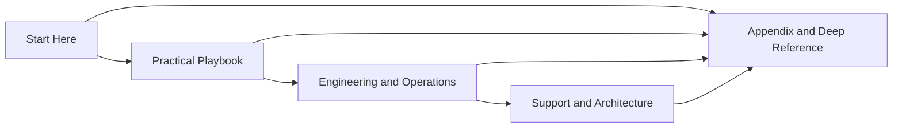

# Face Liveness Docs

## Simple main guide + deep reference for eKYC teams

This documentation is designed to be easy for first-time readers **and** still useful for deeper technical work.

Instead of forcing everyone through a long encyclopedia-style path, the site has two layers:

- **Main guide** — simple, practical, and fast to understand
- **Appendix / deep reference** — detailed technical, testing, standards, security, and vendor material

---

## Read by track, not just by page number

### New to face liveness?
Read these first:

1. [00. Overview](00-overview.md)
2. [01. Face Liveness Guide](01-face-liveness-guide.md)
3. [02. eKYC Integration](02-ekyc-integration.md)

### Building the flow?
Then read:

4. [03. Deployment Guide](03-deployment-guide.md)
5. [04. Best Practices](04-best-practices.md)
6. [05. Real-World Examples](05-real-world-examples.md)
7. [06. API and Response Examples](06-api-and-response-examples.md)
8. [07. Decision Logic](07-decision-logic.md)

### Measuring and improving the system?
Then read:

9. [08. Evaluation Playbook](08-evaluation-playbook.md)
10. [09. Common Failures](09-common-failures.md)
11. [10. Product Guide](10-product-guide.md)
12. [11. Advanced Topics](11-advanced-topics.md)
13. [12. Fusion and Meta-Model](12-fusion-and-meta-model.md)
14. [13. Dataset Strategy](13-dataset-strategy.md)
15. [14. Score Calibration and Thresholding](14-score-calibration-and-thresholding.md)
16. [15. Error Analysis](15-error-analysis.md)
17. [16. Monitoring and Operations](16-monitoring-and-operations.md)

### Hardening, release, and support
Then read:

18. [17. Security Hardening](17-security-hardening.md)
19. [18. Device and Platform Matrix](18-device-and-platform-matrix.md)
20. [19. Model Governance](19-model-governance.md)
21. [20. FAQ](20-faq.md)
22. [21. Troubleshooting](21-troubleshooting.md)
23. [22. Case Studies](22-case-studies.md)
24. [23. System Architecture](23-system-architecture.md)

### Need deep detail?
Go to:

- [Appendix A1 — Key Terms](appendix/A1-key-terms.md)
- [Appendix A3 — Metrics and Evaluation](appendix/A3-metrics-and-evaluation.md)
- [Appendix A5 — Security and Privacy](appendix/A5-security-and-privacy.md)
- [Appendix A8 — Attack Coverage Matrix](appendix/A8-attack-coverage-matrix.md)
- [Appendix A9 — Data Collection and Labeling](appendix/A9-data-collection-and-labeling.md)
- [Appendix A10 — Experiment Design](appendix/A10-experiment-design.md)
- the detailed topic chapters under **Deep Reference by Topic** in the left navigation

---

## Quick role map

| If you are... | Best starting pages |
|---------------|---------------------|
| product or business | [01. Face Liveness Guide](01-face-liveness-guide.md), [10. Product Guide](10-product-guide.md), [22. Case Studies](22-case-studies.md) |
| ML / evaluation | [08. Evaluation Playbook](08-evaluation-playbook.md), [12. Fusion and Meta-Model](12-fusion-and-meta-model.md), [13. Dataset Strategy](13-dataset-strategy.md) |
| backend / platform | [03. Deployment Guide](03-deployment-guide.md), [16. Monitoring and Operations](16-monitoring-and-operations.md), [23. System Architecture](23-system-architecture.md) |
| security / fraud | [17. Security Hardening](17-security-hardening.md), [15. Error Analysis](15-error-analysis.md), [Appendix A8](appendix/A8-attack-coverage-matrix.md) |
| compliance / procurement | [Appendix A4](appendix/A4-standards-and-compliance.md), [Appendix A6](appendix/A6-vendor-evaluation-checklist.md) |

---

## Reading phases

---

## What this documentation covers

- what face liveness is
- why it matters in eKYC
- how passive, active, and hybrid methods differ
- common attack types from print and replay to injection and AI-generated content
- input quality, score interpretation, and thresholding
- deployment choices such as on-device, server-side, and hybrid
- testing, monitoring, governance, and model updates
- fusion, dataset strategy, calibration, and release discipline
- security, privacy, troubleshooting, and vendor evaluation

---

## How to use this site

!!! tip "Fastest practical path"
    If you want a simple but complete understanding, read the **Start Here** pages and the first half of the **Practical Playbook**. That gives you the end-to-end picture without getting overloaded by standards and taxonomy detail.

!!! tip "When to use the appendix"
    Use the appendix when you need attack depth, metrics detail, standards mapping, data collection rules, or vendor and procurement checklists.

!!! note "Deep-dive chapters are still preserved"
    The earlier topic-by-topic chapters are still available. They now serve as reference material rather than the first reading path.
