# Face Liveness Docs

## Simple main guide + deep reference for eKYC teams

This documentation is designed to be easy for first-time readers **and** still useful for deeper technical work.

Instead of forcing everyone through a long encyclopedia-style path, the site has two layers:

- **Main guide** — simple, practical, and fast to understand
- **Appendix / deep reference** — detailed technical, testing, standards, security, and vendor material

---

## Start here

### New to face liveness?
Read these first:

1. [00. Overview](00-overview.md)
2. [01. Face Liveness Guide](01-face-liveness-guide.md)

### Working on eKYC flow design?
Then read:

3. [02. eKYC Integration](02-ekyc-integration.md)

### Building or deploying the system?
Then read:

4. [03. Deployment Guide](03-deployment-guide.md)
5. [04. Best Practices](04-best-practices.md)
6. [05. Real-World Examples](05-real-world-examples.md)
7. [06. API and Response Examples](06-api-and-response-examples.md)
8. [07. Decision Logic](07-decision-logic.md)
9. [08. Evaluation Playbook](08-evaluation-playbook.md)
10. [09. Common Failures](09-common-failures.md)
11. [10. Product Guide](10-product-guide.md)
12. [11. Advanced Topics](11-advanced-topics.md)
13. [12. Fusion and Meta-Model](12-fusion-and-meta-model.md)
14. [13. Dataset Strategy](13-dataset-strategy.md)
15. [14. Score Calibration and Thresholding](14-score-calibration-and-thresholding.md)
16. [15. Error Analysis](15-error-analysis.md)
17. [16. Monitoring and Operations](16-monitoring-and-operations.md)
18. [17. Security Hardening](17-security-hardening.md)
19. [18. Device and Platform Matrix](18-device-and-platform-matrix.md)
20. [19. Model Governance](19-model-governance.md)
21. [20. FAQ](20-faq.md)
22. [21. Troubleshooting](21-troubleshooting.md)
23. [22. Case Studies](22-case-studies.md)
24. [23. System Architecture](23-system-architecture.md)

### Need deeper detail?
Go to:

- [Appendix](appendix/A1-key-terms.md)
- [Attack Coverage Matrix](appendix/A8-attack-coverage-matrix.md)
- [Data Collection and Labeling](appendix/A9-data-collection-and-labeling.md)
- [Experiment Design](appendix/A10-experiment-design.md)
- the detailed topic chapters under **Deep Reference by Topic** in the left navigation

---

## Quick map

```mermaid
flowchart LR
    A[00 Overview] --> B[01 Face Liveness Guide]
    B --> C[02 eKYC Integration]
    C --> D[03 Deployment Guide]
    D --> E[04 Best Practices]
    E --> G[05 Real-World Examples]
    G --> H[06 API and Response Examples]
    H --> I[07 Decision Logic]
    I --> J[08 Evaluation Playbook]
    J --> K[09 Common Failures]
    K --> L[10 Product Guide]
    L --> M[11 Advanced Topics]
    M --> N[12 Fusion and Meta-Model]
    N --> O[13 Dataset Strategy]
    O --> P[14 Calibration and Thresholding]
    P --> Q[15 Error Analysis]
    Q --> R[16 Monitoring and Operations]
    R --> S[17 Security Hardening]
    S --> T[18 Device and Platform Matrix]
    T --> U[19 Model Governance]
    U --> V[20 FAQ]
    V --> W[21 Troubleshooting]
    W --> X[22 Case Studies]
    X --> Y[23 System Architecture]
    B --> F[Appendix]
    C --> F
    D --> F
    E --> F
    G --> F
    H --> F
    I --> F
    J --> F
    K --> F
    L --> F
    M --> F
```

---

## What this documentation covers

- what face liveness is
- why it matters in eKYC
- how passive, active, and hybrid methods differ
- common attack types from print and replay to injection and AI-generated content
- input quality, score interpretation, and thresholding
- deployment choices such as on-device, server-side, and hybrid
- testing, monitoring, and model updates
- fusion, dataset strategy, calibration, and governance
- security, privacy, troubleshooting, and vendor evaluation

---

## How to use this site

!!! tip "Fastest practical path"
    If you want a simple but complete understanding, read the five main pages first. That gives you the end-to-end picture without getting overloaded by standards and taxonomy detail.

!!! tip "Use appendix only when needed"
    The appendix exists so the main guide stays clean. Use it when you need attack depth, metrics detail, standards mapping, or procurement checklists.

!!! note "Detailed topic pages are preserved"
    The earlier deep-dive chapters are still available. They now serve as reference material rather than the first reading path.
